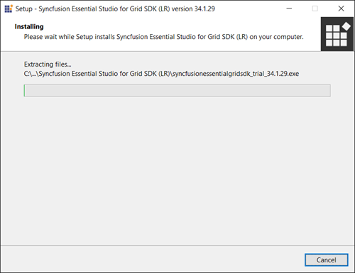
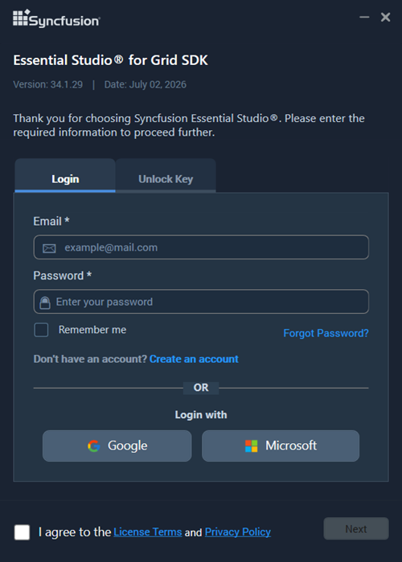
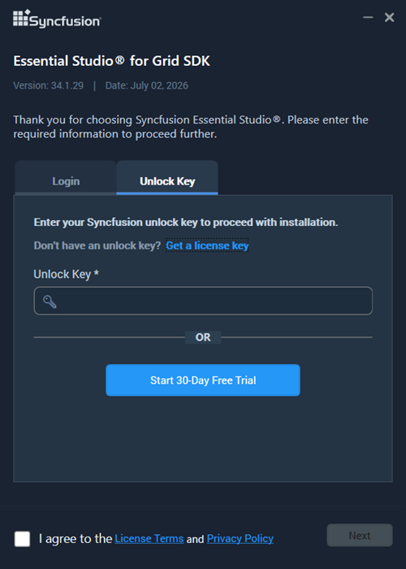
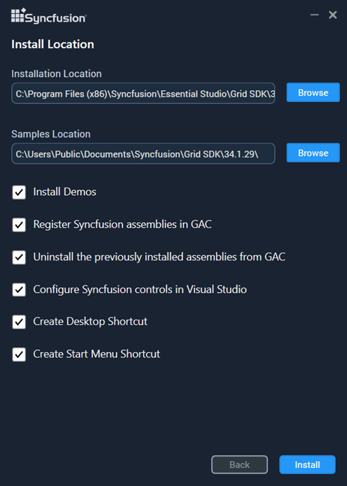
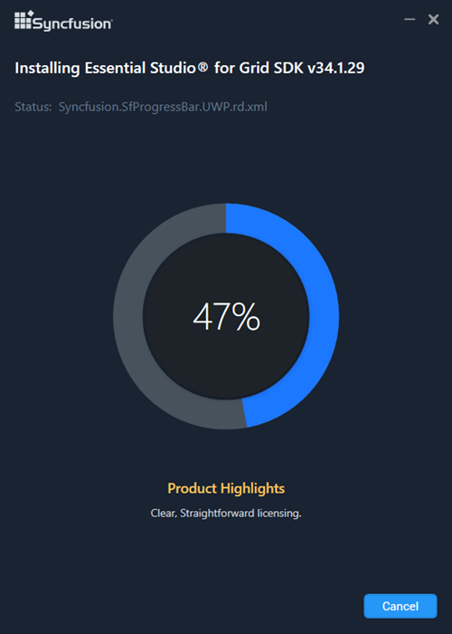
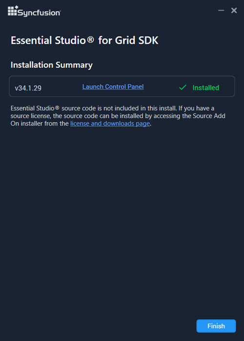

# Installing Syncfusion Grid SDK offline installer

## Installing with UI

The steps below describe how to install the Grid SDK offline installer.

1. Open the Syncfusion Grid SDK offline installer file from the downloaded location by double-clicking it. The installer wizard automatically opens and extracts the package.

   

   N> The installer wizard extracts the `syncfusionessentialgridsdk_<version>.exe` file and displays the package's unzip progress.

2. To unlock the Syncfusion offline installer, choose one of the following options:

   * **Login To Install**
   * **Use Unlock Key**

   **Login To Install**

   Enter your Syncfusion email address and password. If you do not already have a Syncfusion account, click **Create an account** to sign up. If you have forgotten your password, click **Forgot Password** to reset it. After entering your credentials, click **Next**.

   

   **Use Unlock Key**

   Unlock keys are platform- and version-specific, and are required to unlock the Syncfusion offline installer. Use either a licensed unlock key or a trial unlock key to unlock the Grid SDK offline installer.

   The trial unlock key is only valid for 30 days, and the installer will not accept an expired trial key.

   To learn how to generate an unlock key for both trial and licensed products, see [How to generate an unlock key for Essential Studio products](https://support.syncfusion.com/kb/article/7053/how-to-generate-unlock-key-for-essentials-studio-products).

   

3. After reading the License Terms and Privacy Policy, select the **I agree to the License Terms and Privacy Policy** check box. Click **Next**.

4. Change the install and sample locations if needed, and review the **Additional Settings** below. Click **Install** to install with the default settings.

   

   **Additional Settings**

   * **Install Demos** – Select to install the Syncfusion sample applications, or clear the check box to skip sample installation.
   * **Register Syncfusion Assemblies in GAC** – Select to install the latest Syncfusion assemblies in the Global Assembly Cache (GAC), or clear the check box to skip GAC registration. Required by some older .NET Framework projects.
   * **Configure Syncfusion controls in Visual Studio** – Select to add the Syncfusion controls to the Visual Studio toolbox, or clear the check box to skip toolbox configuration. Requires **Register Syncfusion Assemblies in GAC** to be enabled.
   * **Configure Syncfusion Extensions controls in Visual Studio** – Select to install the Syncfusion Visual Studio extensions, or clear the check box to skip extension installation.
   * **Create Desktop Shortcut** – Select to add a desktop shortcut for the Syncfusion Control Panel.
   * **Create Start Menu Shortcut** – Select to add a Start menu shortcut for the Syncfusion Control Panel.

5. If any previous versions of the current product are installed, the **Uninstall Previous Version(s)** wizard will open. Select the **Uninstall** check box for each version you want to remove and click **Proceed**.

   

   N> From the 2021 Volume 1 release (v18.1) onward, the installer can remove previous versions of the same product during installation. Earlier versions must be uninstalled manually.

   N> If a version is selected to uninstall, a confirmation screen appears. Click **Continue** to display the uninstall and install progress, respectively. If no versions are selected, only the install progress is displayed.

   **Confirmation Alert**

   

   **Uninstall Progress**

   

   **Install Progress**

   

    N> The Completed screen is displayed once the Grid SDK product is installed. If any version is selected to uninstall, The completed screen will display both install and uninstall status.
	
	
	
7.  After installing, click the **Launch Control Panel** link to open the Syncfusion Control Panel.

8.  Click the Finish button. Your system has been installed with the Syncfusion Essential Studio Grid SDK product.

## Installing in silent mode

The Syncfusion Essential Studio Grid SDK Installer supports installation and uninstallation via the command line.

### Command Line Installation

To install through the Command Line in Silent mode, follow the steps below.

1.	Run the Syncfusion Grid SDK installer by double-clicking it. The Installer Wizard automatically opens and extracts the package.
2.	The file syncfusionessentialgridsdk_(version).exe file will be extracted into the Temp directory.
3.	Run %temp%. The Temp folder will be opened. The syncfusionessentialgridsdk_(version).exe file will be located in one of the folders.
4.	Copy the extracted syncfusionessentialgridsdk_(version).exe file in local drive.
5.	Exit the Wizard.
6.	Run Command Prompt in administrator mode and enter the following arguments.

   
    **Arguments:** “installer file path\SyncfusionEssentialStudio(platform)_(version).exe” /Install silent /UNLOCKKEY:“(product unlock key)” [/log “{Log file path}”] [/InstallPath:{Location to install}] [/InstallSamples:{true/false}] [/InstallAssemblies:{true/false}] [/UninstallExistAssemblies:{true/false}] [/InstallToolbox:{true/false}]

    N> [..] – Arguments inside the square brackets are optional.

    **Example:** “D:\Temp\syncfusionessentialgridsdk_x.x.x.x.exe” /Install silent /UNLOCKKEY:“product unlock key” /log “C:\Temp\EssentialStudio_Platform.log” /InstallPath:C:\Syncfusion\x.x.x.x /InstallSamples:true /InstallAssemblies:true /UninstallExistAssemblies:true /InstallToolbox:true

	
7.  Essential Studio for Grid SDK is installed.

    N> x.x.x.x should be replaced with the Essential Studio version and the Product Unlock Key needs to be replaced with the Unlock Key for that version.
   

### Command Line Uninstallation

Syncfusion Essential Grid SDK can be uninstalled silently using the Command Line.

1.	Run the Syncfusion Grid SDK installer by double-clicking it. The Installer Wizard automatically opens and extracts the package.
2.	The file syncfusionessentialgridsdk_(version).exe file will be extracted into the Temp directory.
3.	Run %temp%. The Temp folder will be opened. The syncfusionessentialgridsdk_(version).exe file will be located in one of the folders.
4.	Copy the extracted syncfusionessentialgridsdk_(version).exe file in local drive.
5.	Exit the Wizard.
6.	Run Command Prompt in administrator mode and enter the following arguments.
   
    **Arguments:** “Copied installer file path\syncfusionessentialgridsdk_(version).exe” /uninstall silent 

    **Example:** “D:\Temp\syncfusionessentialgridsdk_x.x.x.x.exe" /uninstall silent

7.  Essential Studio for Grid SDK is uninstalled.
   
   
