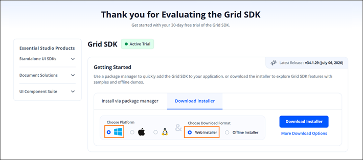
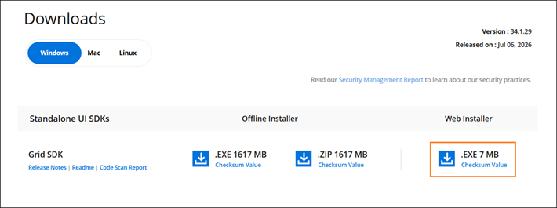

# Downloading Syncfusion Grid SDK Web Installer

The Syncfusion Grid SDK web installer can be downloaded from the [Syncfusion](https://www.syncfusion.com/) website. You can either download the licensed installer or try our trial installer depending on your license. A registered Syncfusion account is required to download any installer.

   -	Trial Installer
   -	Licensed Installer

## Download the Trial Version

Our 30-day trial can be downloaded in two ways.

* Download Free Trial Setup
* Start Trials if using components through [NuGet.org](https://www.nuget.org/packages?q=syncfusion)

### Download Free Trial Setup

1. Evaluate the 30-day free trial by visiting the [Download Free Trial](https://www.syncfusion.com/downloads) page and selecting the **Grid SDK** product from the product list.
2. After completing the required form or logging in with your registered Syncfusion account, you can download the Grid SDK trial installer from the confirmation page (as shown in the below screenshot).

   

3. With a trial license, only the latest version's trial installer can be downloaded.
4. After downloading, unlock the Syncfusion Grid SDK trial installer using either the trial unlock key or your Syncfusion registered login credential. For more information on generating an unlock key, see [How to generate an unlock key for Essential Studio products](https://support.syncfusion.com/kb/article/7053/how-to-generate-unlock-key-for-essentials-studio-products).
5. Before the trial expires, you can download the trial installer at any time from your registered account's [Trials & Downloads](https://www.syncfusion.com/account/manage-trials/downloads) page (as shown in the below screenshot).

   

6. Click the **Download** button (element 1 in the screenshot above) to get the Grid SDK web installer.

### Start Trials if using components through [NuGet.org](https://www.nuget.org/packages?q=syncfusion)

If you have already obtained our components through [NuGet.org](https://www.nuget.org/packages?q=syncfusion), you can initiate a trial evaluation.

1. You can start your 30-day free trial for Grid SDK from the [Start Trial](https://www.syncfusion.com/account/manage-trials/start-trials) page in your account.

   

2. To access this page, you must sign up or log in with your Syncfusion account.
3. Begin your trial by selecting the **Grid SDK** product.

   N> If you've already used the trial products and they haven't expired, you won't be able to start the trial for the same product again.

4. After you've started the trial, go to the [Trials & Downloads](https://www.syncfusion.com/account/manage-trials/downloads) page to get the latest version of the trial installer. You can generate the [unlock key](https://support.syncfusion.com/kb/article/7053/how-to-generate-unlock-key-for-essentials-studio-products) and [license key](https://help.syncfusion.com/common/essential-studio/licensing/how-to-generate) here at any time before the trial period expires (as shown in the below screenshot).

   

5. You can find your current active trial products on the [Trials & Downloads](https://www.syncfusion.com/account/manage-trials/downloads) page.

## Download the License Version

1. Syncfusion licensed products are available on the [License & Downloads](https://www.syncfusion.com/account/downloads) page under your registered Syncfusion account.
2. You can view all the licenses (both active and expired) associated with your account.
3. Select the **Grid SDK** product from the Licensed Products list.
4. Click the **Download** button (element 1 in the screenshot below) to download the most recent version of the Grid SDK installer.

   

5. To download older version installers, click **Downloads - Older Versions** (element 2 in the screenshot above) and select the desired version.
6. To download installers for other platforms or add-ons, click **More Downloads Options** (element 3 in the screenshot above).

   N> The most recent version of the installer is downloaded by default from the License & Downloads page.

7. Before the license expires, you can download the installer at any time from your registered account's [License & Downloads](https://www.syncfusion.com/account/downloads) page. See the screenshot below.

   

8. After downloading, the Syncfusion Grid SDK web installer can be unlocked using your Syncfusion registered login credential.

   N> For Syncfusion trial and licensed products, there is no separate web installer. Based on your account license, Syncfusion trial or licensed products will be installed via web installer.

You can also refer to the [**Web installer**](https://help.syncfusion.com/grid-sdk/installation/web-installer/how-to-install) links for step-by-step installation guidelines.	