# Installing Syncfusion Grid SDK Web Installer

## Overview

For the Essential Studio Grid SDK product, Syncfusion offers a Web Installer. This installer alleviates the burden of downloading a larger installer. You can simply download and run the online installer, which will be smaller in size and will download and install the Essential Studio products you have chosen. You can get the most recent version of Essential Studio Web Installer [here](https://www.syncfusion.com/downloads/latest-version). 

 
## Installation

The steps below describe how to install the Grid SDK Web Installer.

1. Open the Syncfusion Grid SDK Web Installer file from the downloaded location by double-clicking it. The installer wizard automatically opens and extracts the package. By default, the file is in the `~/Downloads` folder.

   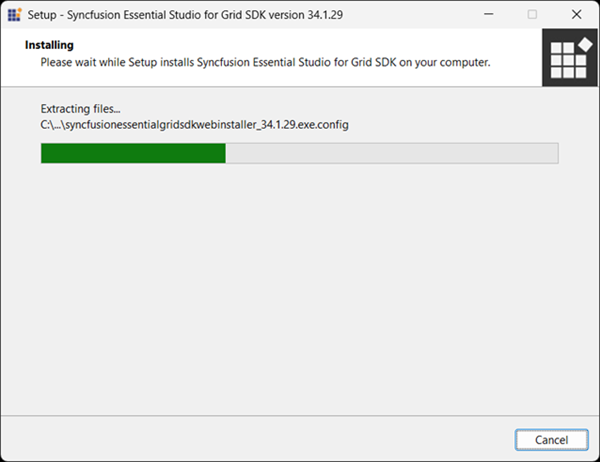

   N> The installer wizard extracts the `syncfusionessentialgridsdkwebinstaller_<version>.exe` file and displays the package's unzip progress.

2. The welcome wizard appears. Click **Next**.

   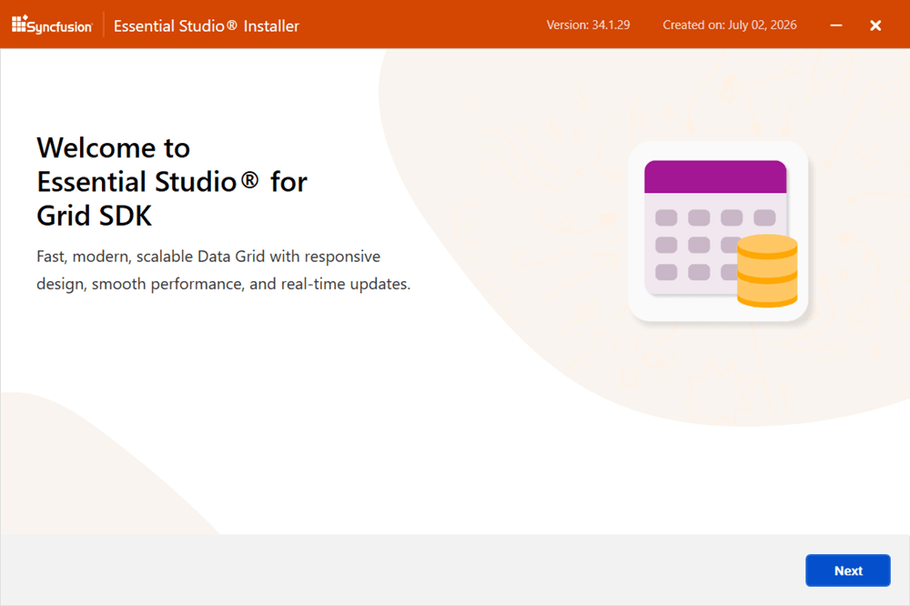

3. The Platform Selection wizard appears. From the **Available** tab, select the products to install. To install all products, select the **Install All** check box.

   **Available**

   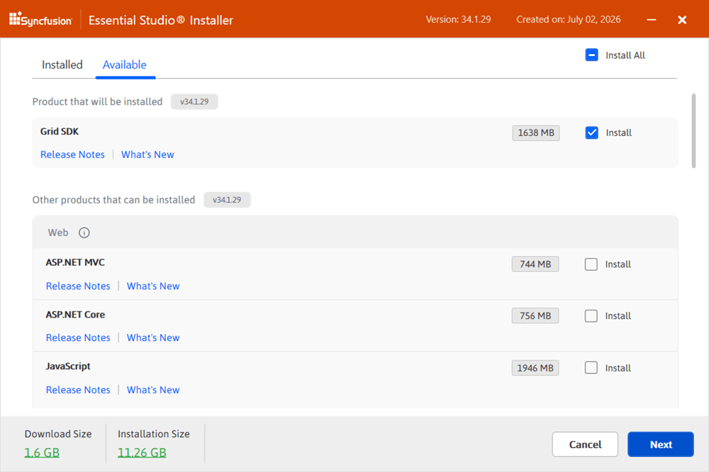

   If you have multiple products installed in the same version, they are listed under the **Installed** tab. You can also select which products to uninstall from the same version. Click **Next**.

   **Installed**

   

   I> If the required software for the selected product is not already installed, the **Additional Software Required** alert appears. You can continue the installation and install the necessary software later.

   **Required Software**

   

4. If previous versions of the selected products are installed, the **Uninstall Previous Version** wizard is displayed. The list shows the previously installed versions for the products you selected. To remove all versions, select the **Uninstall All** check box. Click **Next**.

   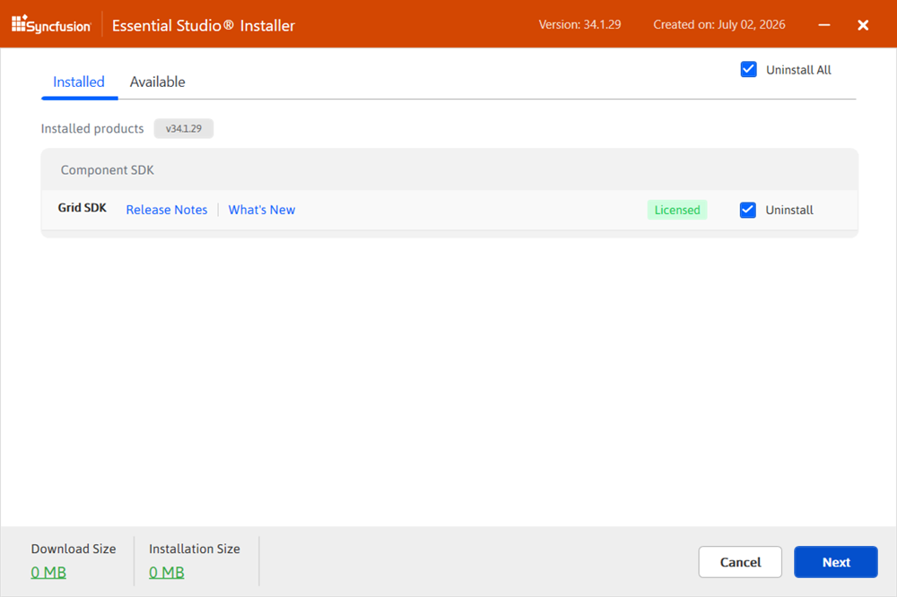

   N> From the 2021 Volume 1 release (v18.1) onward, the installer can remove previous versions of the same product during installation. Earlier versions must be uninstalled manually.

5. A pop-up appears to confirm the uninstallation of the selected previous versions.

   

6. The Confirmation wizard appears with the list of products to install and uninstall. You can view and modify the list from this page.

   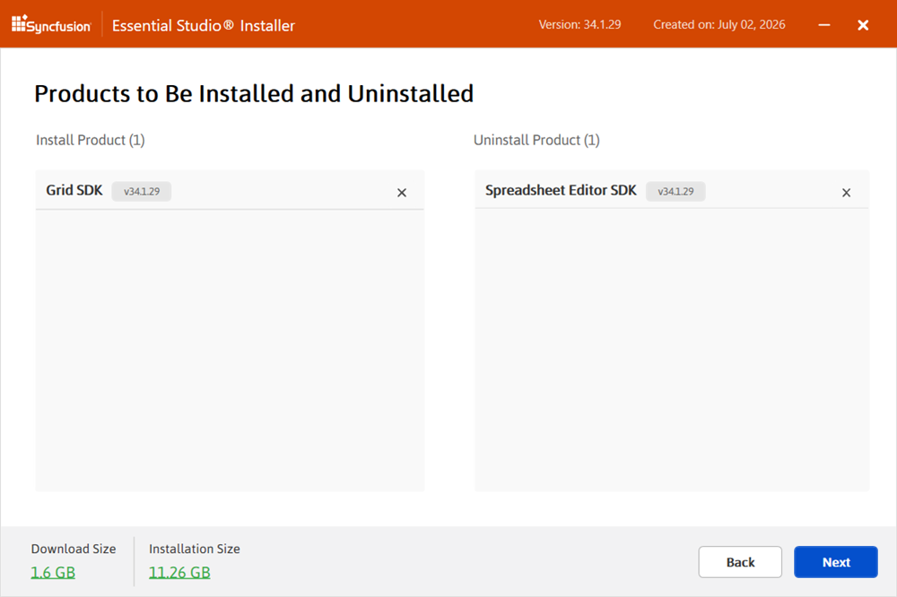

   N> Click the **Download Size** and **Installation Size** links to determine the approximate size of the download and installation.

7. The Configuration wizard appears. You can change the **Download**, **Install**, and **Demos** locations from here. You can also change the **Additional Settings** on a product-by-product basis. Click **Install** to install with the default settings.

   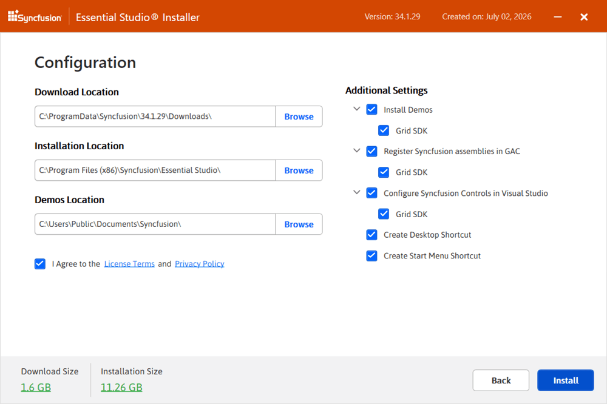

   **Additional Settings**

   * **Install Demos** – Select to install the Syncfusion sample applications, or clear the check box to skip sample installation.
   * **Register Syncfusion Assemblies in GAC** – Select to install the latest Syncfusion assemblies in the Global Assembly Cache (GAC), or clear the check box to skip GAC registration. Required by some older .NET Framework projects.
   * **Configure Syncfusion controls in Visual Studio** – Select to add the Syncfusion controls to the Visual Studio toolbox, or clear the check box to skip toolbox configuration. Requires **Register Syncfusion Assemblies in GAC** to be enabled.
   * **Configure Syncfusion Extensions controls in Visual Studio** – Select to install the Syncfusion Visual Studio extensions, or clear the check box to skip extension installation.
   * **Create Desktop Shortcut** – Select to add a desktop shortcut for the Syncfusion Control Panel.
   * **Create Start Menu Shortcut** – Select to add a Start menu shortcut for the Syncfusion Control Panel.

8. After reading the License Terms and Privacy Policy, select the **I agree to the License Terms and Privacy Policy** check box. Click **Next**.

9. The login wizard appears. Enter your Syncfusion email address and password. If you do not already have a Syncfusion account, click **Create an Account** to sign up. If you have forgotten your password, click **Forgot Password** to reset it. Click **Install**.

   

   I> The products you selected are installed based on your Syncfusion license (Trial or Licensed).

10. The download and installation progress is displayed.

    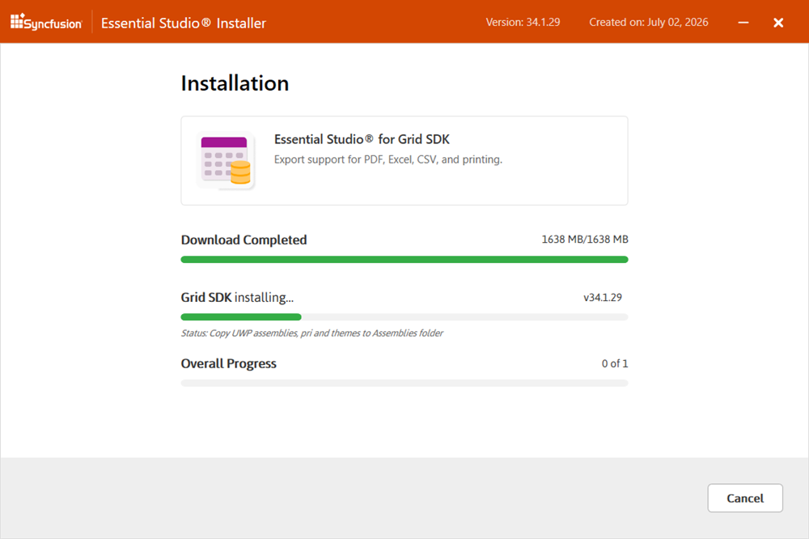

11. When the installation is complete, the **Summary** wizard appears. It shows the list of products that have been installed successfully and those that have failed. Click **Finish** to close the Summary wizard.

    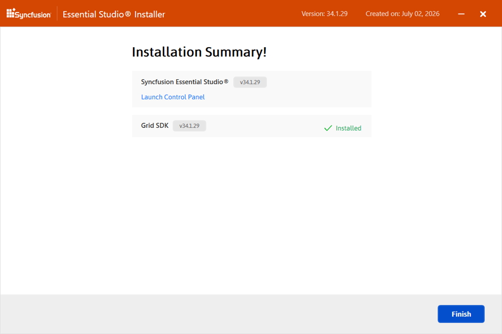

    * To open the Syncfusion Control Panel, click **Launch Control Panel**.

12. After installation, there will be two Syncfusion control panel entries, as shown below. The Essential Studio entry will manage all Syncfusion products installed in the same version, while the Product entry will only uninstall the specific product setup.

    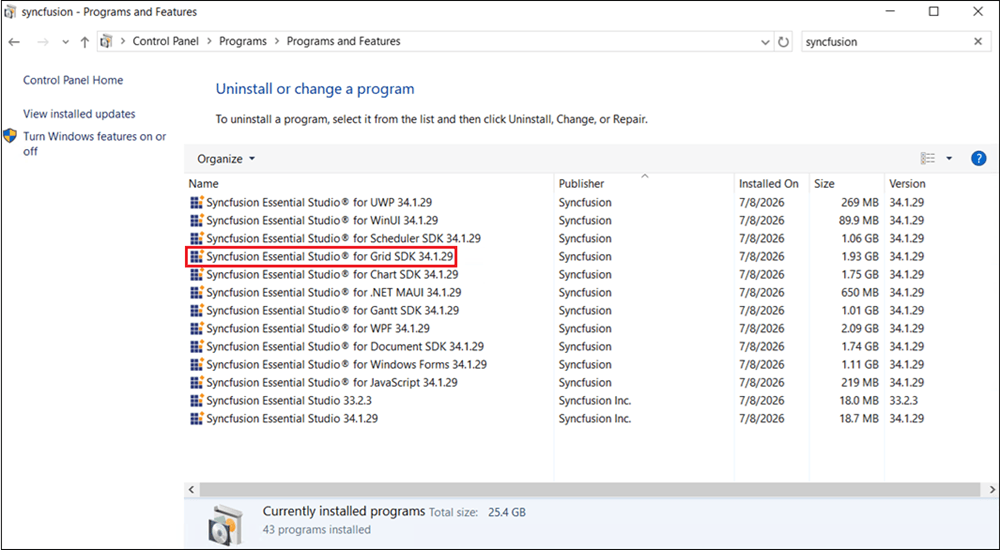
	
	
	
## Uninstallation

The Grid SDK Web Installer can be uninstalled in two ways:

* **Option 1:** Uninstall the Grid SDK using the Syncfusion Grid SDK Web Installer.
* **Option 2:** Uninstall the Grid SDK from the Windows Control Panel.

### Option 1: Uninstall the Grid SDK Using the Syncfusion Grid SDK Web Installer

You can uninstall products of the same version directly from the Web Installer application. The Web Installer removes them one at a time.

1. Open the Syncfusion Grid SDK Web Installer file by double-clicking it. The welcome wizard appears.
2. Click **Next**.
3. The Platform Selection wizard appears. From the **Installed** tab, select the products to uninstall. To select all products, check the **Uninstall All** check box. Click **Next**.

   **Installed**

   

### Option 1: Uninstall the Grid SDK Processing from Windows Control Panel

You can uninstall all the installed products by selecting the Syncfusion® Essential Studio {version} entry (element 1 in the below screenshot) from the Windows control panel, or you can uninstall Grid SDK Processing alone by selecting the Syncfusion® Essential Studio for Grid SDK Processing {version} entry (element 2 in the below screenshot) from the Windows control panel.

	
N> If the **Syncfusion Essential Studio for Grid SDK {version}** entry is selected from the Windows control panel, the Syncfusion Essential Studio Grid SDK alone will be removed and the below default MSI uninstallation window will be displayed.	

1.  The Syncfusion Grid SDK Web Installer's welcome wizard will be displayed. Click the Next button
	
    
	
2.  The Platform Selection Wizard will appear. From the **Installed** tab, select the products to be uninstalled. To select all products, check the **Uninstall All** checkbox. Click the Next button.
    
	<em>**Installed**</em>
	
	
	
	You can also select the products to be installed from the **Available** tab.Click the Next button.
	
	<em>**Available**</em>
	
	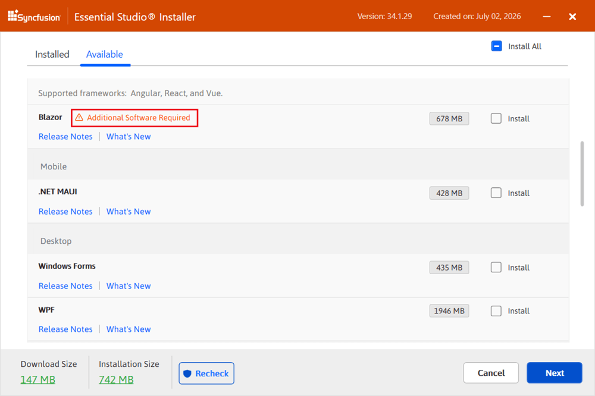
	
3.  If any other products selected for installation, Uninstall previous version wizard will be displayed with previous version(s) installed for the selected products. Here you can view the list of installed previous versions for the selected products. Select **Uninstall All** checkbox to select all the versions. Click Next.

	
	
4.	Pop up screen will be displayed to get the confirmation to uninstall selected previous versions.

		
	
5.  The Confirmation Wizard will appear with the list of products to be installed/uninstalled. Here you can view and modify the list of products that will be installed/uninstalled.

   

7. The Configuration wizard appears. You can change the **Download**, **Install**, and **Demos** locations from here. You can also change the **Additional Settings** on a product-by-product basis. Click **Install** to install with the default settings.

   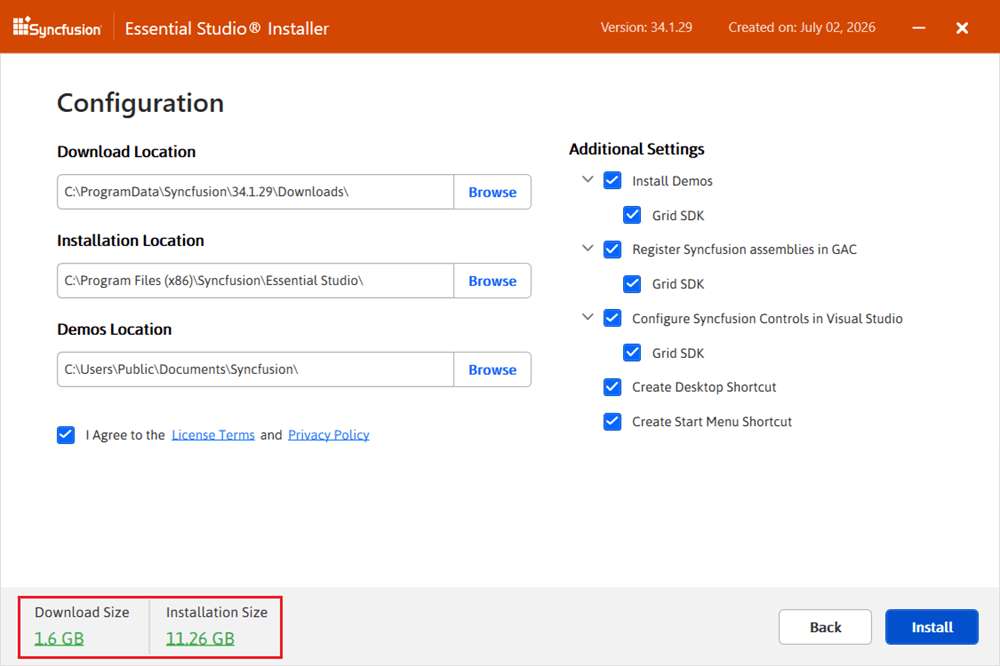

8. After reading the License Terms and Privacy Policy, select the **I agree to the License Terms and Privacy Policy** check box. Click **Next**.

9. The login wizard appears. Enter your Syncfusion email address and password. Click **Install**.

   

10. The download, installation, and uninstallation progress is displayed.

    

11. When the process is complete, the **Summary** wizard appears. It shows the list of products that have been installed and uninstalled successfully and those that have failed. Click **Finish** to close the Summary wizard.

10.	When the installation is finished, the **Summary** wizard will appear. Here you can see the list of products that have been successfully and unsuccessfully installed/uninstalled. To close the Summary wizard, click Finish.

    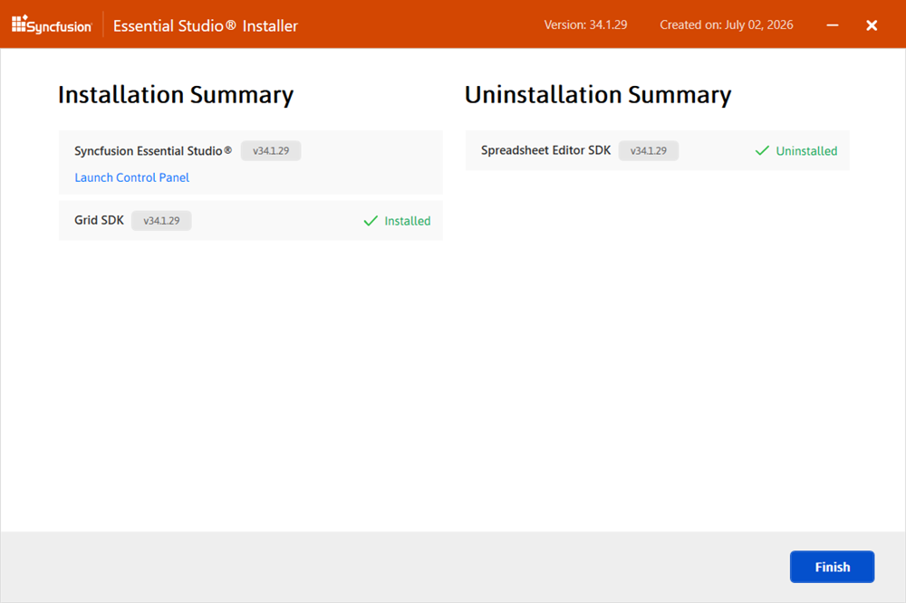
	
	* To open the Syncfusion Control Panel, click **Launch Control Panel**.