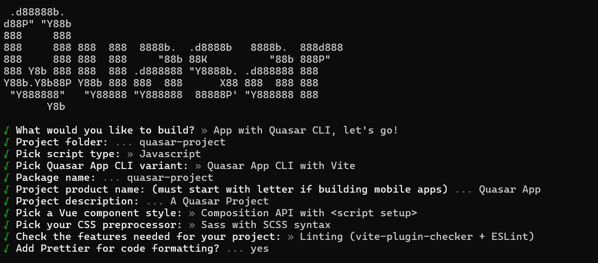
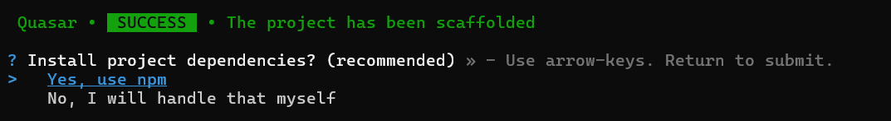

# Getting Started with Vue Data Grid Component in Quasar Framework

A step-by-step guide for setting up a [Quasar](https://quasar.dev/) project and integrating the [Vue Data Grid](https://www.syncfusion.com/vue-components/vue-grid) component using the [Composition API](https://vuejs.org/guide/introduction.html#composition-api).

The `Quasar` Framework is a Vue.js-based open-source framework that empowers developers to create high-performance and responsive applications across various platforms, such as web, mobile, and desktop.

## Prerequisites

* Vue supported version >= `2.6+`.
* Required [Node.js](https://nodejs.org/en/) version >= `16+`.

## Setup the Quasar project

To initiate the creation of a new [Quasar](https://quasar.dev/start/quick-start/) project, use the following commands:

```bash
npm init quasar
```

This command prompts additional configurations. The following steps are outlined in the images below:



This generates the necessary files and prompts for project dependency installation. Responding with "yes" proceeds with npm install, as shown in the image below:



Navigate to the project directory:

```bash
cd quasar-project
```

The `quasar-project` is now ready to run with default settings. Next, the Vue Data Grid component is added to the project.

## Add Vue Data Grids package

To install the Grids package, use the following command:

```bash
npm install @syncfusion/ej2-vue-grids --save
```

## Adding CSS reference

Themes for Syncfusion<sup style="font-size:70%">&reg;</sup> Data Grid components can be applied using CSS files provided through [npm theme packages](https://www.npmjs.com/package/@syncfusion/ej2-material3-theme). For available themes, refer to the [Themes](https://ej2.syncfusion.com/vue/documentation/appearance/theme) documentation.

Install the **Material 3** theme package using the following command:




npm install @syncfusion/ej2-material3-theme --save




Then add the following CSS reference to the **src/App.vue** file:




<style>
    @import "../node_modules/@syncfusion/ej2-material3-theme/styles/grid/index.css";
</style>




## Adding DataGrid component

The DataGrid code should be added in the **src/App.vue** file.




<template>
  <ejs-grid :dataSource='data' :width="1000">
    <e-columns>
      <e-column field='OrderID' textAlign="Center"></e-column>
      <e-column field='CustomerID' textAlign="Center"></e-column>
      <e-column field='EmployeeID' textAlign="Center"></e-column>
      <e-column field='Freight' format="C2" textAlign="Center"></e-column>
      <e-column field='ShipCountry' textAlign="Center"></e-column>
    </e-columns>
  </ejs-grid>
</template>

<script setup>
import { GridComponent as EjsGrid, ColumnsDirective as EColumns, ColumnDirective as EColumn } from '@syncfusion/ej2-vue-grids';
const data = [
  {
    OrderID: 10248, CustomerID: 'VINET', EmployeeID: 5, ShipCountry: 'France', Freight: 32.38 
  },
  {
    OrderID: 10249, CustomerID: 'TOMSP', EmployeeID: 6, ShipCountry: 'Germany', Freight: 11.61 
  },
  {
    OrderID: 10250, CustomerID: 'HANAR', EmployeeID: 4, ShipCountry: 'Brazil', Freight: 65.83 
  }
];
</script>

<style>
@import "../node_modules/@syncfusion/ej2-base/styles/material3.css";
@import "../node_modules/@syncfusion/ej2-buttons/styles/material3.css";
@import "../node_modules/@syncfusion/ej2-calendars/styles/material3.css";
@import "../node_modules/@syncfusion/ej2-dropdowns/styles/material3.css";
@import "../node_modules/@syncfusion/ej2-inputs/styles/material3.css";
@import "../node_modules/@syncfusion/ej2-navigations/styles/material3.css";
@import "../node_modules/@syncfusion/ej2-popups/styles/material3.css";
@import "../node_modules/@syncfusion/ej2-splitbuttons/styles/material3.css";
@import "../node_modules/@syncfusion/ej2-vue-grids/styles/material3.css";
</style>




## Run the application

```bash
npm run dev
```

The output will appear as follows:

