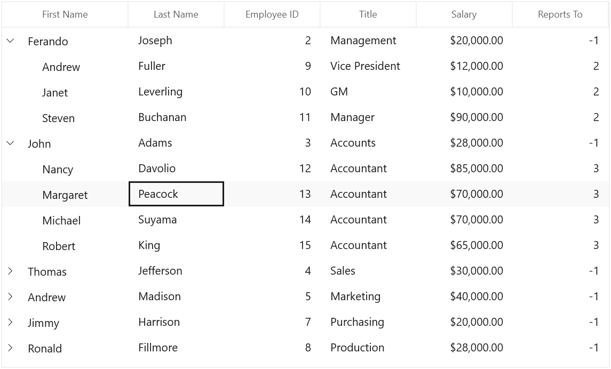

# WinUI TreeGrid Overview

The Syncfusion® [WinUI TreeGrid](https://www.syncfusion.com/winui-controls/treegrid) is a data-oriented control that displays self-relational data in a tree-structure user interface like a multicolumn tree view. The data can be loaded on demand. The control's rich feature set includes editing with different column types, selection, and node selection with check boxes, sorting, and filtering. 

* **Data binding** – Supports to bind different types of data sources.
* **Columns** – Support for various column types including unbound columns.
* **Editing** – Various built-in and template column types handle different types of data.
* **Sorting** – Sort one or more columns by tapping a header.
* **Filtering** – Filter the data using an intuitive, built-in, Excel-inspired filtering UI.
* **Selection** - Select rows or cells in a similar way to Excel for all keyboard navigations.
* **Data validation** – Support to validate the data on errors.
* **Styling** – Extensive support for customizing styles of cells and rows in SfTreeGrid.
* **Stacked Headers** – Extensive support to show multiple headers called stacked headers.

