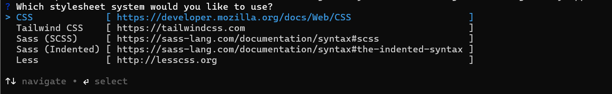
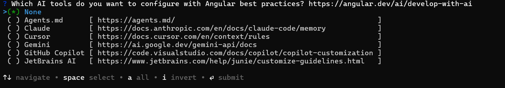

# Getting Started with the Angular Block Editor Component

This guide explains how to create a default Block Editor component in a new Angular application.

## Prerequisites

Before you begin, ensure the following are installed:

- **Node.js** (v18 or later) — required by the Angular CLI.
- **Angular CLI** (v14 or later) — required for the standalone components used in this guide.

## Set up Angular Environment

Use the [Angular CLI](https://github.com/angular/angular-cli) to set up your Angular applications. Angular CLI requires Node.js v18 or later. To install the Angular CLI globally, run the following command.

```
npm install -g @angular/cli
```

## Create an Angular Application

1. Run the following Angular CLI command to create a new application:

    ```bash
    ng new my-app
    ```

2. When prompted for the stylesheet format, accept the default (CSS) or choose another option:

    

3. When prompted to enable Server-Side Rendering (SSR) and Static Site Generation (SSG), select the appropriate configuration:

    

4. When prompted to configure AI tooling, select any preferred option based on the development workflow:

    

5. Navigate to the project folder:

    ```bash
    cd my-app
    ```

## Add Syncfusion<sup style="font-size:70%">&reg;</sup> Block Editor Packages

All available Essential JS 2 packages are published in the [npmjs.com](https://www.npmjs.com/~syncfusionorg) registry. The `@syncfusion/ej2-angular-blockeditor` package supports Angular 14 and later. Install the Block Editor component with the following command:

```bash
npm install @syncfusion/ej2-angular-blockeditor
```

## Add CSS Reference

Syncfusion provides multiple themes for the Block Editor component. For a complete list of available themes, refer to the [themes packages](https://ej2.syncfusion.com/angular/documentation/appearance/overview#theme-packages).

Install a Syncfusion theme package to provide the required styles. The following example installs the [Material 3](https://www.npmjs.com/package/@syncfusion/ej2-material3-theme) theme:

```bash
npm install @syncfusion/ej2-material3-theme --save
```

To render the Block Editor component, add the following import in the [src/styles.css] file to load all required dependency styles:

```css
@import '../node_modules/@syncfusion/ej2-material3-theme/styles/blockeditor/index.css';
```

## Add Syncfusion Block Editor Component

Modify the template in the `src/app/app.ts` file to render the Block Editor component. Add the Angular Block Editor by using the `<ejs-blockeditor>` selector in the `template` section of the `app.ts` file.

The following example shows a default Block Editor component.













>  **Note:** Angular CLI 21 and later generates the root component as `src/app/app.ts`. Earlier Angular CLI versions use `src/app/app.component.ts`.

## Run the Application

Run the application in the browser using the following command:

```
ng serve --open
```

