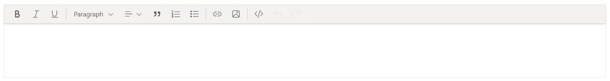

# Getting Started with ASP.NET Core Markdown Editor Control

The [ASP.NET Core Markdown Editor](https://www.syncfusion.com/rich-text-editor-sdk/aspnet-core-rich-text-editor)is a web-based editor that enables users to create, edit, and format Markdown content with features such as table support and structured content formatting. This section briefly explains about how to include [ASP.NET Core Markdown Editor](https://www.syncfusion.com/rich-text-editor-sdk/aspnet-core-rich-text-editor) control in your ASP.NET Core application using [Visual Studio](https://visualstudio.microsoft.com/vs/).

## Create an ASP.NET Core Web App with Razor pages

Create an **ASP.NET Core Web App** using Visual Studio via [Microsoft Templates](https://learn.microsoft.com/en-us/aspnet/core/tutorials/razor-pages/razor-pages-start?view=aspnetcore-10.0&tabs=visual-studio#create-a-razor-pages-web-app) or the [Syncfusion® ASP.NET Core Extension](https://ej2.syncfusion.com/aspnetcore/documentation/visual-studio-integration/create-project). For detailed instructions, refer to the [ASP.NET Core Web App Getting Started](https://ej2.syncfusion.com/aspnetcore/documentation/getting-started/razor-pages) documentation.

## Install the required ASP.NET Core packages

To add [ASP.NET Core Markdown Editor](https://www.syncfusion.com/rich-text-editor-sdk/aspnet-core-rich-text-editor) control in the app, open the NuGet package manager in Visual Studio *(Tools → NuGet Package Manager → Manage NuGet Packages for Solution)*, search for and install the [Syncfusion.AspNetCore.RichTextEditor](https://www.nuget.org/packages/Syncfusion.AspNetCore.RichTextEditor/) and [Syncfusion.AspNetCore.Themes](https://www.nuget.org/packages/Syncfusion.AspNetCore.Themes/) packages. All Syncfusion ASP.NET Core packages are available in [nuget.org](https://www.nuget.org/packages?q=syncfusion.EJ2). See the [NuGet packages](https://ej2.syncfusion.com/aspnetcore/documentation/nuget-packages) topic for details.

Alternatively, you can install the same package using the Package Manager Console with the following commands.




Install-Package Syncfusion.AspNetCore.RichTextEditor -Version {{ site.releaseversion }}
Install-Package Syncfusion.AspNetCore.Themes -Version {{ site.releaseversion }}


 

## Add the ASP.NET Core Tag Helpers

After the packages are installed, open the **~/Pages/_ViewImports.cshtml** file and import the `Syncfusion.AspNetCore.Base` and `Syncfusion.AspNetCore.RichTextEditor` Tag Helpers.




@addTagHelper *, Syncfusion.AspNetCore.Base
@addTagHelper *, Syncfusion.AspNetCore.RichTextEditor




## Add stylesheet and script resources

The theme stylesheet and script can be referenced from [CDN](https://ej2.syncfusion.com/aspnetcore/documentation/appearance/theme#cdn-reference). Include the [stylesheet](https://ej2.syncfusion.com/aspnetcore/documentation/appearance/theme) and [script references](https://ej2.syncfusion.com/aspnetcore/documentation/common/adding-script-references) inside the `<head>` of **~/Pages/Shared/_Layout.cshtml** 




<head>
    ...
    <!-- ASP.NET Core controls styles -->
    <link rel="stylesheet" href="_content/Syncfusion.AspNetCore.Themes/styles/fluent2.css" />
    <!-- ASP.NET Core controls scripts -->
    
</head>




## Register the Script Manager

Open the **~/Pages/Shared/_Layout.cshtml** file and register the script manager `<ejs-scripts>` at the end of the `<body>` element as follows.




<body>
    ...
    <!-- ASP.NET Core Script Manager -->
    <ejs-scripts></ejs-scripts>
</body>




## Add ASP.NET Core Markdown Editor control

Add the [ASP.NET Core Markdown Editor](https://www.syncfusion.com/rich-text-editor-sdk/aspnet-core-rich-text-editor) control in the **~/Pages/Index.cshtml** file.




<ejs-richtexteditor id="editor" editorMode="Markdown"></ejs-richtexteditor>




I> When the Markdown Editor control is rendered, the `id` attribute must be provided; otherwise, the control will fail to render.

## Run the application

Press <kbd>Ctrl</kbd>+<kbd>F5</kbd> (Windows) or <kbd>⌘</kbd>+<kbd>F5</kbd> (macOS) to launch the application. The [ASP.NET Core Markdown Editor](https://www.syncfusion.com/rich-text-editor-sdk/aspnet-core-rich-text-editor) control will render in your default web browser.

> [View Sample in GitHub](https://github.com/SyncfusionExamples/ASP-NET-Core-Getting-Started-Examples/tree/main/RichTextEditor/ASP.NET%20Core%20Tag%20Helper%20Examples).

## See Also

1. [Getting Started with ASP.NET Core using Razor Pages](https://ej2.syncfusion.com/aspnetcore/documentation/getting-started/razor-pages)
2. [Getting Started with ASP.NET Core MVC using Tag Helper](https://ej2.syncfusion.com/aspnetcore/documentation/getting-started/aspnet-core-mvc-taghelper)
3. [Blog posting using Rich Text Editor](https://ej2.syncfusion.com/aspnetcore/RichTextEditor/Forums#/bootstrap5)
4. [How to change the editor type](https://ej2.syncfusion.com/aspnetcore/documentation/rich-text-editor/editor-types/editor-mode)
5. [How to render the iframe](https://ej2.syncfusion.com/aspnetcore/documentation/rich-text-editor/editor-types/iframe)
6. [Accessibility in Rich Text Editor](https://ej2.syncfusion.com/aspnetcore/documentation/rich-text-editor/accessibility)
7. [Keyboard support in Rich Text Editor](https://ej2.syncfusion.com/aspnetcore/documentation/rich-text-editor/keyboard-support)
8. [Globalization in Rich Text Editor](https://ej2.syncfusion.com/aspnetcore/documentation/rich-text-editor/globalization)
