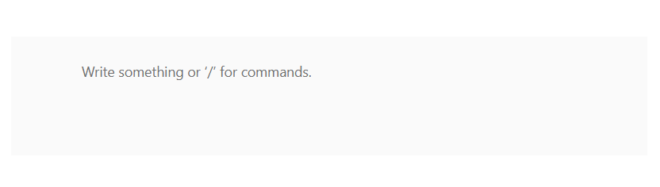

# Getting Started with ASP.NET MVC Block Editor Control

This section briefly explains how to include the `ASP.NET MVC Block Editor` control in your ASP.NET MVC application using Visual Studio.

## Prerequisites

- Visual Studio 2019 or later
- .NET Framework 4.5.2 or later
- [System requirements for ASP.NET MVC controls](https://ej2.syncfusion.com/aspnetmvc/documentation/system-requirements)

## Create an ASP.NET MVC Application

You can create an ASP.NET MVC web application in one of two ways. Choose one of the options below to create your project:

* [Create a project using Microsoft templates](https://learn.microsoft.com/en-us/aspnet/mvc/overview/getting-started/introduction/getting-started#create-your-first-app)
* [Create a project using the Syncfusion<sup style="font-size:70%">&reg;</sup> ASP.NET MVC extension](https://ej2.syncfusion.com/aspnetmvc/documentation/visual-studio-integration/create-project)

W> **Important:** W> **Important:** Syncfusion® ASP.NET MVC controls require `System.Web.Mvc` version **5.3.0**. Using earlier versions may result in runtime or build errors. For more information, refer to the [release notes](https://ej2.syncfusion.com/aspnetmvc/documentation/release-notes/30.1.37?type=all). ASP.NET MVC controls require `System.Web.Mvc` version **5.3.0** or later. Using earlier versions may result in runtime or build errors. For more information, refer to the [release notes](https://ej2.syncfusion.com/aspnetmvc/documentation/release-notes/30.1.37?type=all).


N> Refer to the [licensing topic](https://help.syncfusion.com/common/essential-studio/licensing/overview) to learn how to generate and register a license key.

## Install the Syncfusion ASP.NET MVC Package

Add the Syncfusion<sup style="font-size:70%">&reg;</sup> Block Editor to your ASP.NET MVC application by installing the required NuGet package. This can be done in one of two ways, as described below.

### 1. Using the NuGet Package Manager

Open Visual Studio and navigate to **Tools → NuGet Package Manager → Manage NuGet Packages for Solution**. Search for [Syncfusion.AspNetMvc.BlockEditor](https://www.nuget.org/packages/Syncfusion.AspNetMvc.BlockEditor) and install it directly.

### 2. Using the Package Manager Console

Run the following command in the Package Manager Console:




Install-Package Syncfusion.AspNetMvc.BlockEditor -Version 34.1.31




I> Ensure you run this command inside Visual Studio's Package Manager Console (**Tools → NuGet Package Manager → Package Manager Console**), not in an external terminal such as CMD or PowerShell.

N> Syncfusion<sup style="font-size:70%">&reg;</sup> ASP.NET MVC controls are available on [nuget.org](https://www.nuget.org/packages?q=syncfusion). Refer to the [NuGet packages topic](https://ej2.syncfusion.com/aspnetmvc/documentation/nuget-packages) to learn more about installing NuGet packages across various OS environments. The `Syncfusion.AspNetMvc.BlockEditor` package depends on [Newtonsoft.Json](https://www.nuget.org/packages/Newtonsoft.Json/) for JSON serialization and [Syncfusion.Licensing](https://www.nuget.org/packages/Syncfusion.Licensing/) for validating the Syncfusion<sup style="font-size:70%">&reg;</sup> license key. Verify that the installed package version is compatible with `System.Web.Mvc 5.3.0` or later.

## Add Namespace References

Add the following namespace references in `Web.config` under the `Views` folder:

```
<namespaces>
    <add namespace="Syncfusion.EJ2"/>
    <add namespace="Syncfusion.AspNetMvc.BlockEditor"/>
</namespaces>
```

## Add stylesheet and script resources

Here, the theme and script is referred using CDN inside the `<head>` of `~/Pages/Shared/_Layout.cshtml` file as follows,




<head>
    ...
    <!-- Syncfusion ASP.NET MVC controls styles -->
    <link rel="stylesheet" href="https://cdn.syncfusion.com/ej2/{{ site.ej2version }}/fluent2.css" />
    <!-- Syncfusion ASP.NET MVC controls scripts -->
    <script src="https://cdn.syncfusion.com/ej2/{{ site.ej2version }}/dist/ej2.min.js"></script>
</head>




N> Replace `34.1.31` with the exact package version you installed if it differs. Checkout the [Themes topic](https://ej2.syncfusion.com/aspnetmvc/documentation/appearance/theme) to learn different ways (CDN, NPM package, and [CRG](https://ej2.syncfusion.com/aspnetmvc/documentation/common/custom-resource-generator)) to reference styles in an ASP.NET MVC application. Checkout the [Adding Script Reference](https://ej2.syncfusion.com/aspnetmvc/documentation/common/adding-script-references) topic to learn different approaches for adding script references.

## Register the Syncfusion Script Manager

Also, register the script manager `EJS().ScriptManager()` at the end of `<body>` in the `~/Pages/Shared/_Layout.cshtml` file as follows.




<body>
...
    <!-- Syncfusion ASP.NET MVC Script Manager -->
    @Html.EJS().ScriptManager()
</body>




## Add the ASP.NET MVC Block Editor Control

Now, add the Syncfusion<sup style="font-size:70%">&reg;</sup> ASP.NET MVC Block Editor control in `~/Views/Home/Index.cshtml` page.










I> Replace the existing content in `Index.cshtml` with the code snippet above.

I> The `id` attribute is required when rendering the Block Editor control. If the `id` is not provided, the control will fail to render.

## Run the Application

Press <kbd>Ctrl</kbd>+<kbd>F5</kbd> (Windows) or <kbd>⌘</kbd>+<kbd>F5</kbd> (macOS) to build and run the application. Once the build succeeds, your default browser opens automatically and displays the page containing the Block Editor control, as shown below.



