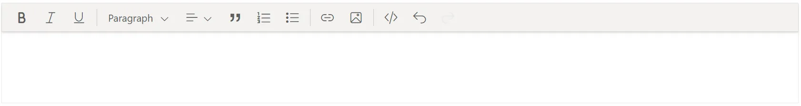

# Getting Started with ASP.NET MVC Rich Text Editor Control

The [ASP.NET MVC Rich Text Editor](https://www.syncfusion.com/rich-text-editor-sdk/aspnet-mvc-rich-text-editor) is a WYSIWYG (What You See Is What You Get) editor that enables users to create, edit, and format rich text content with features like multimedia insertion, lists, and links. This section briefly explains how to include [ASP.NET MVC Rich Text Editor](https://www.syncfusion.com/rich-text-editor-sdk/aspnet-mvc-rich-text-editor) control in your ASP.NET MVC application using [Visual Studio](https://visualstudio.microsoft.com/vs/).

> **Ready to streamline your ASP.NET MVC development?** Discover the full potential of ASP.NET MVC controls with AI Coding Assistant. Effortlessly integrate, configure, and enhance your projects with intelligent, context-aware code suggestions, streamlined setups, and real-time insights—all seamlessly integrated into your preferred AI-powered IDEs like Visual Studio, Visual Studio Code, Cursor, CodeStudio and more. [Explore AI Coding Assistant](https://ej2.syncfusion.com/aspnetmvc/documentation/ai-coding-assistant/overview)

## Create an ASP.NET MVC Web App with HTML Helper

Create an **ASP.NET MVC Web App** using Visual Studio via [Microsoft Templates](https://learn.microsoft.com/en-us/aspnet/mvc/overview/getting-started/introduction/getting-started#create-your-first-app) or the [ASP.NET MVC Extension](https://ej2.syncfusion.com/aspnetmvc/documentation/visual-studio-integration/create-project). For detailed instructions, refer to the [ASP.NET MVC Getting Started](https://ej2.syncfusion.com/aspnetmvc/documentation/getting-started/aspnet-mvc-htmlhelper) documentation.

## Install the required ASP.NET MVC package

To add [ASP.NET MVC Rich Text Editor](https://www.syncfusion.com/rich-text-editor-sdk/aspnet-mvc-rich-text-editor) control in the app, open the NuGet package manager in Visual Studio *(Tools → NuGet Package Manager → Manage NuGet Packages for Solution)*, search for and install the [Syncfusion.AspNetMvc.RichTextEditor](https://www.nuget.org/packages/Syncfusion.AspNetMvc.RichTextEditor/) package. All Syncfusion ASP.NET MVC packages are available in [nuget.org](https://www.nuget.org/packages?q=syncfusion.EJ2). See the [NuGet packages](https://ej2.syncfusion.com/aspnetmvc/documentation/nuget-packages) topic for details.

Alternatively, you can install the same package using the Package Manager Console with the following command.




Install-Package Syncfusion.AspNetMvc.RichTextEditor -Version {{ site.releaseversion }}




## Add the Namespace

After the package is installed, open the **~/Views/Web.config** file and import the `Syncfusion.EJ2` namespace.




<namespaces>
    <add namespace="Syncfusion.EJ2"/>
</namespaces>




## Add stylesheet and script resources

The theme stylesheet and script can be referenced from the [CDN](https://ej2.syncfusion.com/aspnetmvc/documentation/appearance/theme#cdn-reference). Include the [stylesheet](https://ej2.syncfusion.com/aspnetmvc/documentation/appearance/theme) and [script references](https://ej2.syncfusion.com/aspnetmvc/documentation/common/adding-script-references) inside the `<head>` of **~/Views/Shared/_Layout.cshtml**.




<head>
    ...
    <!-- ASP.NET MVC controls styles -->
    <link rel="stylesheet" href="https://cdn.syncfusion.com/ej2/{{ site.ej2version }}/fluent2.css" />
    <!-- ASP.NET MVC controls scripts -->
    
</head>




## Register the script manager

Open the **~/Views/Shared/_Layout.cshtml** file and register the script manager `EJS().ScriptManager()` at the end of the `<body>` element as follows.




<body>
...
    <!-- ASP.NET MVC Script Manager -->
    @Html.EJS().ScriptManager()
</body>




## Add ASP.NET MVC Rich Text Editor control

Add the [ASP.NET MVC Rich Text Editor](https://www.syncfusion.com/rich-text-editor-sdk/aspnet-mvc-rich-text-editor) control in the **~/Views/Home/Index.cshtml** file.




@Html.EJS().RichTextEditor("editor").Render()




I> Replace the existing content in the `Index.cshtml` file with the above code snippet. Ensure that the Rich Text Editor control is assigned a valid ID (for example, `"editor"`), as the control will not render without it.

## Run the Application

Press <kbd>Ctrl</kbd>+<kbd>F5</kbd> (Windows) or <kbd>⌘</kbd>+<kbd>F5</kbd> (macOS) to launch the application. The [ASP.NET MVC Rich Text Editor](https://www.syncfusion.com/rich-text-editor-sdk/aspnet-mvc-rich-text-editor) control will render in your default web browser.

N> [View Sample in GitHub](https://github.com/SyncfusionExamples/ASP-NET-MVC-Getting-Started-Examples/tree/main/RichTextEditor/ASP.NET%20MVC%20Razor%20Examples).

## See Also

1. [Getting Started with ASP.NET MVC using HTML Helper](https://ej2.syncfusion.com/aspnetmvc/documentation/getting-started/aspnet-mvc-htmlhelper)
2. [Getting Started with ASP.NET Core MVC using Tag Helper](https://ej2.syncfusion.com/aspnetmvc/documentation/getting-started/aspnet-core-mvc-taghelper)
3. [How to change the editor type](https://ej2.syncfusion.com/aspnetmvc/documentation/rich-text-editor/editor-types/editor-mode)
4. [How to render the iframe](https://ej2.syncfusion.com/aspnetmvc/documentation/rich-text-editor/editor-types/iframe)
5. [How to render the toolbar in inline mode](https://ej2.syncfusion.com/aspnetmvc/documentation/rich-text-editor/editor-types/inline-editing)
6. [Accessibility in Rich Text Editor](https://ej2.syncfusion.com/aspnetmvc/documentation/rich-text-editor/accessibility)
7. [Keyboard support in Rich Text Editor](https://ej2.syncfusion.com/aspnetmvc/documentation/rich-text-editor/keyboard-support)
8. [Globalization in Rich Text Editor](https://ej2.syncfusion.com/aspnetmvc/documentation/rich-text-editor/globalization)