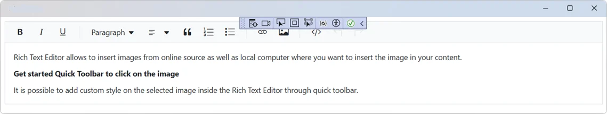
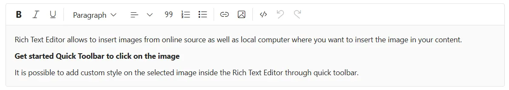

# Getting Started with Blazor Rich Text Editor

This section provides a step-by-step guide to integrating the [Blazor Rich Text Editor](https://www.syncfusion.com/rich-text-editor-sdk/blazor-rich-text-editor) component in your Blazor MAUI App using [Visual Studio](https://visualstudio.microsoft.com/vs/) and [Visual Studio Code](https://code.visualstudio.com/) and the [.NET CLI](https://learn.microsoft.com/en-us/dotnet/core/tools/).

> **Ready to streamline your Blazor development?**  Discover the full potential of Blazor components with AI Coding Assistants. Effortlessly integrate, configure, and enhance your projects with intelligent, context-aware code suggestions, streamlined setups, and real-time insights—all seamlessly integrated into your preferred AI-powered IDEs like VS Code, Cursor, CodeStudio and more. [Explore AI Coding Assistants](https://blazor.syncfusion.com/documentation/ai-coding-assistant/overview)

## Create a new Blazor MAUI App





Create a Blazor MAUI App using Visual Studio via [Microsoft Templates](https://learn.microsoft.com/en-us/dotnet/maui/get-started/first-app?pivots=devices-windows&view=net-maui-9.0&tabs=vswin). For detailed instructions, refer to the [Blazor MAUI App Getting Started](https://blazor.syncfusion.com/documentation/getting-started/maui-blazor-app) documentation.





Run the following command to create a new Blazor MAUI App.




dotnet new maui-blazor -o MauiBlazorApp
cd MauiBlazorApp




Alternatively, create a **Blazor MAUI App** using Visual Studio Code via [Microsoft Templates](https://learn.microsoft.com/en-us/dotnet/maui/get-started/first-app?pivots=devices-windows&view=net-maui-9.0&tabs=visual-studio-code) or the [Syncfusion® Blazor Extension](https://blazor.syncfusion.com/documentation/visual-studio-code-integration/create-project). For detailed instructions, refer to the [Blazor MAUI App Getting Started](https://blazor.syncfusion.com/documentation/getting-started/maui-blazor-app) documentation.





Run the following command to create a new Blazor MAUI App.




dotnet new maui-blazor -o MauiBlazorApp
cd MauiBlazorApp








## Install required Blazor packages

Install the [Syncfusion.Blazor.RichTextEditor](https://www.nuget.org/packages/Syncfusion.Blazor.RichTextEditor) and [Syncfusion.Blazor.Themes](https://www.nuget.org/packages/Syncfusion.Blazor.Themes) NuGet packages. All Syncfusion Blazor packages are available on [nuget.org](https://www.nuget.org/packages?q=syncfusion.blazor). See the [NuGet packages](https://blazor.syncfusion.com/documentation/nuget-packages) topic for details.





1. Go to *Tools → NuGet Package Manager → Manage NuGet Packages for Solution*.
2. Search the required NuGet packages (`Syncfusion.Blazor.RichTextEditor` and `Syncfusion.Blazor.Themes`) and install them.

Alternatively, you can install the same packages using the Package Manager Console with the following commands.




Install-Package Syncfusion.Blazor.RichTextEditor -Version {{ site.releaseversion }}
Install-Package Syncfusion.Blazor.Themes -Version {{ site.releaseversion }}








Open the terminal and run the following commands.




dotnet add package Syncfusion.Blazor.RichTextEditor -v {{ site.releaseversion }}
dotnet add package Syncfusion.Blazor.Themes -v {{ site.releaseversion }}








Open the command prompt and run the following commands.




dotnet add package Syncfusion.Blazor.RichTextEditor -v {{ site.releaseversion }}
dotnet add package Syncfusion.Blazor.Themes -v {{ site.releaseversion }}








## Add import namespaces

After the packages are installed, open the **~/Components/_Imports.razor** file and import the `Syncfusion.Blazor` and `Syncfusion.Blazor.RichTextEditor` namespaces.




@using Syncfusion.Blazor 
@using Syncfusion.Blazor.RichTextEditor




## Register Blazor service

Open the **MauiProgram.cs** file in Blazor MAUI App and register the Blazor service.




....
using Syncfusion.Blazor;

....

public static class MauiProgram
{
    public static MauiApp CreateMauiApp()
    {
        ....
        builder.Services.AddSyncfusionBlazor();
        ....
    }
}




## Add stylesheet and script resources

The theme stylesheet and script can be accessed from NuGet through [Static Web Assets](https://blazor.syncfusion.com/documentation/appearance/themes#static-web-assets). Include the [stylesheet](https://blazor.syncfusion.com/documentation/appearance/themes) and [script references](https://blazor.syncfusion.com/documentation/common/adding-script-references) in the **~wwwroot/index.html** file.




...
<link href="_content/Syncfusion.Blazor.Themes/fluent2.css" rel="stylesheet" />
...




## Add Blazor Rich Text Editor component

Open a Razor file located in the **~/Pages/*.razor** (for example, **Home.razor**) and add the [Blazor Rich Text Editor](https://www.syncfusion.com/rich-text-editor-sdk/blazor-rich-text-editor) component inside the razor file.




@using Syncfusion.Blazor.RichTextEditor

<SfRichTextEditor>
    
Rich Text Editor allows to insert images from online source as well as local computer where you want to insert the image in your content.

    
<b>Get started Quick Toolbar to click on the image</b>

    
It is possible to add custom style on the selected image inside the Rich Text Editor through quick toolbar.

</SfRichTextEditor>




## Run the application on Windows





Press <kbd>Ctrl</kbd>+<kbd>F5</kbd> (Windows) or <kbd>⌘</kbd>+<kbd>F5</kbd> (macOS) to launch the application. The [Blazor Rich Text Editor](https://www.syncfusion.com/rich-text-editor-sdk/blazor-rich-text-editor) component will render in your default web browser.





Open the terminal and run the following command.




dotnet run








Open the command prompt and run the following command.




dotnet run








## Run the application on Android

To run the Blazor Rich Text Editor in a Blazor Android MAUI application using the Android emulator, follow these steps:

1. Set up and start the Android emulator. For help, see the [Android Device Manager guide](https://learn.microsoft.com/en-us/dotnet/maui/android/emulator/device-manager#android-device-manager-on-windows).

2. Run your app using the emulator to view the Rich Text Editor.

N> If you encounter any errors while using the Android Emulator, refer to the [Troubleshooting Android Emulator](https://learn.microsoft.com/en-us/dotnet/maui/android/emulator/troubleshooting) for guidance.

## See also

1. [Getting Started with Blazor Web App](https://blazor.syncfusion.com/documentation/getting-started/blazor-web-app)
2. [Getting Started with Blazor Server App](https://blazor.syncfusion.com/documentation/getting-started/blazor-server-side-visual-studio)
3. [How to insert Emoticons](https://blazor.syncfusion.com/demos/rich-text-editor/insert-emoticons?theme=bootstrap5)
4. [Blog posting using Rich Text Editor](https://blazor.syncfusion.com/demos/rich-text-editor/usecase?theme=bootstrap5)
5. [Accessibility in Rich text editor](https://blazor.syncfusion.com/documentation/rich-text-editor/accessibility)
6. [Keyboard support in Rich text editor](https://blazor.syncfusion.com/documentation/rich-text-editor/keyboard-support)
7. [Globalization in Rich text editor](https://blazor.syncfusion.com/documentation/rich-text-editor/globalization)