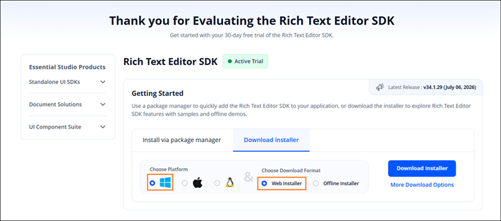
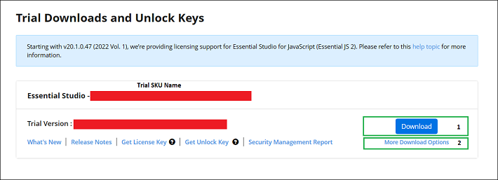
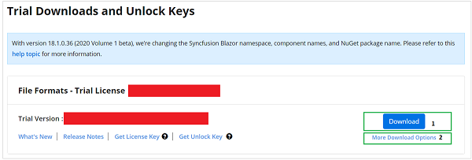
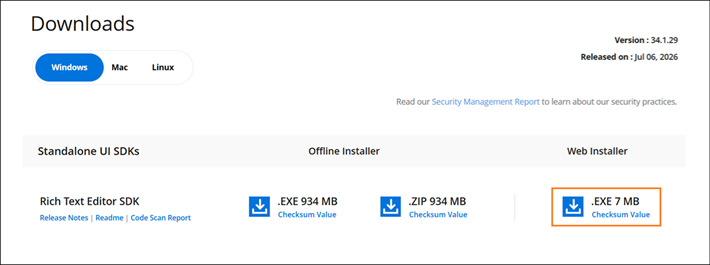

# Downloading Syncfusion Rich Text Editor SDK Web Installer

The web installer is a small setup file that downloads and installs the Syncfusion Rich Text Editor SDK components over the internet. A stable internet connection is required during installation. You can either download the licensed installer or try our trial installer depending on your license.

## Download the Trial Version

Our 30-day trial can be downloaded in two ways.

   * Download Free Trial Setup
   * Start Trials if using components through [NuGet.org](https://www.nuget.org/packages?q=syncfusion)

### Download Free Trial Setup

1. You can evaluate our 30-day free trial by visiting the [Download Free Trial](https://www.syncfusion.com/downloads) page and selecting the **Rich Text Editor SDK** platform.
2. After completing the required form or logging in with your registered Syncfusion account, you can download the Rich Text Editor SDK trial installer from the confirmation page (as shown in the screenshot below).

   
   
3. With a trial license, only the latest version’s trial installer can be downloaded.
4. After downloading, the Syncfusion Rich Text Editor SDK trial installer can be unlocked using either the trial unlock key or the Syncfusion registered login credential. More information on generating an unlock key can be found in [this](https://support.syncfusion.com/kb/article/7053/how-to-generate-unlock-key-for-essentials-studio-products) article.
5. Before the trial expires, you can download the trial installer at any time from your registered account’s [Trials & Downloads](https://www.syncfusion.com/account/manage-trials/downloads) page (as shown in the screenshot below).
6. Click the **Download** (element 1 in the screenshot above) button to get the Syncfusion Rich Text Editor SDK web installer.

   

   
   
### Start Trials if using components through [NuGet.org](https://www.nuget.org/packages?q=syncfusion)

You should initiate an evaluation if you have already obtained our components through [NuGet.org](https://www.nuget.org/packages?q=syncfusion)

1. You can start your 30-day free trial for Rich Text Editor SDK from the [Start Trial](https://www.syncfusion.com/account/manage-trials/start-trials) page from your account.

   

2. To access this page, you must sign up or log in with your Syncfusion account.
3. Begin your trial by selecting the **Rich Text Editor SDK** product.

   N> If you've already used the trial products and they haven't expired, you won't be able to start the trial for the same product again.

4. After you've started the trial, go to the [Trials & Downloads](https://www.syncfusion.com/account/manage-trials/downloads) page to get the latest version trial installer. You can generate the [unlock key](https://support.syncfusion.com/kb/article/7053/how-to-generate-unlock-key-for-essentials-studio-products) and [license key](https://help.syncfusion.com/file-formats/licensing/how-to-generate) here at any time before the trial period expires. (as shown in below screenshot.)

   

5. You can find your current active trial products on the [Trials & Downloads](https://www.syncfusion.com/account/manage-trials/downloads) page.
   

## Download the License Version

1. Syncfusion licensed products are available on the [License & Downloads](https://www.syncfusion.com/account/downloads) page under your registered Syncfusion account. You can view all licenses (both active and expired) associated with your account.
2. Click the **Download** (element 1 in the screenshot below) button to download the respective product's installer. The most recent version will be downloaded by default.
3. To download older version installers, go to [Downloads Older Versions](https://www.syncfusion.com/account/downloads/studio) (element 2 in the screenshot below).
4. You can download other platform or add-on installers by going to **More Download Options** (element 3 in the screenshot below).

    
	
7. Before the license expires, you can download the installer at any time from your registered account’s [License & Downloads](https://www.syncfusion.com/account/downloads) page (See the screenshot below.)
   
   
   
8. After downloading, the Syncfusion Rich Text Editor SDK web installer can be unlocked using Syncfusion registered login credential.

N> You must be signed in to your Syncfusion account to download the licensed installer.

You can also refer to the [**Web Installer**](https://help.syncfusion.com/richtexteditor-sdk/installation/web-installer/how-to-install) link for step-by-step installation guidelines.	