# Installing Syncfusion Rich Text Editor SDK Web Installer

## Overview

For the Syncfusion Rich Text Editor SDK product, Syncfusion offers a web installer. This installer avoids downloading a large setup file by streaming the installation files as needed. You can simply download and run the web installer, which is smaller in size and will download and install the Rich Text Editor SDK files. You can get the most recent version of the Syncfusion Rich Text Editor SDK web installer [here](https://www.syncfusion.com/downloads/latest-version). 

 
## Installation

The steps below show how to install the Syncfusion Rich Text Editor SDK web installer.

1. Open the Syncfusion Rich Text Editor SDK web installer file from the downloaded location by double-clicking it. The installer wizard automatically opens and extracts the package.

    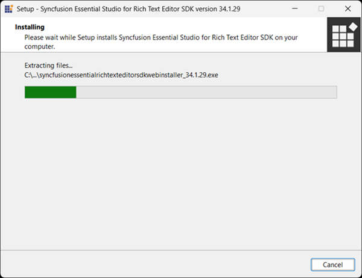

    N> The wizard extracts `syncfusionessentialrichtexteditorsdkwebinstaller_(version).exe`, which shows the progress of the package extraction.
    
2. The web installer welcome wizard will be displayed. Click the **Next** button.

    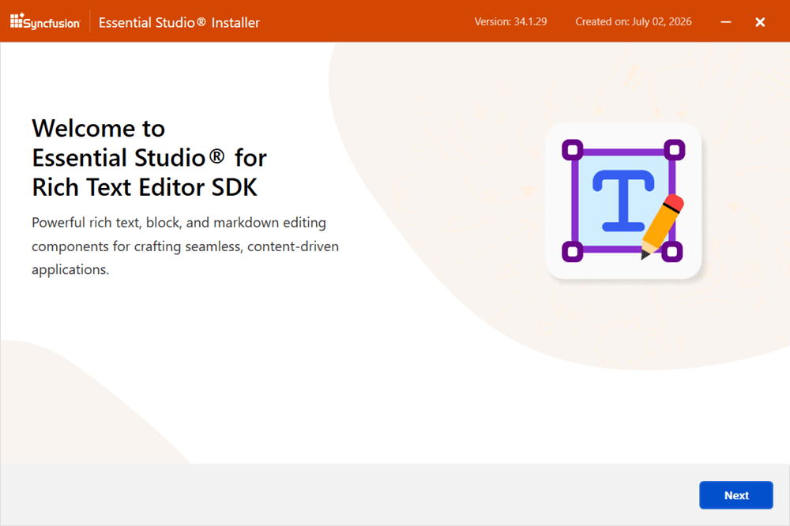

  
3.  The Platform Selection Wizard will appear. From the **Available** tab, select the products to be installed. Select the **Install All** checkbox to install all products. 
    
	<em>**Available**</em>
	
	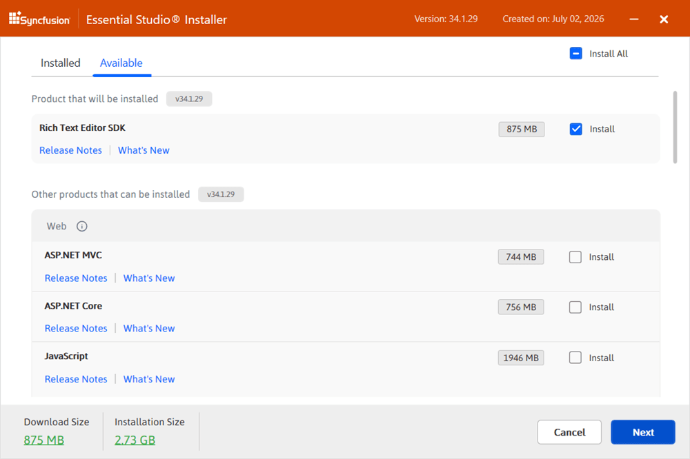
	
	If you have multiple products installed in the same version, they will be listed under the **Installed** tab. You can also select which products to uninstall from the same version. Click the Next button.
	
	<em>**Installed**</em>
	
    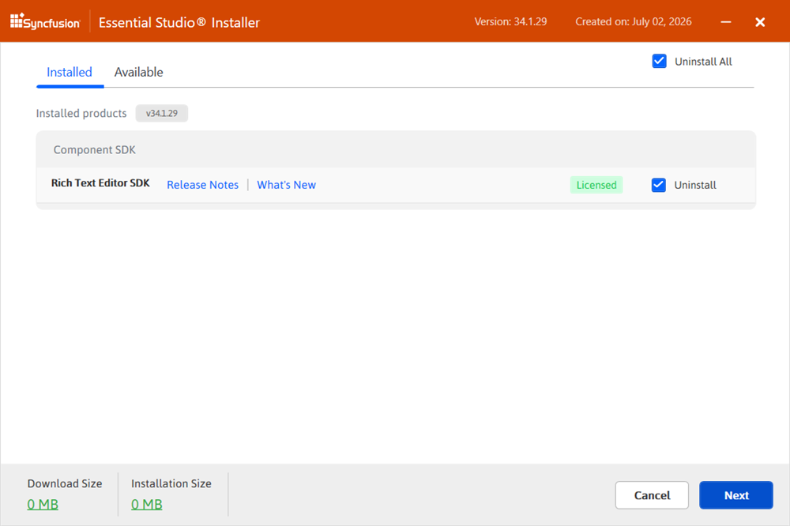
	
	I> If the required software for the selected product isn't already installed, the **Additional Software Required** alert will appear. You can, however, continue the installation and install the necessary software later.
	
	**Required Software**
	
	
		
	
4.	If previous version(s) for the selected products are installed, the Uninstall previous version wizard will be displayed. You can see the list of previously installed versions for the products you've chosen here. To remove all versions, check the **Uninstall All** checkbox. Click the Next button.

    

    N> From the 2021 Volume 1 release, Syncfusion has provided the option to uninstall previous versions (18.1 and later) while installing the new version.
	
	
5. A pop-up screen will be displayed to get the confirmation to uninstall selected previous versions.

	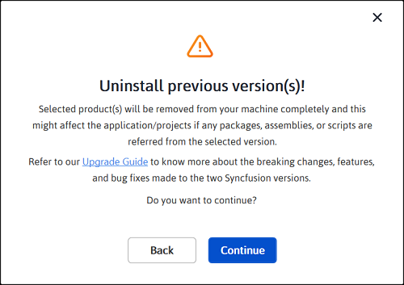
	
	
6. The Confirmation Wizard will appear with the list of products to be installed/uninstalled. You can view and modify the list of products that will be installed and uninstalled from this page.

    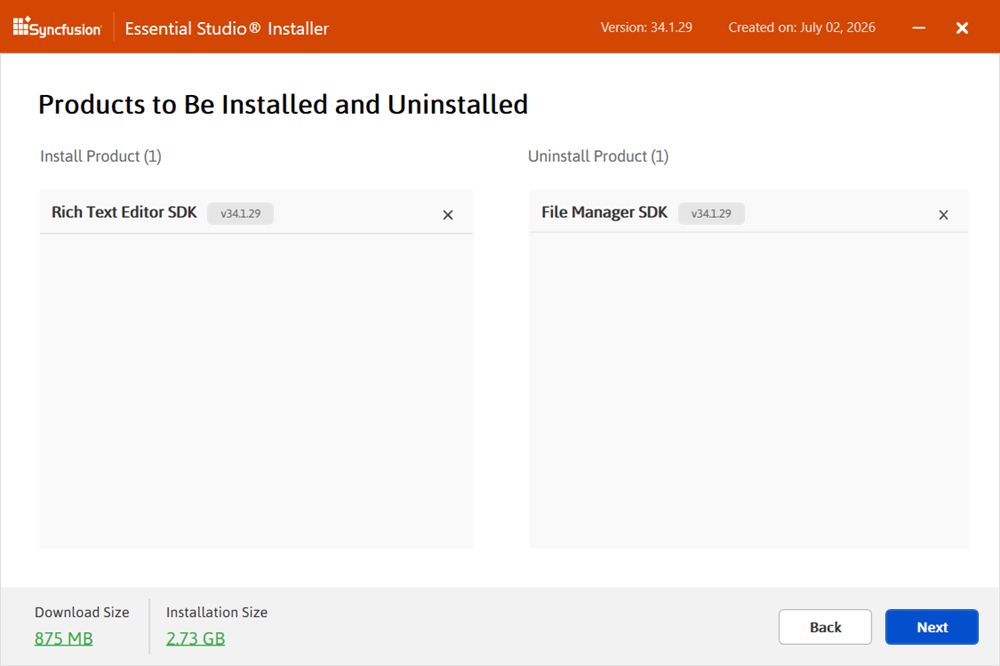

    N> By clicking the **Download Size** and **Installation Size** links, you can determine the approximate size of the download and installation.

7.  The Configuration Wizard will appear. You can change the Download, Install, and Demos locations from here. You can also change the Additional settings on a product-by-product basis. Click Next to install with the default settings.

    
	
	**Additional settings**
	
    * Select the **Install Demos** check box to install Syncfusion samples, or leave the check box unchecked, if you do not want to install Syncfusion samples
	* Select the **Register Syncfusion Assemblies in GAC** check box to install the latest Syncfusion assemblies in GAC, or clear this check box when you do not want to install the latest assemblies in GAC.
    * Select the **Configure Syncfusion controls in Visual Studio** check box to configure the Syncfusion controls in the Visual Studio toolbox, or clear this check box when you do not want to configure the Syncfusion controls in the Visual Studio toolbox during installation. This option requires the **Register Syncfusion Assemblies in GAC** check box to be selected.
    * Select the **Configure Syncfusion Extensions controls in Visual Studio** checkbox to configure the Syncfusion Extensions in Visual Studio or clear this check box when you do not want to configure the Syncfusion Extensions in Visual Studio.
    * Check the **Create Desktop Shortcut** checkbox to add a desktop shortcut for Syncfusion Control Panel
    * Check the **Create Start Menu Shortcut** checkbox to add a shortcut to the start menu for Syncfusion Control Panel

8.  After reading the License Terms and Conditions, check the **I agree to the License Terms and Privacy Policy** check box. Click the Next button.

9. The login wizard will appear. You must enter your Syncfusion email address and password. If you do not already have one, you can create a Syncfusion account by clicking on **Create an Account**. If you have forgotten your password, click **Forgot Password** to create a new one. Click the **Install** button.

    

    I> The products you have chosen will be installed based on your Syncfusion License (Trial or Licensed).

10. The download and installation/uninstallation progress will be displayed as shown below.

    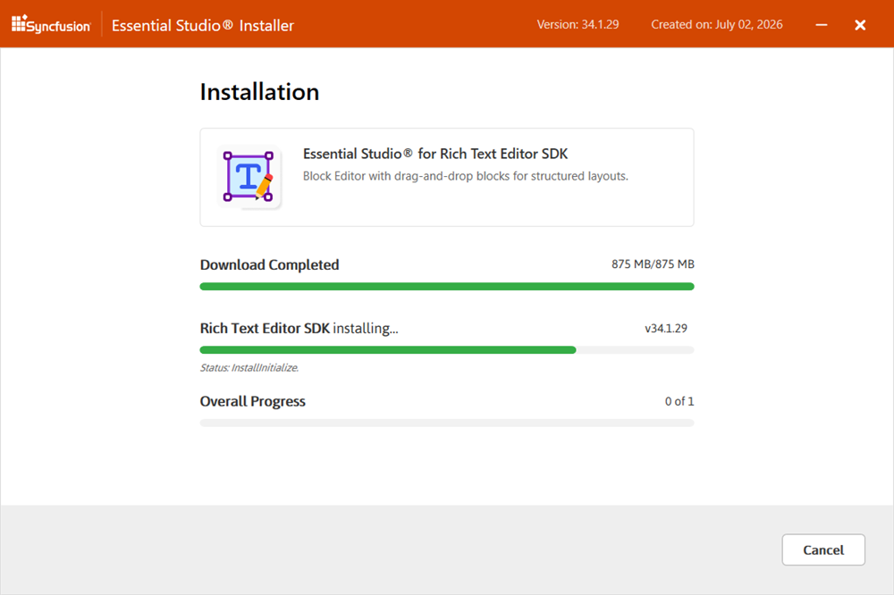

11. When the installation is finished, the **Summary** wizard will appear with the list of products that have been installed successfully and those that have failed. To close the Summary wizard, click **Finish**.

    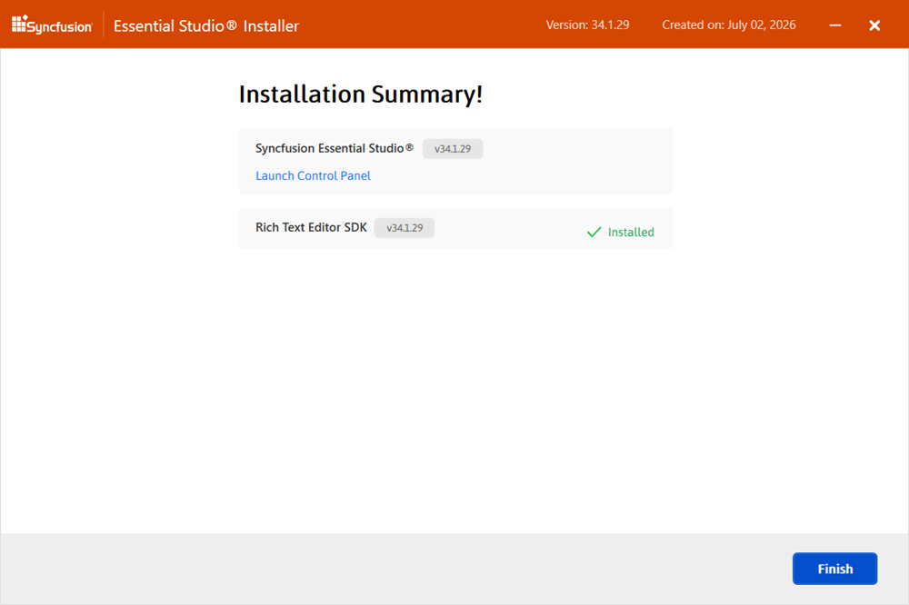

    * To open the Syncfusion Control Panel, click **Launch Control Panel**.

12. After installation, there will be two Syncfusion Control Panel entries, as shown below. The Essential Studio entry will manage all Syncfusion products installed in the same version, while the Product entry will only uninstall the specific product setup.

    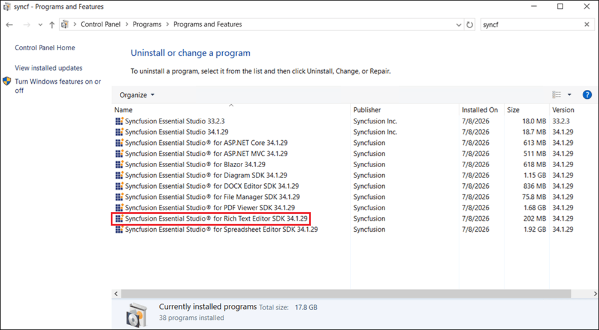
	
	
	
## Uninstallation

The Syncfusion Rich Text Editor SDK installer can be uninstalled in two ways.

* Uninstall the Rich Text Editor SDK using the Syncfusion Rich Text Editor SDK web installer.
* Uninstall the Rich Text Editor SDK from the Windows Control Panel.

Follow one of the options below to uninstall the Syncfusion Rich Text Editor SDK installer.

### Option 1: Uninstall the Rich Text Editor SDK using the Syncfusion Rich Text Editor SDK web installer

Syncfusion provides the option to uninstall products of the same version directly from the web installer application. Select the products to be uninstalled from the list, and the web installer will uninstall them one by one.

	
	
**Option 2: Uninstall the Rich Text Editor SDK from Windows Control Panel**  
	
You can uninstall all the installed products by selecting the **Syncfusion Essential Studio {version}** entry (element 1 in the below screenshot) from the Windows control panel, or you can uninstall Rich Text Editor SDK alone by selecting the **Syncfusion Essential Studio for Rich Text Editor SDK {version}** entry (element 2 in the below screenshot) from the Windows control panel.

N> If the **Syncfusion Essential Studio for Rich Text Editor SDK {version}** entry is selected from the Windows Control Panel, only the Syncfusion Rich Text Editor SDK will be removed, and the default MSI uninstallation window will be displayed.

1. The web installer's welcome wizard will be displayed. Click the **Next** button.

    

2. The Platform Selection Wizard will appear. From the **Installed** tab, select the products to be uninstalled. To select all products, check the **Uninstall All** checkbox. Click the **Next** button.

   <em>**Installed**</em>

   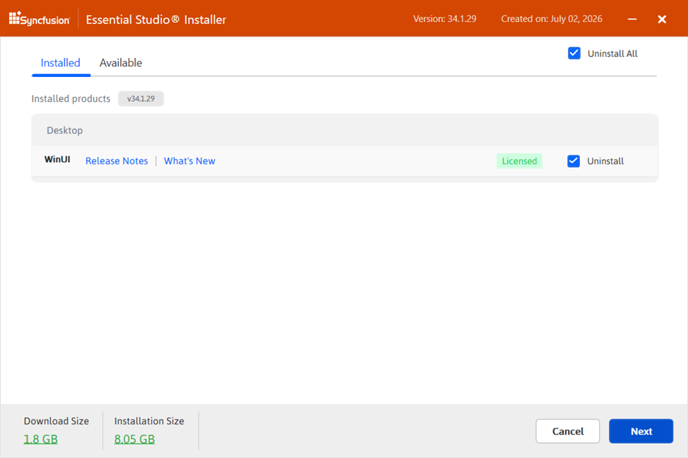

   You can also select the products to be installed from the **Available** tab. Click the **Next** button.

   <em>**Available**</em>

   

3. If any other products are selected for installation, the **Uninstall Previous Version** wizard will be displayed with the previous version(s) installed for the selected products. Here you can view the list of installed previous versions. Select the **Uninstall All** checkbox to select all versions. Click **Next**.

   

4. A pop-up screen will be displayed to get the confirmation to uninstall selected previous versions.

   

5. The Confirmation Wizard will appear with the list of products to be installed/uninstalled. Here you can view and modify the list of products that will be installed/uninstalled.

   

   N> By clicking the **Download Size** and **Installation Size** links, you can determine the approximate size of the download and installation.

6. The Configuration Wizard will appear. You can change the Download, Install, and Demos locations from here. You can also change the Additional settings on a product-by-product basis. Click **Next** to install with the default settings.

   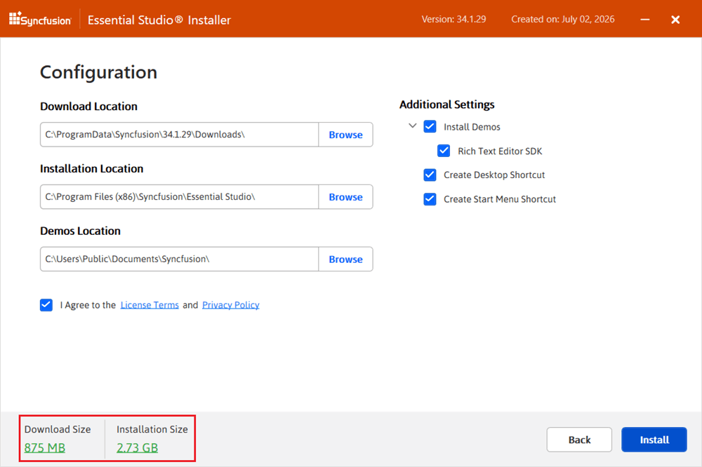

7. After reading the License Terms and Conditions, check the **I agree to the License Terms and Privacy Policy** check box. Click the **Next** button.

8. The login wizard will appear. You must enter your Syncfusion email address and password. If you do not already have one, you can create a Syncfusion account by clicking on **Create an Account**. If you have forgotten your password, click **Forgot Password** to create a new one. Click the **Install** button.

   

   I> The products you have chosen will be installed based on your Syncfusion License (Trial or Licensed).

9. The download, installation, and uninstallation progress will be shown.

   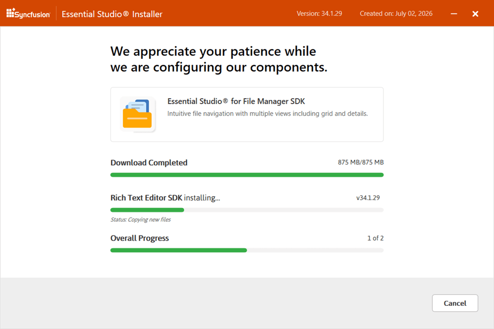

10. When the installation is finished, the **Summary** wizard will appear with the list of products that have been successfully and unsuccessfully installed/uninstalled. To close the Summary wizard, click **Finish**.

    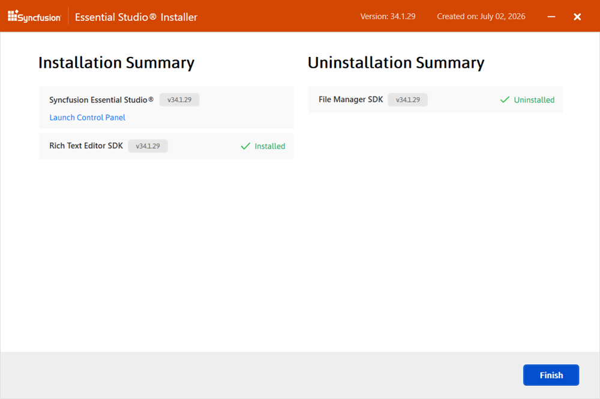

    * To open the Syncfusion Control Panel, click **Launch Control Panel**.