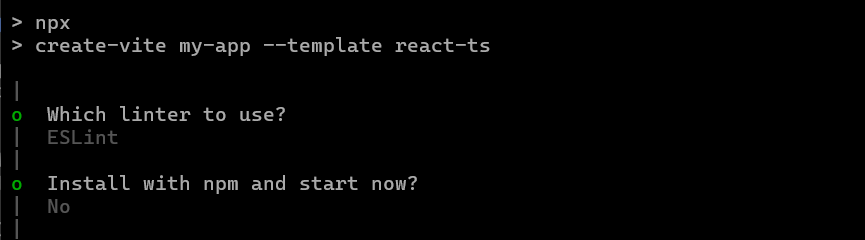

# Getting Started with the React Block Editor Component

This section explains how to create a simple Block Editor and configure its available functionalities in the React environment.

## Create a React Application

Run the following commands to set up a React application:

```bash
npm create vite@latest my-app -- --template react-ts
```

This command will prompt you to select options for the new project. Choose **React** as the framework and **TypeScript** as the variant. Select the options as shown below.



As Syncfusion packages are not installed yet, currently, the `No` option will be selected. Then, navigate to the project directory and install the dependencies using the following commands:

```
cd my-app
npm install
```

> **Note:** To set up a React application with Nextjs or Remix, refer to this [documentation](https://ej2.syncfusion.com/react/documentation/getting-started/quick-start) for more details.

## Adding Syncfusion<sup style="font-size:70%">&reg;</sup> Packages

All available Essential<sup style="font-size:70%">&reg;</sup> JS 2 packages are published in the [`npmjs.com`](https://www.npmjs.com/~syncfusionorg) public registry.

To install the Block Editor component package, use the following command:

```bash
npm install @syncfusion/ej2-react-blockeditor --save
```

## Adding a CSS Reference

Syncfusion provides multiple themes for the Block Editor component. For a complete list of available themes, refer to the [themes packages](https://ej2.syncfusion.com/angular/documentation/appearance/overview#theme-packages).

To install the [tailwind3](https://www.npmjs.com/package/@syncfusion/ej2-tailwind3-theme) theme package, use the following command:

```bash
npm install @syncfusion/ej2-tailwind3-theme --save
```

Import the required CSS theme files for the Block Editor and its dependencies in your `src/index.css` file.

```css
@import "../node_modules/@syncfusion/ej2-tailwind3-theme/styles/blockeditor/index.css";
```

## Add the Block Editor Component

You can now add the Block Editor component to your application. Replace the default contents of `src/App.tsx` with the following code, which uses the `<BlockEditorComponent>` directive to render the editor.












> **Note:** This guide assumes React 18+. The Vite template mounts the app into a `<div id="root">` element in `index.html` via `src/main.tsx` using `createRoot`. Ensure your `main.tsx` renders the `App` component into that node.

## Run the application

Now, run the `npm run dev` command in your terminal to start the development server.

```
npm run dev
```
