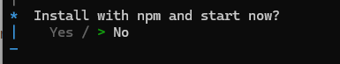

# Getting started in TypeScript Rich Text Editor control

The TypeScript Rich Text Editor is a WYSIWYG (What You See Is What You Get) editor that enables users to create, edit, and format rich text content with features like multimedia insertion, lists, and links. This section explains the steps to create a simple Rich Text Editor and demonstrate the basic usage of the Rich Text Editor control using a Vite-based TypeScript project scaffolded with the latest Vite version.

## Prerequisites

This guide uses Vite as the bundler and development environment. Install Node.js `24.13.0` or `higher` before proceeding. For detailed information about Vite’s capabilities and configuration options, refer to the [Vite documentation](https://vitejs.dev/).

## Create a TypeScript application

To set up a TypeScript application, run the following command.

```bash
npm create vite@latest my-app -- --template vanilla-ts
```

This command will prompt you to install the required packages and start the application. Select the options as shown below.



As Syncfusion packages are not installed yet, currently, the `No` option will be selected. Then, navigate to the project directory and install the dependencies using the following commands:

```bash
cd my-app
npm install
```

## Adding Rich Text Editor packages

All the available Essential<sup style="font-size:70%">&reg;</sup> JS 2 packages are published in [`npmjs.com`](https://www.npmjs.com/~syncfusionorg) public registry.
To install the Rich Text Editor control, use the following command

```bash
npm install @syncfusion/ej2-richtexteditor
```

## Adding CSS reference

Syncfusion provides multiple themes for the Rich Text Editor control. For a complete list of available themes, refer to the [themes packages](https://ej2.syncfusion.com/documentation/appearance/theme#theme-packages).

To apply the [Tailwind 3](https://www.npmjs.com/package/@syncfusion/ej2-tailwind3-theme) theme, install the corresponding theme package using the following command:

```bash
npm install @syncfusion/ej2-tailwind3-theme
```

The installed theme package includes an `index.css` file that automatically imports all the required dependency styles. Import the following stylesheet into `src/style.css`.

```css
@import '../node_modules/@syncfusion/ej2-tailwind3-theme/styles/rich-text-editor/index.css';
```

I> To apply the application-specific styles correctly, import **style.css** into **src/main.ts** and remove all the default styles from **src/style.css** and use the Rich Text Editor styles provided above.

## Module Injection

The following modules provide the basic features of the Rich Text Editor.

* `Toolbar` - Inject this module to use the Toolbar feature.
* `Link` - Inject this module to use the link feature in Rich Text Editor.
* `Image`- Inject this module to use the image feature in Rich Text Editor.
* `HtmlEditor` - Inject this module to use the Rich Text Editor as HTML editor.
* `QuickToolbar` - Inject this module to use the quick toolbar feature for the target element.

These modules should be injected into the Rich Text Editor using the `RichTextEditor.Inject` method as demonstrated in the following example:




import './style.css';
import { RichTextEditor, Toolbar, Link, Image, HtmlEditor, QuickToolbar } from '@syncfusion/ej2-richtexteditor';

RichTextEditor.Inject(Toolbar, Link, Image, HtmlEditor, QuickToolbar);
const editor: RichTextEditor = new RichTextEditor({});
editor.appendTo('#editor');




T> Additional feature modules are available [here](https://ej2.syncfusion.com/documentation/rich-text-editor/module)

## Adding Rich Text Editor control

Now, you can start adding the Rich Text Editor control to the application. For getting started, add the Rich Text Editor initialization code in the **src/main.ts** file and add the target element in the **index.html** file using the following sample.




import './style.css';
import { RichTextEditor, Toolbar, Link, Image, HtmlEditor, QuickToolbar } from '@syncfusion/ej2-richtexteditor';

RichTextEditor.Inject(Toolbar, Link, Image, HtmlEditor, QuickToolbar);
const editor: RichTextEditor = new RichTextEditor({});
editor.appendTo('#editor');





@import '../node_modules/@syncfusion/ej2-tailwind3-theme/styles/rich-text-editor/index.css';




<!doctype html>
<html lang="en">

<head>
  <meta charset="UTF-8" />
  <link rel="icon" type="image/svg+xml" href="/vite.svg" />
  <meta name="viewport" content="width=device-width, initial-scale=1.0" />
  <title>Syncfusion TypeScript Rich Text Editor</title>
</head>

<body>
  <div id="editor"></div>
  <script type="module" src="/src/main.ts"></script>
</body>

</html>



          
## Run the Application

Use the following command to run the application in the browser.

```bash
npm run dev
```

The Syncfusion<sup style="font-size:70%">&reg;</sup> TypeScript Rich Text Editor is displayed in the browser as shown below.


## See Also

**Documentation:**

* [How to change the editor type](editor-types/editor-modes.md)
* [How to render the iframe](editor-types/iframe.md)
* [How to render the toolbar in inline mode](editor-types/inline-editing.md)
* [Accessibility in Rich Text Editor](accessibility.md)
* [Keyboard support in Rich Text Editor](keyboard-support.md)
* [Globalization in Rich Text Editor](globalization.md)

**Live examples:**

* [Insert Emoticons](https://ej2.syncfusion.com/javascript/demos/#/tailwind3/rich-text-editor/insert-emoticons)
* [Blog posting using Rich Text Editor](https://ej2.syncfusion.com/javascript/demos/#/tailwind3/rich-text-editor/blog-posting)
* [Reactive Form with Rich Text Editor](https://ej2.syncfusion.com/javascript/demos/#/tailwind3/rich-text-editor/reactive-form)
