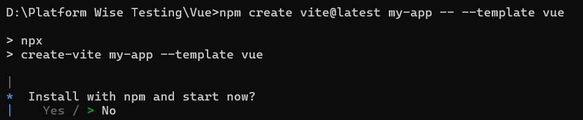

# Getting Started with the Block Editor component in Vue 3

This article provides a step-by-step guide for setting up a [Vite](https://vitejs.dev/) project with a JavaScript environment and integrating the Syncfusion<sup style="font-size:70%">&reg;</sup> Vue Block Editor component using the [Composition API](https://vuejs.org/guide/introduction.html#composition-api) / [Options API](https://vuejs.org/guide/introduction.html#options-api).

The `Composition API` is a new feature introduced in Vue.js 3 that provides an alternative way to organize and reuse component logic. It allows developers to write components as functions that use smaller, reusable functions called composition functions to manage their properties and behavior.

The `Options API` is the traditional way of writing Vue.js components, where the component logic is organized into a series of options that define the component's properties and behavior. These options include data, methods, computed properties, watchers, life cycle hooks, and more.

## Prerequisites

This guide uses Vite as the bundler and development environment. Install Node.js 24.13.0 or higher before proceeding. For detailed information about Vite’s capabilities and configuration options, refer to the [Vite documentation](https://vitejs.dev/).

## Create a Vue Application

To set up a Vue application, run the following command.

```bash
npm create vite@latest my-app -- --template vue
```

This command prompts you to install the required packages and start the application. Select the options shown in the prompt, and confirm that the `my-app` folder is created before continuing.



As Syncfusion packages are not installed yet, the `No` option is selected by default. Then, navigate to the project directory and install the dependencies using the following commands:

```bash
cd my-app
npm install
```

After installation completes, confirm that the dependencies were installed successfully before moving to the next step.

## Adding Syncfusion<sup style="font-size:70%">&reg;</sup> Vue packages

All available Essential JS 2 packages are published in the [npmjs.com](https://www.npmjs.com/search?q=ej2-vue) registry. Install the Vue Block Editor component with the following command:

```bash
npm install @syncfusion/ej2-vue-blockeditor --save
```

## Adding CSS reference

Syncfusion provides multiple themes for the Block Editor component. For a complete list of available themes, refer to the [themes topic](https://ej2.syncfusion.com/vue/documentation/appearance/theme#theme-packages).

To apply the [Tailwind 3](https://www.npmjs.com/package/@syncfusion/ej2-tailwind3-theme) theme, install the corresponding theme package by using the following command:

```bash
npm install @syncfusion/ej2-tailwind3-theme --save
```

Then add the following CSS reference to the **src/App.vue** file:

```css
@import "../node_modules/@syncfusion/ej2-tailwind3-theme/styles/blockeditor/index.css";
```

## Adding Block Editor component

Now, you can start adding the Vue Block Editor component in the application. For getting started, add the Block Editor component in **src/App.vue** file using following sample.




<template>
    <div style="margin: 50px auto;">
        <ejs-blockeditor id="BlockEditor"></ejs-blockeditor>
    </div>
</template>

<script setup>
    import { BlockEditorComponent as EjsBlockeditor } from "@syncfusion/ej2-vue-blockeditor";
</script>

<style>
@import "../node_modules/@syncfusion/ej2-tailwind3-theme/styles/blockeditor/index.css";
</style>




<template>
    <div style="margin: 50px auto;">
        <ejs-blockeditor id="BlockEditor"></ejs-blockeditor>
    </div>
</template>

<script>
import { BlockEditorComponent } from "@syncfusion/ej2-vue-blockeditor";

export default {
    name: "App",
    components: {
        'ejs-blockeditor': BlockEditorComponent
    }
}
</script>

<style>
@import "../node_modules/@syncfusion/ej2-tailwind3-theme/styles/blockeditor/index.css";
</style>






## Run the application

Use the following command to run the application in the browser.

```bash
npm run dev
```

## See also

For additional Vue 3 examples and related topics, see the following resources:

* [Getting Started with Vue UI Components using Composition API and TypeScript](https://ej2.syncfusion.com/vue/documentation/getting-started/vue-3-ts-composition)
* [Getting Started with Vue UI Components using Options API and TypeScript](https://ej2.syncfusion.com/vue/documentation/getting-started/vue-3-ts-options)

For migrating from Vue 2 to Vue 3, refer to the [`migration`](https://ej2.syncfusion.com/vue/documentation/getting-started/vue-3-vue-cli#migration-from-vue-2-to-vue-3) documentation.

N> Looking for the full Vue Block Editor component overview, features, pricing, and documentation? Visit the [Vue Block Editor](https://www.syncfusion.com/rich-text-editor-sdk/vue-block-editor) page.
