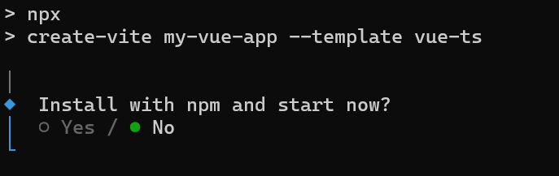
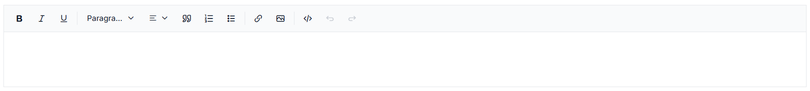

# Getting Started with Vue Rich Text Editor

The [Vue Rich Text Editor](https://www.syncfusion.com/vue-components/vue-wysiwyg-rich-text-editor) is a WYSIWYG (What You See Is What You Get) editor that enables users to create, edit, and format rich text content with features like multimedia insertion, lists, and links. This article provides a step-by-step guide for setting up a [Vite](https://vitejs.dev/) project with a TypeScript environment and integrating the Vue Rich Text Editor component using either the [Composition API](https://vuejs.org/guide/introduction.html#composition-api) or the [Options API](https://vuejs.org/guide/introduction.html#options-api).

To get started quickly with the Vue Rich Text Editor, refer to this video tutorial:



## Prerequisites

This guide uses Vite as the bundler and development environment. Install Node.js `24.13.0` or `higher` before proceeding. For detailed information about Vite’s capabilities and configuration options, refer to the [Vite documentation](https://vitejs.dev/).

N> For information about supported Vue versions and Syncfusion package compatibility, refer to the [Version Compatibility](https://ej2.syncfusion.com/vue/documentation/upgrade/version-compatibility) documentation.

## Create a Vue Application

To set up a Vue application, run the following command.

```bash
npm create vite@latest my-app -- --template vue-ts
```
This command will prompt you to install the required packages and start the application. Select the options as shown below.



Since the Syncfusion packages are not installed at this stage, choose the `No` option when prompted. Then, navigate to the project directory and install the dependencies using the following commands:

```bash
cd my-app
npm install
```

## Adding Syncfusion Rich Text Editor package

All available Essential JS 2 packages are published in the [npmjs.com](https://www.npmjs.com/search?q=ej2-vue) registry. Install the Vue Rich Text Editor component with the following command:


```bash
npm install @syncfusion/ej2-vue-richtexteditor
```

## Adding CSS reference

Syncfusion provides multiple themes for the Rich Text Editor component. For a complete list of available themes, refer to the [themes packages](https://ej2.syncfusion.com/vue/documentation/appearance/theme#theme-packages). 

To apply the [Tailwind 3](https://www.npmjs.com/package/@syncfusion/ej2-tailwind3-theme) theme, install the corresponding theme package by using the following command:

```bash
npm install @syncfusion/ej2-tailwind3-theme
```

The installed theme package includes an `index.css` file that automatically imports all the required dependency styles. Import the following stylesheet into `src/style.css`.

```css
@import '../node_modules/@syncfusion/ej2-tailwind3-theme/styles/rich-text-editor/index.css';
```

I> To apply the application-specific styles correctly remove all the default styles from **src/style.css**. 

## Module Injection

The following modules provide the basic features of the Rich Text Editor.

* **HtmlEditor** - Inject this module to use the Rich Text Editor as HTML editor.
* **Image** - Inject this module to use the image feature in Rich Text Editor.
* **Link** - Inject this module to use the link feature in Rich Text Editor.
* **QuickToolbar** - Inject this module to use the quick toolbar feature for the target element.
* **Toolbar** - Inject this module to use the Toolbar feature.

These modules can be injected as `services` using Vue's `provide` function as demonstrated in the following example.










T> Additional feature modules are available [here](https://ej2.syncfusion.com/vue/documentation/rich-text-editor/module).

## Adding Rich Text Editor component

Now, you can start adding the Vue Rich Text Editor component in the application. For getting started, add the Rich Text Editor component in **src/App.vue** file using the following sample.















## Run the Application

Use the following command to run the application in the browser.

```bash
npm run dev
```

The Syncfusion<sup style="font-size:70%">&reg;</sup> Vue Rich Text Editor is displayed in the browser as shown below.



## See also

For migrating from Vue 2 to Vue 3, refer to the [`migration`](https://ej2.syncfusion.com/vue/documentation/getting-started/vue-3-vue-cli#migration-from-vue-2-to-vue-3) documentation.
