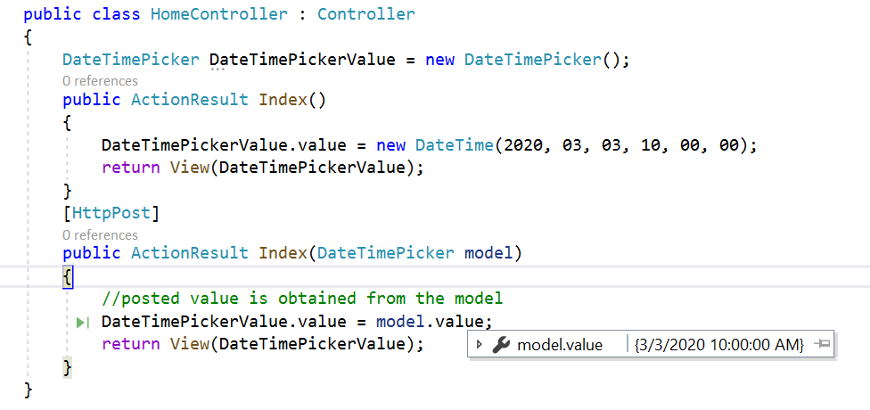

# Render DateTimePickerFor

The DateTimePickerFor component can be rendered by passing a value from the model. The selected date value can be retrieved during form submission using the post method at the server end.
























