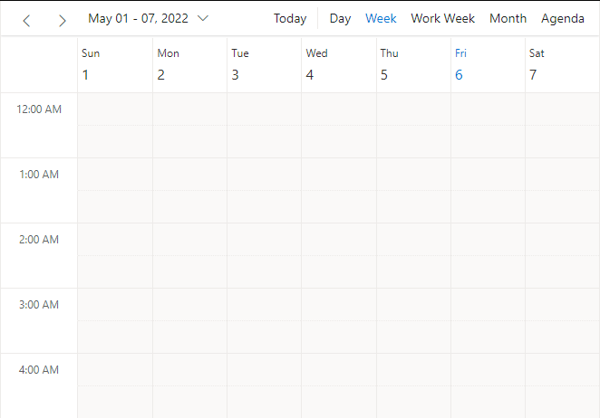
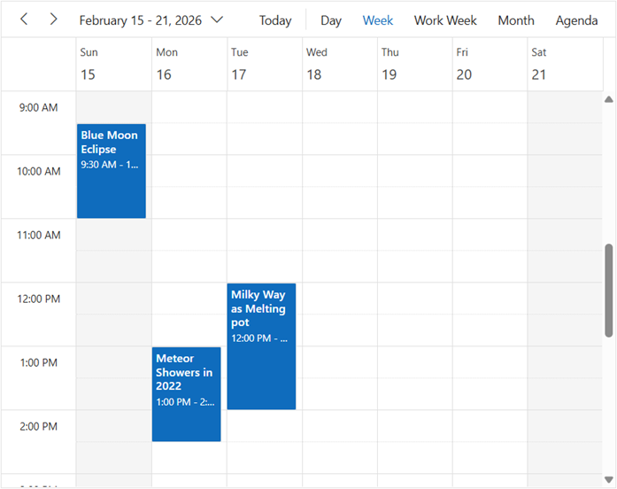
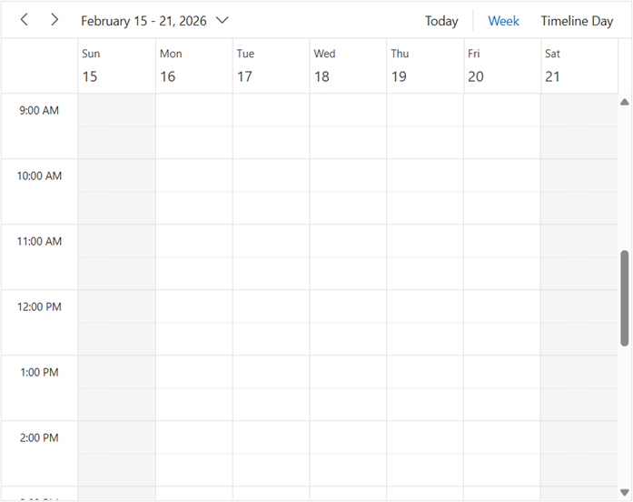
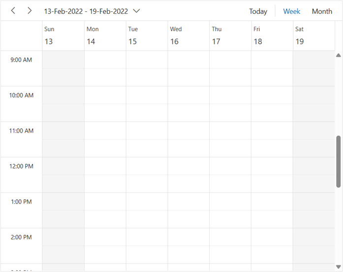

# Getting Started with the ASP.NET Core Scheduler Control

This section briefly explains how to include the [ASP.NET Core Scheduler](https://www.syncfusion.com/scheduler-sdk/aspnet-core-scheduler) control in your ASP.NET Core Web App using [Visual Studio](https://visualstudio.microsoft.com/vs/).

> **Ready to streamline your ASP.NET Core development?** Discover the full potential of ASP.NET Core controls with AI Coding Assistant. Effortlessly integrate, configure, and enhance your projects with intelligent, context-aware code suggestions, streamlined setups, and real-time insights—all seamlessly integrated into your preferred AI-powered IDEs like Visual Studio, Visual Studio Code, Cursor, CodeStudio and more. [Explore AI Coding Assistant](https://ej2.syncfusion.com/aspnetcore/documentation/ai-coding-assistant/overview)

To get started quickly with ASP.NET Core Scheduler control, you can check out this video:



## Create an ASP.NET Core web App with Razor Pages

Create an **ASP.NET Core Web App** using Visual Studio via [Microsoft Templates](https://learn.microsoft.com/en-us/aspnet/core/tutorials/razor-pages/razor-pages-start?view=aspnetcore-10.0&tabs=visual-studio#create-a-razor-pages-web-app) or the [ASP.NET Core Extension](https://ej2.syncfusion.com/aspnetcore/documentation/visual-studio-integration/create-project).

## Install the required ASP.NET Core packages

To add **ASP.NET Core Scheduler** control in the app, open the NuGet package manager in Visual Studio (Tools → NuGet Package Manager → Manage NuGet Packages for Solution), then search and install [Syncfusion.AspNetCore.Schedule](https://www.nuget.org/packages/Syncfusion.AspNetCore.Schedule) and [Syncfusion.AspNetCore.Themes](https://www.nuget.org/packages/Syncfusion.AspNetCore.Themes). All Syncfusion ASP.NET Core packages are available in [nuget.org](https://www.nuget.org/packages?q=syncfusion.EJ2). See the [NuGet packages](https://ej2.syncfusion.com/aspnetcore/documentation/nuget-packages) topic for the details.

Alternatively, you can install the same packages using the Package Manager Console with the following commands.




Install-Package Syncfusion.AspNetCore.Schedule -Version {{ site.releaseversion }}
Install-Package Syncfusion.AspNetCore.Themes -Version {{ site.releaseversion }}




## Add ASP.NET Core tag helpers

After the packages are installed, open the **~/Pages/_ViewImports.cshtml** file and import the `Syncfusion.AspNetCore.Schedule` and `Syncfusion.AspNetCore.Base` tag helpers.




@addTagHelper *, Syncfusion.AspNetCore.Schedule
@addTagHelper *, Syncfusion.AspNetCore.Base




## Add stylesheet and script resources

The theme stylesheet and script can be referenced from NuGet through [Static Web Assets](https://ej2.syncfusion.com/aspnetcore/documentation/appearance/theme#static-web-assets). Include the [stylesheet](https://ej2.syncfusion.com/aspnetcore/documentation/appearance/theme) and [script references](https://ej2.syncfusion.com/aspnetcore/documentation/common/adding-script-references) inside the `<head>` of **~/Pages/Shared/_Layout.cshtml** file.




<head>
    ...
    ...
    <link rel="stylesheet" href="_content/Syncfusion.AspNetCore.Themes/styles/fluent2.css" />
    
</head>




## Register the script manager

Open the **~/Pages/Shared/_Layout.cshtml** file and register the script manager (`<ejs-scripts>`) at the end of the `<body>` element as shown below.




<body>
    ...
    <!-- Syncfusion ASP.NET Core Script Manager -->
    <ejs-scripts></ejs-scripts>
</body>




## Add the ASP.NET Core Scheduler control

Add the [ASP.NET Core Scheduler](https://www.syncfusion.com/scheduler-sdk/aspnet-core-scheduler) control in the **~/Pages/Index.cshtml** file.







Press <kbd>Ctrl</kbd>+<kbd>F5</kbd> (Windows) or <kbd>⌘</kbd>+<kbd>F5</kbd> (macOS) to launch the application. The [ASP.NET Core Schedule](https://www.syncfusion.com/scheduler-sdk/aspnet-core-scheduler) control will render in your default web browser.

## Populating appointments

To populate an empty Scheduler with appointments, bind the event data to it by assigning the [DataSource](https://help.syncfusion.com/cr/aspnetcore-js2/Syncfusion.EJ2.Schedule.ScheduleEventSettings.html#Syncfusion_EJ2_Schedule_ScheduleEventSettings_DataSource) property under `e-schedule-eventsettings` tag Helper.






public class AppointmentData
{
    public int Id { get; set; }
    public string Subject { get; set; }
    public DateTime StartTime { get; set; }
    public DateTime EndTime { get; set; }
}



## Setting date

By default, the Scheduler displays the system date as its current date. To change the current date of the scheduler to a specific date, use the [`selectedDate`](https://help.syncfusion.com/cr/aspnetcore-js2/Syncfusion.EJ2.Schedule.Schedule.html#Syncfusion_EJ2_Schedule_Schedule_SelectedDate) property.






public class AppointmentData
{
    public int Id { get; set; }
    public string Subject { get; set; }
    public DateTime StartTime { get; set; }
    public DateTime EndTime { get; set; }
}



## Specific view

Scheduler displays `Week` view by default. To change the current view, define the applicable view name to the [`currentView`](https://help.syncfusion.com/cr/aspnetcore-js2/Syncfusion.EJ2.Schedule.Schedule.html#Syncfusion_EJ2_Schedule_Schedule_CurrentView) property. The applicable view names are;

* Day
* Week
* WorkWeek
* Month
* Year
* Agenda
* MonthAgenda
* TimelineDay
* TimelineWeek
* TimelineWorkWeek
* TimelineMonth
* TimelineYear







## Individual view customization

Each individual scheduler view can be customized with its own options such as setting different start and end hours on Week and Work Week views, while hiding weekend days only in Month view. Set the `views` property to a collection of [ScheduleView](https://help.syncfusion.com/cr/aspnetcore-js2/Syncfusion.EJ2.Schedule.ScheduleView.html) objects, where each object defines the customization for an individual view."







N> [View Sample in GitHub](https://github.com/SyncfusionExamples/ASP-NET-Core-Getting-Started-Examples/tree/main/Schedule/ASP.NET%20Core%20Tag%20Helper%20Examples).

## See also

1. [Getting Started with ASP.NET Core in Visual Studio Code](https://ej2.syncfusion.com/aspnetcore/documentation/getting-started/vscode)
2. [Getting Started with ASP.NET Core MVC using Tag Helper](https://ej2.syncfusion.com/aspnetcore/documentation/getting-started/aspnet-core-mvc-taghelper)
3. [Getting Started with ASP.NET Core in Visual Studio Mac](https://ej2.syncfusion.com/aspnetcore/documentation/getting-started/visual-studio-mac)
