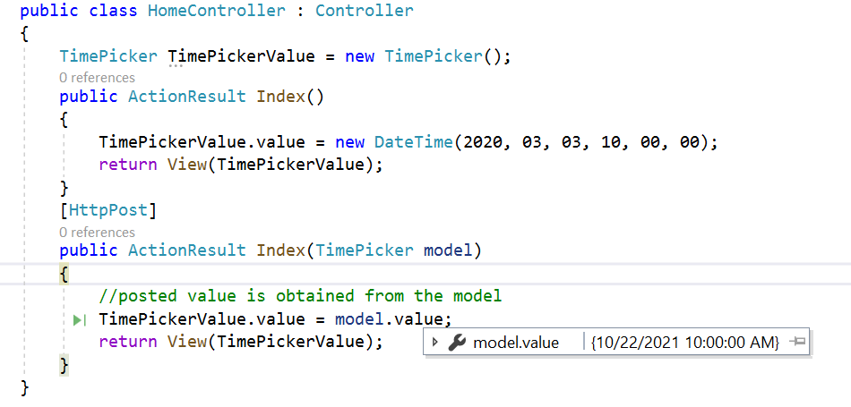

# Render TimePickerFor

The TimePickerFor component can be rendered by passing a value from the model. The selected date value can be retrieved during form submission using the post method at the server end.

The following sample demonstrates how to retrieve the value in the controller by rendering the  TimePickerFor component.
























Selected value will be retrieved as below.

