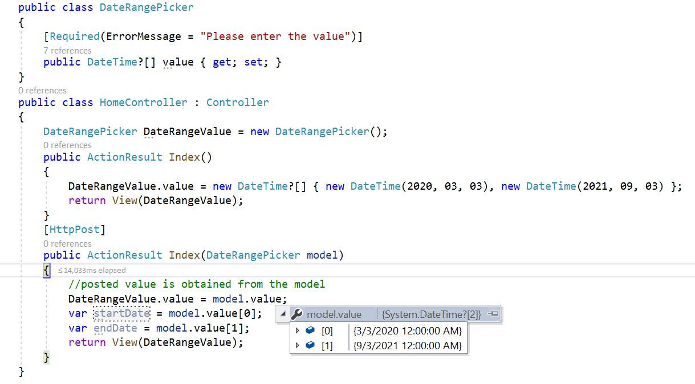

# Render DateRangePickerFor

The DateRangePickerFor component can be rendered by passing value from the model. The selected date range value can be retrieved during form submission using the post method at the server end.
























