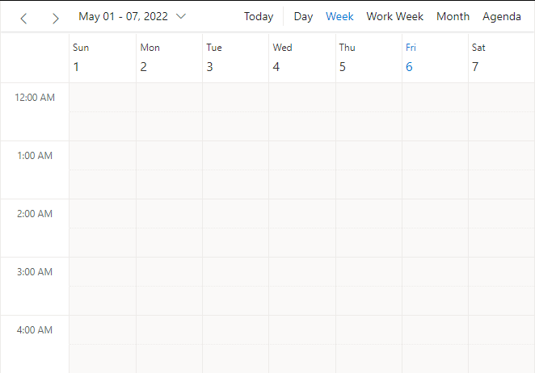
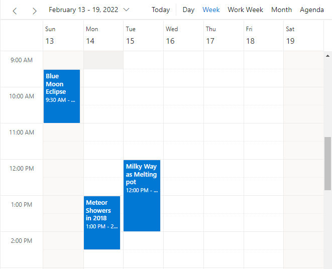
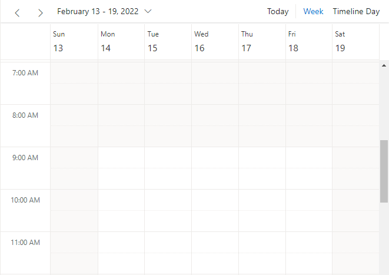
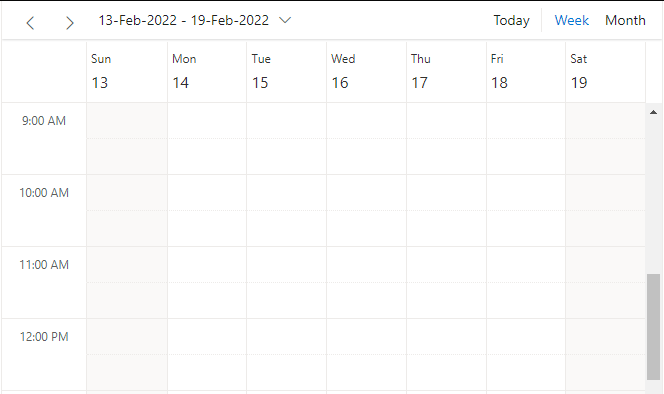

# Getting Started with ASP.NET MVC Scheduler Control

This section briefly explains about how to include [ASP.NET MVC Scheduler](https://www.syncfusion.com/aspnet-mvc-ui-controls/scheduler) control in your ASP.NET MVC application using Visual Studio.

> **Ready to streamline your Syncfusion<sup style="font-size:70%">&reg;</sup> ASP.NET MVC development?** Discover the full potential of Syncfusion<sup style="font-size:70%">&reg;</sup> ASP.NET MVC controls with Syncfusion<sup style="font-size:70%">&reg;</sup> AI Coding Assistant. Effortlessly integrate, configure, and enhance your projects with intelligent, context-aware code suggestions, streamlined setups, and real-time insights—all seamlessly integrated into your preferred AI-powered IDEs like Visual Studio, Visual Studio Code, Cursor, Syncfusion<sup style="font-size:70%">&reg;</sup> CodeStudio and more. [Explore Syncfusion<sup style="font-size:70%">&reg;</sup> AI Coding Assistant](https://ej2.syncfusion.com/aspnetmvc/documentation/ai-coding-assistant/overview)

## Prerequisites

Before you start, ensure you have the following:
* .NET Framework 4.5.2 or later
* ASP.NET MVC 5 or later
* Visual Studio 2015 or later
* NuGet Package Manager

For detailed system requirements, see [System requirements for ASP.NET MVC controls](https://ej2.syncfusion.com/aspnetmvc/documentation/system-requirements)

## Create ASP.NET MVC application with HTML helper

* [Create a Project using Microsoft Templates](https://learn.microsoft.com/en-us/aspnet/mvc/overview/getting-started/introduction/getting-started#create-your-first-app)

* [Create a Project using Syncfusion<sup style="font-size:70%">&reg;</sup> ASP.NET MVC Extension](https://ej2.syncfusion.com/aspnetmvc/documentation/visual-studio-integration/create-project)

## Install ASP.NET MVC package in the application

To add ASP.NET MVC controls to the application, open the NuGet package manager in Visual Studio (Tools → NuGet Package Manager → Manage NuGet Packages for Solution), search for [Syncfusion.EJ2.MVC5](https://www.nuget.org/packages/Syncfusion.EJ2.MVC5) and then install it.




Install-Package Syncfusion.EJ2.MVC5 -Version 26.1.35




> Replace with the latest version available on [NuGet](https://www.nuget.org/packages/Syncfusion.EJ2.MVC5).

N> Syncfusion® ASP.NET MVC controls are available in [nuget.org](https://www.nuget.org/packages?q=syncfusion.EJ2). Refer to [NuGet packages topic](https://ej2.syncfusion.com/aspnetmvc/documentation/nuget-packages) to learn more about installing NuGet packages in various OS environments. The Syncfusion.EJ2.MVC5 NuGet package has dependencies: [Newtonsoft.Json](https://www.nuget.org/packages/Newtonsoft.Json/) for JSON serialization and [Syncfusion.Licensing](https://www.nuget.org/packages/Syncfusion.Licensing/) for validating Syncfusion® license keys. For licensing setup, see [Licensing](https://ej2.syncfusion.com/aspnetmvc/documentation/licensing/licensing-overview).

## Add namespace

Add **Syncfusion.EJ2** namespace reference in the `Web.config` file located under the `Views` folder.

```xml
<configuration>
  <system.web.webServer>
    <compilation>
      <assemblies>
        <!-- Other assemblies -->
      </assemblies>
    </compilation>
  </system.web.webServer>
  <appSettings>
    <add key="webpages:Version" value="3.0.0.0" />
  </appSettings>
</configuration>
```

Update the `<namespaces>` section:

```xml
<namespaces>
    <add namespace="Syncfusion.EJ2"/>
</namespaces>
```

**Verification**: After adding the namespace, rebuild your project. If the Syncfusion® classes are not recognized, ensure the NuGet package is installed and the namespace addition is in the correct `Web.config` file (under Views folder, not the root folder).

## Add stylesheet and script resources

Here, the theme and script is referred using CDN inside the `<head>` of `~/Views/Shared/_Layout.cshtml` file as follows,




<head>
    ...
    <!-- Syncfusion ASP.NET MVC controls styles -->
    <link rel="stylesheet" href="https://cdn.syncfusion.com/ej2/{{ site.ej2version }}/fluent.css" />
    <!-- Syncfusion ASP.NET MVC controls scripts -->
    <script src="https://cdn.syncfusion.com/ej2/{{ site.ej2version }}/dist/ej2.min.js"></script>
</head>




N> Check out the [Themes topic](https://ej2.syncfusion.com/aspnetmvc/documentation/appearance/theme) to learn different ways (CDN, NPM package, and [CRG](https://ej2.syncfusion.com/aspnetmvc/documentation/common/custom-resource-generator)) to refer styles in ASP.NET MVC application, and to have the expected appearance for Syncfusion® ASP.NET MVC controls. Check out the [Adding Script Reference](https://ej2.syncfusion.com/aspnetmvc/documentation/common/adding-script-references) topic to learn different approaches for adding script references in your ASP.NET MVC application. **Supported Browsers**: Chrome, Firefox, Safari, Edge, and Internet Explorer 11+.

## Register Syncfusion® script manager

Register the script manager `EJS().ScriptManager()` at the end of the `<body>` tag in the `~/Views/Shared/_Layout.cshtml` file. This step is **required** for all Syncfusion® controls to function properly.




<body>
...
    <!-- Syncfusion ASP.NET MVC Script Manager -->
    @Html.EJS().ScriptManager()
</body>




## Add ASP.NET MVC Scheduler control

Now, add the Syncfusion® ASP.NET MVC Scheduler control in the `~/Views/Home/Index.cshtml` page.




@Html.EJS().Schedule("schedule")
    .Width("100%")
    .Height("550px")
    .Render()




Press <kbd>Ctrl</kbd>+<kbd>F5</kbd> (Windows) or <kbd>⌘</kbd>+<kbd>F5</kbd> (macOS) to run the app. The Syncfusion® ASP.NET MVC Scheduler control will be rendered in your default web browser.



## Populating appointments

To populate an empty Scheduler with appointments, bind the event data to it by assigning the [DataSource](https://help.syncfusion.com/cr/aspnetmvc-js2/Syncfusion.EJ2.Schedule.ScheduleResource.html#Syncfusion_EJ2_Schedule_ScheduleResource_DataSource) property under the [EventSettings](https://help.syncfusion.com/cr/aspnetmvc-js2/Syncfusion.EJ2.Schedule.Schedule.html#Syncfusion_EJ2_Schedule_Schedule_EventSettings) property. The `AppointmentData` model supports the following fields:
* `Id` (required, int): Unique identifier
* `Subject` (required, string): Event title
* `StartTime` (required, DateTime): Event start time
* `EndTime` (required, DateTime): Event end time
* `Description` (optional, string): Event details
* `Location` (optional, string): Event location
* `IsReadonly` (optional, bool): Prevents editing if true




@Html.EJS().Schedule("schedule")
    .Width("100%")
    .Height("550px")
    .EventSettings(new Syncfusion.EJ2.Schedule.ScheduleEventSettings { DataSource = ViewBag.DataSource })
    .Render()



using Syncfusion.EJ2.Schedule;

public class HomeController : Controller
{
    public ActionResult Index()
    {
        ViewBag.DataSource = GetScheduleData();
        return View();
    }

    public List<AppointmentData> GetScheduleData()
    {
        List<AppointmentData> appData = new List<AppointmentData>();
        appData.Add(new AppointmentData
        { Id = 1, Subject = "Explosion of Betelgeuse Star", StartTime = new DateTime(2026, 7, 11, 9, 30, 0), EndTime = new DateTime(2026, 7, 11, 11, 0, 0) });
        appData.Add(new AppointmentData
        { Id = 2, Subject = "Thule Air Crash Report", StartTime = new DateTime(2026, 7, 12, 12, 0, 0), EndTime = new DateTime(2026, 7, 12, 14, 0, 0) });
        appData.Add(new AppointmentData
        { Id = 3, Subject = "Blue Moon Eclipse", StartTime = new DateTime(2026, 7, 13, 9, 30, 0), EndTime = new DateTime(2026, 7, 13, 11, 0, 0) });
        appData.Add(new AppointmentData
        { Id = 4, Subject = "Meteor Showers in 2026", StartTime = new DateTime(2026, 7, 14, 13, 0, 0), EndTime = new DateTime(2026, 7, 14, 14, 30, 0) });
        appData.Add(new AppointmentData
        { Id = 5, Subject = "Milky Way as Melting Pot", StartTime = new DateTime(2026, 7, 15, 12, 0, 0), EndTime = new DateTime(2026, 7, 15, 14, 0, 0) });
        return appData;
    }
}

public class AppointmentData
{
    public int Id { get; set; }
    public string Subject { get; set; }
    public DateTime StartTime { get; set; }
    public DateTime EndTime { get; set; }
}





## Setting date

By default, the Scheduler displays the current system date. To change the Scheduler to display a specific date, use the [SelectedDate](https://help.syncfusion.com/cr/aspnetmvc-js2/Syncfusion.EJ2.Schedule.Schedule.html#Syncfusion_EJ2_Schedule_Schedule_SelectedDate) property.




@Html.EJS().Schedule("schedule")
    .Width("100%")
    .Height("550px")
    .SelectedDate(new DateTime(2026, 7, 15))
    .EventSettings(new Syncfusion.EJ2.Schedule.ScheduleEventSettings { DataSource = ViewBag.DataSource })
    .Render()



using Syncfusion.EJ2.Schedule;

public class HomeController : Controller
{
    public ActionResult Index()
    {
        ViewBag.DataSource = GetScheduleData();
        return View();
    }

    public List<AppointmentData> GetScheduleData()
    {
        List<AppointmentData> appData = new List<AppointmentData>();
        appData.Add(new AppointmentData
        { Id = 1, Subject = "Explosion of Betelgeuse Star", StartTime = new DateTime(2026, 7, 11, 9, 30, 0), EndTime = new DateTime(2026, 7, 11, 11, 0, 0) });
        appData.Add(new AppointmentData
        { Id = 2, Subject = "Thule Air Crash Report", StartTime = new DateTime(2026, 7, 12, 12, 0, 0), EndTime = new DateTime(2026, 7, 12, 14, 0, 0) });
        appData.Add(new AppointmentData
        { Id = 3, Subject = "Blue Moon Eclipse", StartTime = new DateTime(2026, 7, 13, 9, 30, 0), EndTime = new DateTime(2026, 7, 13, 11, 0, 0) });
        appData.Add(new AppointmentData
        { Id = 4, Subject = "Meteor Showers in 2026", StartTime = new DateTime(2026, 7, 14, 13, 0, 0), EndTime = new DateTime(2026, 7, 14, 14, 30, 0) });
        appData.Add(new AppointmentData
        { Id = 5, Subject = "Milky Way as Melting Pot", StartTime = new DateTime(2026, 7, 15, 12, 0, 0), EndTime = new DateTime(2026, 7, 15, 14, 0, 0) });
        return appData;
    }
}

public class AppointmentData
{
    public int Id { get; set; }
    public string Subject { get; set; }
    public DateTime StartTime { get; set; }
    public DateTime EndTime { get; set; }
}



## Setting view

By default, the Scheduler displays the `Week` view. To change the current view, set the [CurrentView](https://help.syncfusion.com/cr/aspnetmvc-js2/Syncfusion.EJ2.Schedule.Schedule.html#Syncfusion_EJ2_Schedule_Schedule_CurrentView) property to one of the applicable view names. You can also enable multiple views by configuring the `Views` property.

**Available view options:**
* Day
* Week (default)
* WorkWeek
* Month
* Year
* Agenda
* MonthAgenda
* TimelineDay
* TimelineWeek
* TimelineWorkWeek
* TimelineMonth
* TimelineYear




@Html.EJS().Schedule("schedule")
    .Width("100%")
    .Height("550px")
    .SelectedDate(new DateTime(2026, 7, 15))
    .CurrentView(Syncfusion.EJ2.Schedule.View.Month)
    .Views(new List<Syncfusion.EJ2.Schedule.ScheduleView>() 
    { 
        new Syncfusion.EJ2.Schedule.ScheduleView { Option = Syncfusion.EJ2.Schedule.View.Week },
        new Syncfusion.EJ2.Schedule.ScheduleView { Option = Syncfusion.EJ2.Schedule.View.Month },
        new Syncfusion.EJ2.Schedule.ScheduleView { Option = Syncfusion.EJ2.Schedule.View.TimelineDay }
    })
    .EventSettings(new Syncfusion.EJ2.Schedule.ScheduleEventSettings { DataSource = ViewBag.DataSource })
    .Render()



using Syncfusion.EJ2.Schedule;

public ActionResult Index()
{
    ViewBag.DataSource = GetScheduleData();
    return View();
}

private List<AppointmentData> GetScheduleData()
{
    List<AppointmentData> appData = new List<AppointmentData>();
    appData.Add(new AppointmentData
    { Id = 1, Subject = "Team Standup", StartTime = new DateTime(2026, 7, 15, 9, 0, 0), EndTime = new DateTime(2026, 7, 15, 9, 30, 0) });
    appData.Add(new AppointmentData
    { Id = 2, Subject = "Project Review", StartTime = new DateTime(2026, 7, 15, 10, 0, 0), EndTime = new DateTime(2026, 7, 15, 11, 0, 0) });
    return appData;
}





## Individual view customization

Each Scheduler view can be customized with its own options. For example, you can configure different start/end hours for Week and WorkWeek views, or hide weekends on the Month view only. Pass an array of view objects to the `Views` property where each object specifies custom properties for that individual view.

**Common view customization properties:**
* `Option` (required): The view type (Week, Month, etc.)
* `DateFormat` (optional): Custom date format string (e.g., "dd-MMM-yyyy")
* `ShowWeekend` (optional): Set to false to hide weekends
* `Readonly` (optional): Set to true to prevent editing in that view
* `StartHour` (optional): Set working hours start time (e.g., "09:00")
* `EndHour` (optional): Set working hours end time (e.g., "18:00")




@Html.EJS().Schedule("schedule")
    .Width("100%")
    .Height("550px")
    .SelectedDate(new DateTime(2026, 7, 15))
    .Views(new List<Syncfusion.EJ2.Schedule.ScheduleView>() 
    { 
        new Syncfusion.EJ2.Schedule.ScheduleView { Option = Syncfusion.EJ2.Schedule.View.Week, StartHour = "08:00", EndHour = "18:00" },
        new Syncfusion.EJ2.Schedule.ScheduleView { Option = Syncfusion.EJ2.Schedule.View.Month, ShowWeekend = false, Readonly = true, DateFormat = "dd-MMM-yyyy" }
    })
    .EventSettings(new Syncfusion.EJ2.Schedule.ScheduleEventSettings { DataSource = ViewBag.DataSource })
    .Render()



using Syncfusion.EJ2.Schedule;

public ActionResult Index()
{
    ViewBag.DataSource = GetScheduleData();
    return View();
}

private List<AppointmentData> GetScheduleData()
{
    List<AppointmentData> appData = new List<AppointmentData>();
    appData.Add(new AppointmentData
    { Id = 1, Subject = "Planning Meeting", StartTime = new DateTime(2026, 7, 13, 10, 0, 0), EndTime = new DateTime(2026, 7, 13, 11, 0, 0) });
    appData.Add(new AppointmentData
    { Id = 2, Subject = "Design Review", StartTime = new DateTime(2026, 7, 15, 14, 0, 0), EndTime = new DateTime(2026, 7, 15, 15, 30, 0) });
    return appData;
}





## Troubleshooting

**Scheduler control not rendering:**
- Verify that `@Html.EJS().ScriptManager()` is registered in `_Layout.cshtml`
- Ensure the CDN links for styles and scripts are correct (check for 404 errors in browser console)
- Confirm the Syncfusion® EJ2 namespace is added to `Web.config` under Views folder

**Events not displaying:**
- Verify that the `EventSettings.DataSource` property is properly bound
- Check that `StartTime` and `EndTime` are valid DateTime objects
- Ensure the Controller returns data via ViewBag or Model

**View customization not working:**
- Confirm `StartHour` and `EndHour` are in "HH:mm" format (e.g., "09:00")
- Verify that `Readonly` property is set as a boolean, not a string

N> [View Sample in GitHub](https://github.com/SyncfusionExamples/ASP-NET-MVC-Getting-Started-Examples/tree/main/Schedule/ASP.NET%20MVC%20Razor%20Examples).

N> Explore our [ASP.NET MVC Scheduler example](https://ej2.syncfusion.com/aspnetmvc/Schedule/Overview#/material) to learn how to use toolbar buttons and other Scheduler features.
