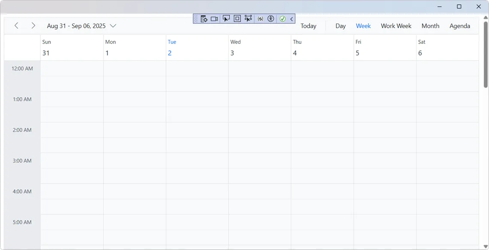

# Getting Started with Blazor Scheduler component

This section walks you through the step-by-step process of integrating the [Blazor Scheduler](https://www.syncfusion.com/scheduler-sdk/blazor-scheduler) component in your Blazor MAUI App using both [Visual Studio](https://visualstudio.microsoft.com/vs/) and [Visual Studio Code](https://code.visualstudio.com/).
This section briefly explains how to include the [Blazor Scheduler](https://www.syncfusion.com/scheduler-sdk/blazor-scheduler) component in a Blazor MAUI App using [Visual Studio](https://visualstudio.microsoft.com/vs/), [Visual Studio Code](https://code.visualstudio.com/), and the [.NET CLI](https://learn.microsoft.com/en-us/dotnet/core/tools/).

**Supported Framework:** .NET 8.0 or later with MAUI

## Create a new Blazor MAUI App





Create a Blazor MAUI App using Visual Studio via [Microsoft Templates](https://learn.microsoft.com/en-us/dotnet/maui/get-started/first-app?pivots=devices-windows&view=net-maui-9.0&tabs=vswin). For detailed instructions, refer to the [Blazor MAUI App Getting Started](https://blazor.syncfusion.com/documentation/getting-started/maui-blazor-app) documentation.

- .NET 8.0 SDK or later
- Visual Studio 2022 with the "Mobile development with the .NET" workload installed
- Mobile development with the .NET extension for Visual Studio (for MAUI templates)

For more details, see the [MAUI installation guide](https://learn.microsoft.com/en-us/dotnet/MAUI/get-started/installation?tabs=vswin). Optionally, install the [Syncfusion® Blazor Extension](https://blazor.syncfusion.com/documentation/visual-studio-integration/template-studio) for additional project templates.




You can create a Blazor MAUI App using Visual Studio via [Microsoft Templates](https://learn.microsoft.com/en-us/dotnet/maui/get-started/first-app?pivots=devices-windows&view=net-maui-9.0&tabs=vswin). For detailed instructions, see the [Blazor MAUI App Getting Started guide](https://blazor.syncfusion.com/documentation/getting-started/maui-blazor-app).
Run the following command to create a new Blazor MAUI App.




dotnet new maui-blazor -o MauiBlazorApp
cd MauiBlazorApp




- .NET 8.0 SDK or later
- Visual Studio Code
- C# DevKit extension for Visual Studio Code

For more details, see the [MAUI installation guide for VS Code](https://learn.microsoft.com/en-us/dotnet/maui/get-started/installation?view=net-maui-9.0&tabs=visual-studio-code). Optionally, install the [Syncfusion® Blazor Extension](https://blazor.syncfusion.com/documentation/visual-studio-code-integration/create-project) for additional project creation options.
Alternatively, create a **Blazor MAUI App** using Visual Studio Code via [Microsoft Templates](https://learn.microsoft.com/en-us/dotnet/maui/get-started/first-app?pivots=devices-windows&view=net-maui-9.0&tabs=visual-studio-code) or the [Syncfusion® Blazor Extension](https://blazor.syncfusion.com/documentation/visual-studio-code-integration/create-project). For detailed instructions, refer to the [Blazor MAUI App Getting Started](https://blazor.syncfusion.com/documentation/getting-started/maui-blazor-app) documentation.



Create a Blazor MAUI App using Visual Studio Code via [Microsoft templates](https://learn.microsoft.com/en-us/dotnet/maui/get-started/first-app?pivots=devices-windows&view=net-maui-9.0&tabs=visual-studio-code) or the [Syncfusion® Blazor Extension](https://blazor.syncfusion.com/documentation/visual-studio-code-integration/create-project). For detailed instructions, see the [Blazor MAUI App Getting Started guide](https://blazor.syncfusion.com/documentation/getting-started/maui-blazor-app).


Run the following command to create a new Blazor MAUI App.




dotnet new maui-blazor -o MauiBlazorApp
cd MauiBlazorApp








## Install required NuGet packages
## Install the required Blazor packages

Install the following NuGet packages:
- [Syncfusion.Blazor.Schedule](https://www.nuget.org/packages/Syncfusion.Blazor.Schedule/) — Scheduler component
- [Syncfusion.Blazor.Themes](https://www.nuget.org/packages/Syncfusion.Blazor.Themes/) — Styling themes

Replace `{{ site.releaseversion }}` with the desired package version (e.g., `27.1.50`). All Syncfusion Blazor packages are available on [nuget.org](https://www.nuget.org/packages?q=syncfusion.blazor). See the [NuGet packages documentation](https://blazor.syncfusion.com/documentation/nuget-packages) for version details.





1. Go to *Tools → NuGet Package Manager → Manage NuGet Packages for Solution*.
2. Search the required NuGet packages (`Syncfusion.Blazor.Schedule` and `Syncfusion.Blazor.Themes`) and install them.

Alternatively, you can install the same packages using the Package Manager Console with the following commands.




Install-Package Syncfusion.Blazor.Schedule -Version {{ site.releaseversion }}
Install-Package Syncfusion.Blazor.Themes -Version {{ site.releaseversion }}








Open the terminal and run the following commands.




dotnet add package Syncfusion.Blazor.Schedule -v {{ site.releaseversion }}
dotnet add package Syncfusion.Blazor.Themes -v {{ site.releaseversion }}








Open the command prompt and run the following commands.




dotnet add package Syncfusion.Blazor.Schedule -v {{ site.releaseversion }}
dotnet add package Syncfusion.Blazor.Themes -v {{ site.releaseversion }}








## Add import namespaces

After the packages are installed, open the **~/_Imports.razor** file in your project root and add the following namespace imports.
After the packages are installed, open the **~/Components/_Imports.razor** file and import the `Syncfusion.Blazor` and `Syncfusion.Blazor.Schedule` namespaces.




@using Syncfusion.Blazor 
@using Syncfusion.Blazor.Schedule




## Register the Blazor service

Register the Blazor service in the **~/MauiProgram.cs** file by adding the using statement and calling `AddSyncfusionBlazor()` in the service collection.
Open the **MauiProgram.cs** file in Blazor MAUI App and register the Blazor service.




using Syncfusion.Blazor;

namespace MauiBlazorApp
{
    public static class MauiProgram
    {
        public static MauiApp CreateMauiApp()
        {
            var builder = MauiApp.CreateBuilder()
                .UseMauiApp<App>()
                .ConfigureFonts(fonts =>
                {
                    fonts.AddFont("OpenSans-Regular.ttf", "OpenSansRegular");
                });

            builder.Services.AddMauiBlazorWeb();
            builder.Services.AddSyncfusionBlazor();  // Add this line

            return builder.Build();
        }
    }
}




## Add stylesheet and script resources

The theme stylesheet and script are accessed from NuGet through [Static Web Assets](https://blazor.syncfusion.com/documentation/appearance/themes#static-web-assets). Include the stylesheet and script references in the **~/index.html** file within the `<head>` section.

```html
The theme stylesheet and script can be accessed from NuGet through [Static Web Assets](https://blazor.syncfusion.com/documentation/appearance/themes#static-web-assets). Include the [stylesheet](https://blazor.syncfusion.com/documentation/appearance/themes) and [script references](https://blazor.syncfusion.com/documentation/common/adding-script-references) in the **~wwwroot/index.html** file.




...
<link href="_content/Syncfusion.Blazor.Themes/fluent2.css" rel="stylesheet" />
...
<script src="_content/Syncfusion.Blazor.Core/scripts/syncfusion-blazor.min.js" type="text/javascript"></script>
```

**Note:** For other theme options (Material, Bootstrap, Tailwind, etc.) and referencing methods, see the [Blazor Themes documentation](https://blazor.syncfusion.com/documentation/appearance/themes). To learn about alternative ways to add script references, see [Adding Script References](https://blazor.syncfusion.com/documentation/common/adding-script-references).

## Add Blazor Scheduler component

Add the Blazor Scheduler component to your **~/Pages/Home.razor** file (or create it if it doesn't exist). The component displays the Scheduler with multiple view options.

### AppointmentData model

Define the data model for scheduler appointments:

```csharp
public class AppointmentData
{
    public int Id { get; set; }                          // Unique identifier
    public string Subject { get; set; }                  // Appointment title
    public string Location { get; set; }                // Appointment location
    public DateTime StartTime { get; set; }             // Start datetime
    public DateTime EndTime { get; set; }               // End datetime
    public string Description { get; set; }             // Appointment description
    public bool IsAllDay { get; set; }                  // All-day event flag
    public string RecurrenceRule { get; set; }          // Recurrence pattern (RRULE)
    public string RecurrenceException { get; set; }     // Recurrence exceptions
    public Nullable<int> RecurrenceID { get; set; }     // Parent event ID for recurring instances
}
```

### Basic Scheduler




## Add Blazor Scheduler component

Open a Razor file located in the **~/Components/Pages/*.razor** (for example, **Home.razor**) and add the [Blazor Scheduler](https://www.syncfusion.com/scheduler-sdk/blazor-scheduler) component inside the razor file.




@using Syncfusion.Blazor.Schedule

<SfSchedule TValue="AppointmentData">
    <ScheduleViews>
        <ScheduleView Option="View.Day"></ScheduleView>
        <ScheduleView Option="View.Week"></ScheduleView>
        <ScheduleView Option="View.WorkWeek"></ScheduleView>
        <ScheduleView Option="View.Month"></ScheduleView>
        <ScheduleView Option="View.Agenda"></ScheduleView>
    </ScheduleViews>
</SfSchedule>

@code {
    public class AppointmentData
    {
        public int Id { get; set; }
        public string Subject { get; set; }
        public string Location { get; set; }
        public DateTime StartTime { get; set; }
        public DateTime EndTime { get; set; }
        public string Description { get; set; }
        public bool IsAllDay { get; set; }
        public string RecurrenceRule { get; set; }
        public string RecurrenceException { get; set; }
        public Nullable<int> RecurrenceID { get; set; }
    }
}




## Populate appointments
## Run the application on Windows





Press <kbd>Ctrl</kbd>+<kbd>F5</kbd> (Windows) or <kbd>⌘</kbd>+<kbd>F5</kbd> (macOS) to launch the application. The [Blazor Scheduler](https://www.syncfusion.com/scheduler-sdk/blazor-scheduler) component will render in your default web browser.





Open the terminal and run the following command.




dotnet run








Open the command prompt and run the following command.




dotnet run










## Run the application on Android

To run the Blazor Scheduler in a Blazor Android MAUI application using the Android emulator, follow these steps:

1. Set up and start the Android emulator. For help, see the [Android Device Manager guide](https://learn.microsoft.com/en-us/dotnet/maui/android/emulator/device-manager#android-device-manager-on-windows).

2. Run your app using the emulator to view the Scheduler.

N> If encounter any errors while using the Android Emulator, refer to the following link for troubleshooting guidance[Troubleshooting Android Emulator](https://learn.microsoft.com/en-us/dotnet/maui/android/emulator/troubleshooting).

To display appointments in the Scheduler, bind event data to the [DataSource](https://help.syncfusion.com/cr/blazor/Syncfusion.Blazor.Schedule.ScheduleEventSettings-1.html) property under [ScheduleEventSettings](https://help.syncfusion.com/cr/blazor/Syncfusion.Blazor.Schedule.ScheduleEventSettings-1.html).




@using Syncfusion.Blazor.Schedule

<SfSchedule TValue="AppointmentData" Height="650px" @bind-SelectedDate="@CurrentDate">
    <ScheduleEventSettings DataSource="@DataSource"></ScheduleEventSettings>
    <ScheduleViews>
        <ScheduleView Option="View.Day"></ScheduleView>
        <ScheduleView Option="View.Week"></ScheduleView>
        <ScheduleView Option="View.WorkWeek"></ScheduleView>
        <ScheduleView Option="View.Month"></ScheduleView>
        <ScheduleView Option="View.Agenda"></ScheduleView>
    </ScheduleViews>
</SfSchedule>

@code{
    DateTime CurrentDate = new DateTime(2025, 2, 14);
    
    List<AppointmentData> DataSource = new List<AppointmentData>
    {
        new AppointmentData 
        { 
            Id = 1, 
            Subject = "Paris", 
            StartTime = new DateTime(2025, 2, 13, 10, 0, 0), 
            EndTime = new DateTime(2025, 2, 13, 12, 0, 0) 
        },
        new AppointmentData 
        { 
            Id = 2, 
            Subject = "Germany", 
            StartTime = new DateTime(2025, 2, 15, 10, 0, 0), 
            EndTime = new DateTime(2025, 2, 15, 12, 0, 0) 
        }
    };

    public class AppointmentData
    {
        public int Id { get; set; }
        public string Subject { get; set; }
        public string Location { get; set; }
        public DateTime StartTime { get; set; }
        public DateTime EndTime { get; set; }
        public string Description { get; set; }
        public bool IsAllDay { get; set; }
        public string RecurrenceRule { get; set; }
        public string RecurrenceException { get; set; }
        public Nullable<int> RecurrenceID { get; set; }
    }
}




## Set the initial date

By default, the Scheduler displays the system date. To display a specific date, use two-way binding on the [SelectedDate](https://help.syncfusion.com/cr/blazor/Syncfusion.Blazor.Schedule.SfSchedule-1.html#Syncfusion_Blazor_Schedule_SfSchedule_1_SelectedDate) property.




@using Syncfusion.Blazor.Schedule

<SfSchedule TValue="AppointmentData" Height="650px" @bind-SelectedDate="@CurrentDate">
    <ScheduleViews>
        <ScheduleView Option="View.Day"></ScheduleView>
        <ScheduleView Option="View.Week"></ScheduleView>
        <ScheduleView Option="View.WorkWeek"></ScheduleView>
        <ScheduleView Option="View.Month"></ScheduleView>
        <ScheduleView Option="View.Agenda"></ScheduleView>
    </ScheduleViews>
</SfSchedule>

@code{
    DateTime CurrentDate = new DateTime(2025, 1, 10);  // Change to desired initial date
    
    public class AppointmentData
    {
        public int Id { get; set; }
        public string Subject { get; set; }
        public string Location { get; set; }
        public DateTime StartTime { get; set; }
        public DateTime EndTime { get; set; }
        public string Description { get; set; }
        public bool IsAllDay { get; set; }
        public string RecurrenceRule { get; set; }
        public string RecurrenceException { get; set; }
        public Nullable<int> RecurrenceID { get; set; }
    }
}




## Set the default view

The Scheduler displays `Week` view by default. To change the initial view, use two-way binding on the [CurrentView](https://help.syncfusion.com/cr/blazor/Syncfusion.Blazor.Schedule.SfSchedule-1.html#Syncfusion_Blazor_Schedule_SfSchedule_1_CurrentView) property.

### Available views

The Scheduler supports these built-in views:

| View | Description |
|------|-------------|
| Day | Single day view |
| Week | 7-day week view (default) |
| WorkWeek | 5-day work week view (Mon-Fri) |
| Month | Month grid view |
| Agenda | List view of upcoming appointments |
| MonthAgenda | Month view with agenda side panel |
| TimelineDay | Horizontal day timeline |
| TimelineWeek | Horizontal week timeline |
| TimelineWorkWeek | Horizontal work week timeline |
| TimelineMonth | Horizontal month timeline |
| TimelineYear | Horizontal year timeline |
| Year | Annual overview view |

Configure only the views your application needs by adding `ScheduleView` components.




@using Syncfusion.Blazor.Schedule

<SfSchedule TValue="AppointmentData" Height="650px" @bind-CurrentView="@CurrentView">
    <ScheduleViews>
        <ScheduleView Option="View.Day"></ScheduleView>
        <ScheduleView Option="View.Week"></ScheduleView>
        <ScheduleView Option="View.Month"></ScheduleView>
    </ScheduleViews>
</SfSchedule>

@code{
    View CurrentView = View.Month;  // Set initial view
    
@code {
    View CurrentView = View.Month;
    public class AppointmentData
    {
        public int Id { get; set; }
        public string Subject { get; set; }
        public string Location { get; set; }
        public DateTime StartTime { get; set; }
        public DateTime EndTime { get; set; }
        public string Description { get; set; }
        public bool IsAllDay { get; set; }
        public string RecurrenceRule { get; set; }
        public string RecurrenceException { get; set; }
        public Nullable<int> RecurrenceID { get; set; }
    }
}




## See also

1. [Blazor Scheduler API Reference](https://help.syncfusion.com/cr/blazor/Syncfusion.Blazor.Schedule.SfSchedule-1.html)
2. [Blazor Scheduler Features](https://blazor.syncfusion.com/documentation/scheduler/getting-started)
3. [Getting Started with Blazor WebAssembly](https://blazor.syncfusion.com/documentation/getting-started/blazor-webassembly-dotnet-cli)
4. [Getting Started with Blazor Server](https://blazor.syncfusion.com/documentation/getting-started/blazor-server-side-dotnet-cli)