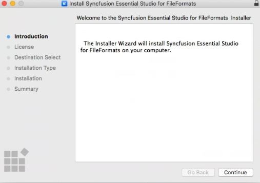

# Installing Syncfusion Scheduler SDK Mac installer

## Steps to resolve the warning message in Catalina OS or later

   While running Essential Studio Scheduler SDK Mac Installers on Catalina MacOS or later, the below alert will be displayed.

     
     
   If you receive this alert, follow the below steps for the easiest solution.   

   1.	Right-click the downloaded pkg file.
   2.	Select the "Open With" option and choose "Installer (Default)". The following pop-up appears.

		

   3.	When you click "Open" the installer window will be opened.

## Step-by-Step Installation

The steps below show how to install the Syncfusion Scheduler SDK Mac Installer.

1. Open the Syncfusion Scheduler SDK Mac installer (.pkg) file. The installer wizard opens. Click **Continue**.

   

2. The Software License Agreement appears. Click **Continue**.

   

3. The License Agreement confirmation window appears. If you have read the Software License Agreement, click **Agree**. Clicking **Disagree** exits the installer.

   

   N> The Unlock key is not required to install the Syncfusion Scheduler SDK Mac Installer.

4. The Destination Select wizard appears. Choose the user/volume to install the Syncfusion Scheduler SDK Mac Installer on, then click **Continue**.

   

5. The Installation Type wizard appears. Click **Install** to begin the standard installation.

   

6. The Authentication window appears. Enter your Mac password and click **Install Software**.

   

7. The installation process begins on your machine.

   

8. The Installation Complete screen appears. To exit the installer wizard, click **Close**.

   

By default, the Mac Installer installs the files in the following location (where `<version>` is the installed Scheduler SDK version and `~` is your home directory):

**Location:** `~/Documents/Syncfusion/<version>/Scheduler SDK`

## License key registration in samples

After the installation, the license key is required to register the Syncfusion license in the demo source included in the Mac Installer. To learn about the steps for license registration for the ASP.NET Core - EJ2 samples in the Syncfusion Scheduler SDK Mac Installer, please refer to the following links:

* Register the license key in the [Program.cs](https://ej2.syncfusion.com/aspnetcore/documentation/licensing/how-to-register-in-an-application#for-aspnet-core-application-using-net-60) file if you created the ASP.NET Core web application with Visual Studio 2022 and .NET 6.0.
* Register the license key in Configure method of [Startup.cs](https://ej2.syncfusion.com/aspnetcore/documentation/licensing/how-to-register-in-an-application#for-aspnet-core-application-using-net-50-or-net-31)