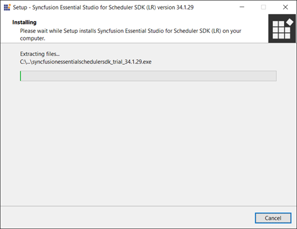
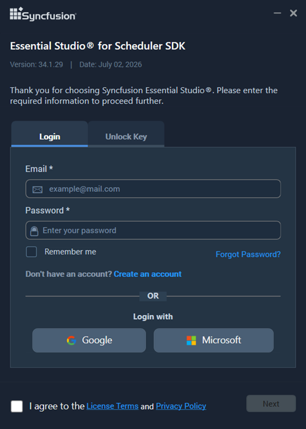
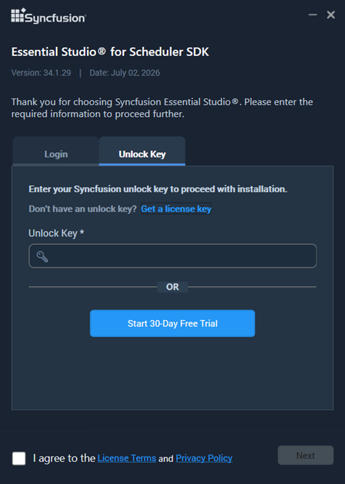
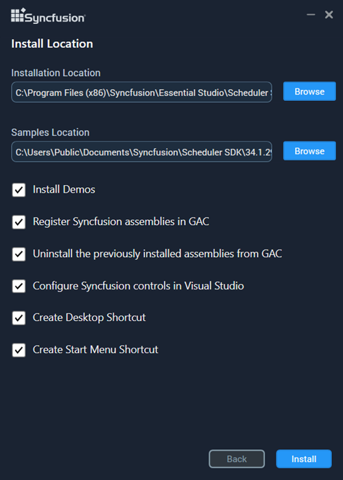
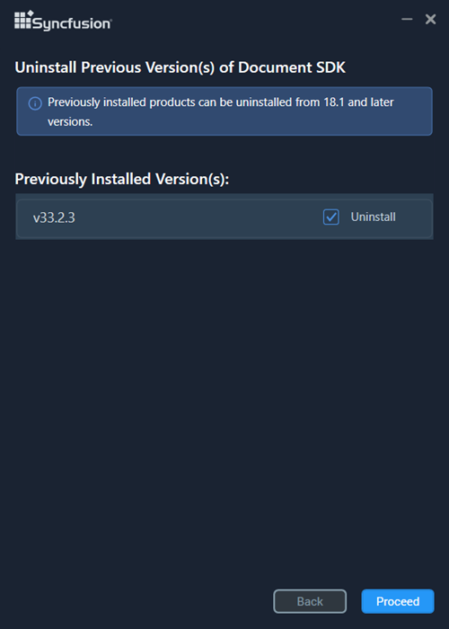
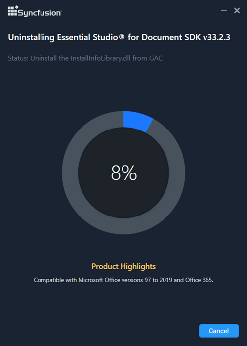
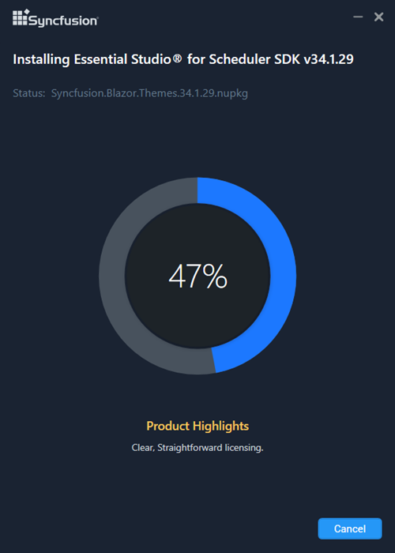
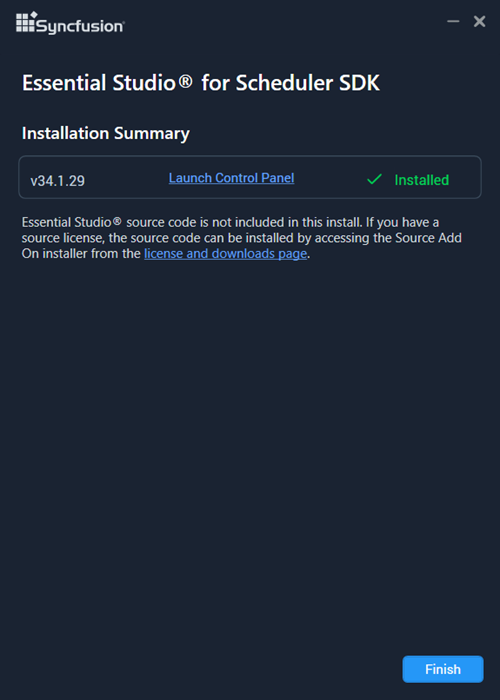

# Installing Syncfusion Scheduler SDK Offline Installer

## Installing with UI

The steps below show how to install the Syncfusion Scheduler SDK offline installer.

1. Open the Syncfusion Scheduler SDK offline installer file (typically located in your browser's `Downloads` folder) by double-clicking it. The Installer Wizard opens and extracts the package.

   

   N> The Installer wizard extracts the `syncfusionessentialschedulersdk_<version>.exe` setup, which displays the package extraction progress. Replace `<version>` with the actual version (for example, `26.1.35`).

2. To unlock the Syncfusion offline installer, choose one of the following options:

   #### Login To Install

   You must enter your Syncfusion email address and password. If you don't already have a Syncfusion account, you can sign up for one by clicking **"Create an account"**. If you have forgotten your password, click **"Forgot Password"** to create a new one. Once you've entered your Syncfusion email and password, click **Next**.

   

   #### Use Unlock Key

   Use a Syncfusion licensed or trial Unlock key to unlock the Scheduler SDK installer. Unlock keys are platform- and version-specific.

   The trial unlock key is valid for 30 days; the installer does not accept an expired trial key.

   To learn how to generate an unlock key for both trial and licensed products, see [this](https://www.syncfusion.com/kb/2326) Knowledge Base article.

   

3. Read the License Terms and Privacy Policy, select the **"I agree to the License Terms and Privacy Policy"** check box, and click **Next**.

4. You can change the installation and sample locations and configure additional settings. Click **Next**, then click **Install** to proceed with the default settings.

   

   **Additional Settings**

   * Select the **Install Demos** check box to install Syncfusion samples, or leave it unchecked if you do not want to install Syncfusion samples.
   * Select the **Register Syncfusion Assemblies in GAC** check box to install the latest Syncfusion assemblies in GAC, or clear this check box when you do not want to install the latest assemblies in GAC.
   * Select the **Configure Syncfusion controls in Visual Studio** check box to configure the Syncfusion controls in the Visual Studio toolbox, or clear this check box when you do not want to configure them. You must also select the **Register Syncfusion assemblies in GAC** check box when you select this option.
   * Select the **Configure Syncfusion Extensions controls in Visual Studio** check box to configure the Syncfusion Extensions in Visual Studio, or clear it when you do not want to configure them.
   * Select the **Create Desktop Shortcut** check box to add a desktop shortcut for the Syncfusion Control Panel.
   * Select the **Create Start Menu Shortcut** check box to add a start menu shortcut for the Syncfusion Control Panel.

5. If previous versions of the current product are installed, the **Uninstall Previous Version(s)** wizard opens. Select the **Uninstall** check box next to the versions you want to remove, then click **Proceed**.

   

   N> Syncfusion supports uninstalling previous versions (from 18.1 onward) when installing a newer version.

   N> If any version is selected to uninstall, a confirmation screen appears; selecting **Continue** shows the Progress screen with both uninstall and install progress. If no versions are selected for uninstall, only the install progress is shown.

   **Confirmation Alert**

   

   **Uninstall Progress:**

   

   **Install Progress:**

   

   N> The Completed screen is displayed once the Scheduler SDK product is installed. If any version is selected to uninstall, the Completed screen shows both the install and uninstall status.

   

6. After installing, click the **Launch Control Panel** link to open the Syncfusion Control Panel.

8.  Click the Finish button. Your system has been installed with the Syncfusion Essential Studio Scheduler SDK product.

## Installing in silent mode

The Syncfusion Essential Studio Scheduler SDK Installer supports installation and uninstallation via the command line.

### Command Line Installation

To install through the Command Line in Silent mode, follow the steps below.

1.	Run the Syncfusion Scheduler SDK installer by double-clicking it. The Installer Wizard automatically opens and extracts the package.
2.	The file syncfusionessentialschedulersdk_(version).exe file will be extracted into the Temp directory.
3.	Run %temp%. The Temp folder will be opened. The syncfusionessentialschedulersdk_(version).exe file will be located in one of the folders.
4.	Copy the extracted syncfusionessentialschedulersdk_(version).exe file in local drive.
5.	Exit the Wizard.
6.	Run Command Prompt in administrator mode and enter the following arguments.

   
    **Arguments:** “installer file path\SyncfusionEssentialStudio(platform)_(version).exe” /Install silent /UNLOCKKEY:“(product unlock key)” [/log “{Log file path}”] [/InstallPath:{Location to install}] [/InstallSamples:{true/false}] [/InstallAssemblies:{true/false}] [/UninstallExistAssemblies:{true/false}] [/InstallToolbox:{true/false}]

    N> [..] – Arguments inside the square brackets are optional.

    **Example:** “D:\Temp\syncfusionessentialschedulersdk_x.x.x.x.exe” /Install silent /UNLOCKKEY:“product unlock key” /log “C:\Temp\EssentialStudio_Platform.log” /InstallPath:C:\Syncfusion\x.x.x.x /InstallSamples:true /InstallAssemblies:true /UninstallExistAssemblies:true /InstallToolbox:true

	
7.  Essential Studio for Scheduler SDK is installed.

    N> x.x.x.x should be replaced with the Essential Studio version and the Product Unlock Key needs to be replaced with the Unlock Key for that version.
   

### Command Line Uninstallation

Syncfusion Essential Scheduler SDK can be uninstalled silently using the Command Line.

1.	Run the Syncfusion Scheduler SDK installer by double-clicking it. The Installer Wizard automatically opens and extracts the package.
2.	The file syncfusionessentialschedulersdk_(version).exe file will be extracted into the Temp directory.
3.	Run %temp%. The Temp folder will be opened. The syncfusionessentialschedulersdk_(version).exe file will be located in one of the folders.
4.	Copy the extracted syncfusionessentialschedulersdk_(version).exe file in local drive.
5.	Exit the Wizard.
6.	Run Command Prompt in administrator mode and enter the following arguments.
   
    **Arguments:** “Copied installer file path\syncfusionessentialschedulersdk_(version).exe” /uninstall silent 

    **Example:** “D:\Temp\syncfusionessentialschedulersdk_x.x.x.x.exe" /uninstall silent

7.  Essential Studio for Scheduler SDK is uninstalled.
   
   
