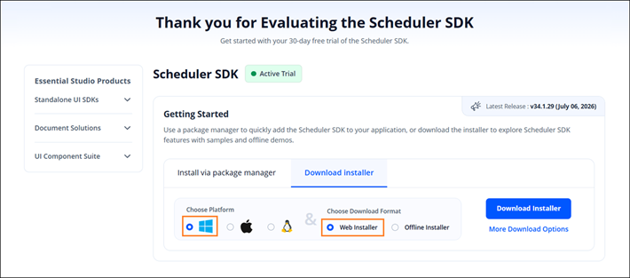
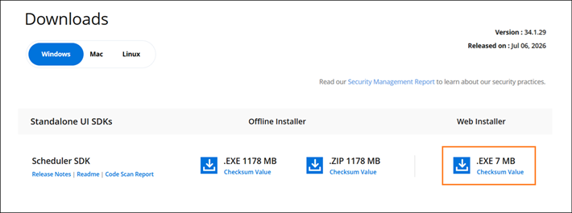

# Downloading Syncfusion Scheduler SDK Web Installer

You can either download the licensed installer or try our trial installer depending on your license. 

The Syncfusion Web Installer can be downloaded from the [Syncfusion](https://www.syncfusion.com/) website. You can either download the licensed installer or try our trial installer depending on your license type.

   -	Trial Installer
   -	Licensed Installer

## Download the Trial Version

Our 30-day trial can be downloaded in two ways.

   * Download Free Trial Setup
   * Start Trials if using components through [NuGet.org](https://www.nuget.org/packages?q=syncfusion)

### Download Free Trial Setup

1. You can evaluate our 30-day free trial by visiting the [Download Free Trial](https://www.syncfusion.com/downloads) page, selecting the Scheduler SDK platform.
2. After completing the required form or logging in with your registered Syncfusion account, you can download the Scheduler SDK trial installer from the confirmation page. (as shown in the screenshot below.)

   

3. With a trial license, only the latest version's trial installer can be downloaded.
4. After downloading, you can unlock the Syncfusion Scheduler SDK trial installer using either the trial unlock key or your Syncfusion account credentials. More information on generating an unlock key can be found in [this](https://support.syncfusion.com/kb/article/7053/how-to-generate-unlock-key-for-essentials-studio-products) article.
5. Before the trial expires, you can download the trial installer at any time from your registered account's [Trials & Downloads](https://www.syncfusion.com/account/manage-trials/downloads) page, as shown in the screenshot below.
6. Click the **Download** button (shown in the screenshot below) to get the Syncfusion Scheduler SDK Web Installer.

   

### Start Trials if using components through [NuGet.org](https://www.nuget.org/packages?q=syncfusion)

Initiate an evaluation if you have already obtained our components through [NuGet.org](https://www.nuget.org/packages?q=syncfusion).

1. You can start your 30-day free trial for Scheduler SDK from the [Start Trial](https://www.syncfusion.com/account/manage-trials/start-trials) page in your account.

   

2. To access this page, you must sign up / log in with your Syncfusion account.
3. Begin your trial by selecting the Scheduler SDK product.

   N> If you've already used the trial products and they haven't expired, you won't be able to start the trial for the same product again.

4. After you've started the trial, go to the [Trials & Downloads](https://www.syncfusion.com/account/manage-trials/downloads) page to get the latest version trial installer. You can generate the [unlock key](https://support.syncfusion.com/kb/article/7053/how-to-generate-unlock-key-for-essentials-studio-products) and [license key](https://help.syncfusion.com/common/essential-studio/licensing/how-to-generate) here at any time before the trial period expires. (as shown in the screenshot below.)

   

## Download the License Version

> An active Scheduler SDK license must be associated with your Syncfusion account to download the licensed installer.

1. Syncfusion licensed products will be available on the [License & Downloads](https://www.syncfusion.com/account/downloads) page under your registered Syncfusion account.
2. You can view all the licenses (both active and expired) associated with your account.
3. From the list, select the **Scheduler SDK** product, then click the **Download** button (highlighted in the screenshot below) to download the latest version of the installer.
4. The latest version of the installer is downloaded from this page.
5. To download an older version installer, go to the [Downloads Older Versions](https://www.syncfusion.com/account/downloads/studio) page (highlighted in the screenshot below).
6. To download other platform/add-on installers, go to **More Download Options** (highlighted in the screenshot below).

   

7. While your license is active, you can download the installer at any time from your registered account's [License & Downloads](https://www.syncfusion.com/account/downloads) page, as shown in the screenshot below.

   

8. After downloading, you can unlock the Syncfusion Scheduler SDK Web Installer using your Syncfusion account credentials.

You can also refer to the [**Web Installer**](https://help.syncfusion.com/scheduler-sdk/installation/web-installer/how-to-install) link for step-by-step installation guidelines.	