# Installing Syncfusion Scheduler SDK Web Installer

## Overview

For the Syncfusion Scheduler SDK product, Syncfusion offers a Web Installer. This installer alleviates the burden of downloading a larger installer. You can simply download and run the online installer, which is smaller in size and downloads and installs only the Scheduler SDK components you choose. You can get the latest version of the Syncfusion Web Installer [here](https://www.syncfusion.com/downloads/latest-version).

 
## Installation

The steps below show how to install the Syncfusion Scheduler SDK Web Installer.

1.  Open the Syncfusion Scheduler SDK Web Installer file (typically located in your browser's `Downloads` folder) by double-clicking it. The Installer Wizard opens and extracts the package.

    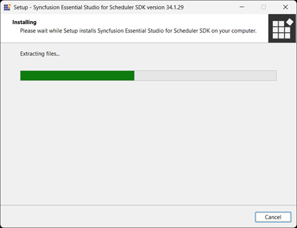

    
N> The installer wizard extracts the `syncfusionessentialwebschedulerwebinstaller_<version>.exe` setup, which displays the package extraction progress. Replace `<version>` with the actual Scheduler SDK version (for example, `26.1.35`).
    
2. 	The Syncfusion Scheduler SDK Web Installer's welcome wizard appears. Click **Next**.

    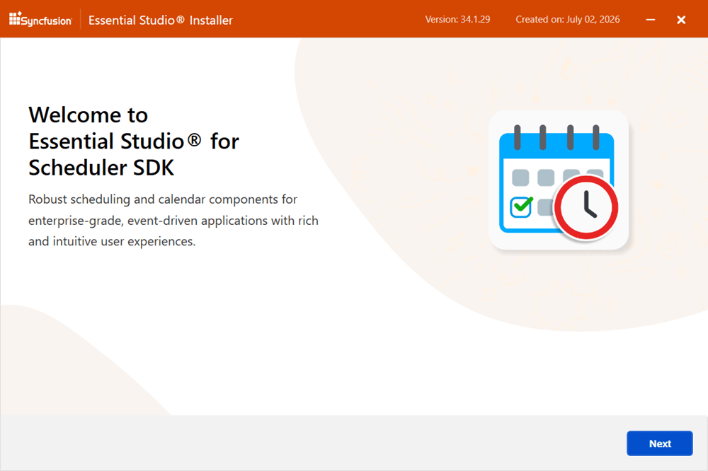

  
3. The Platform Selection Wizard appears. From the **Available** tab, select the products to be installed. To install all products, select the **Install All** check box.

   **Available**

   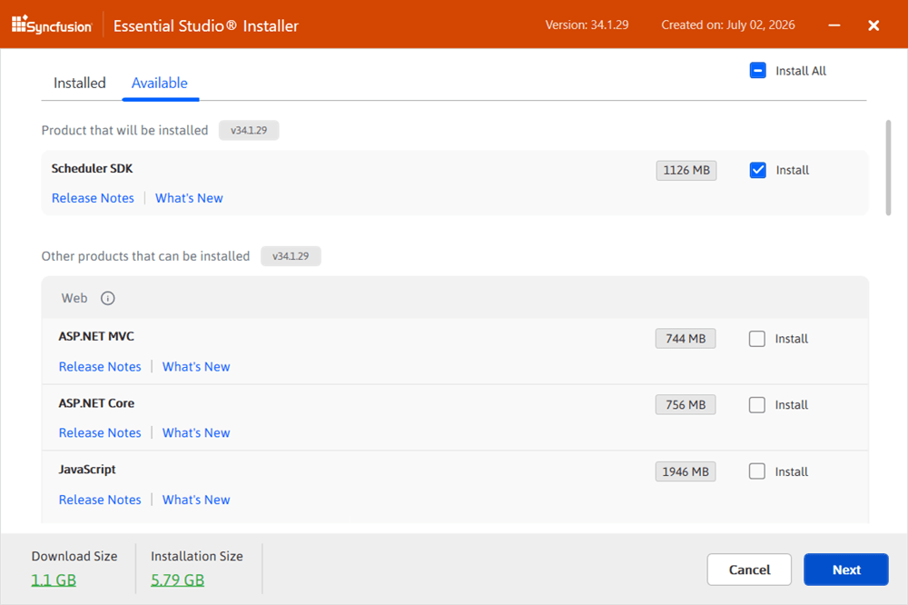

   If you have multiple products installed in the same version, they are listed under the **Installed** tab. You can also select which products to uninstall from the same version. Click **Next**.

   **Installed**

   

   I> If the required software for the selected product isn't already installed, the **Additional Software Required** alert appears. You can continue the installation and install the necessary software later.

   **Required Software**

   
		
	
4. If previous version(s) for the selected products are installed, the **Uninstall Previous Version** wizard appears. The list of previously installed versions for the products you've chosen is shown here. To remove all versions, select the **Uninstall All** check box. Click **Next**.

   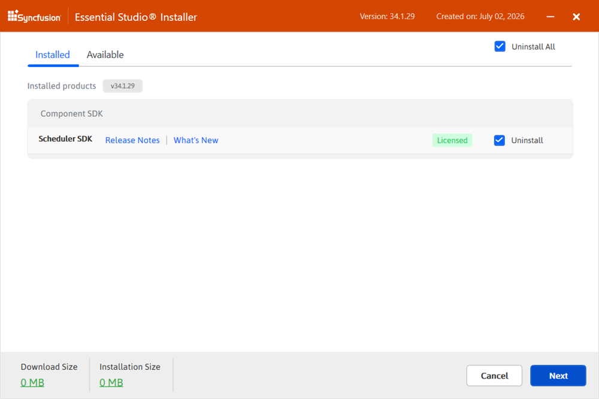

   N> Syncfusion provides the option to uninstall previous versions (from 18.1 onward) when installing a newer version.

5. A confirmation pop-up appears for uninstalling the selected previous versions.

   

6. The Confirmation Wizard appears with the list of products to be installed/uninstalled. You can view and modify the list of products to be installed and uninstalled from this page.

   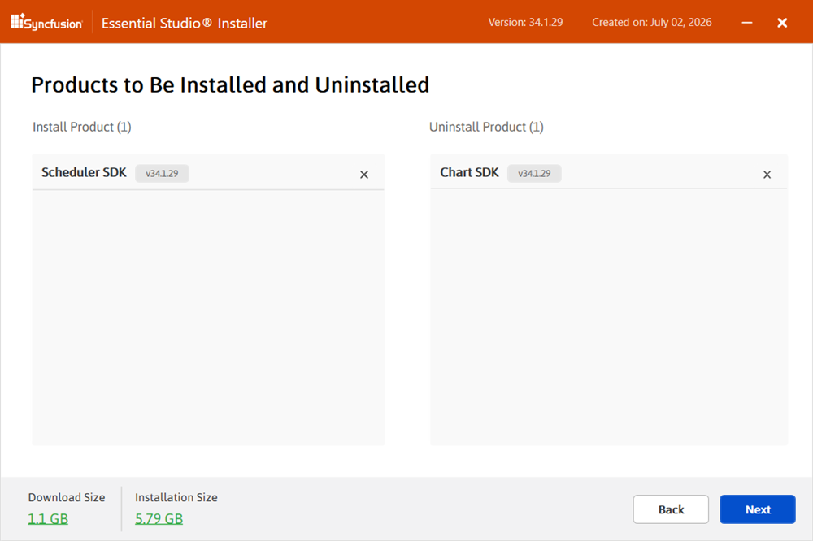

   N> Click the **Download Size** and **Installation Size** links to view the approximate size of the download and installation.

7. The Configuration Wizard appears. You can change the Download, Install, and Demos locations from here. You can also change the Additional settings on a product-by-product basis. Click **Next** to install with the default settings.

   

   **Additional settings**

   * Select the **Install Demos** check box to install Syncfusion samples, or leave it unchecked if you do not want to install Syncfusion samples.
   * Select the **Register Syncfusion Assemblies in GAC** check box to install the latest Syncfusion assemblies in GAC, or clear this check box when you do not want to install the latest assemblies in GAC.
   * Select the **Configure Syncfusion controls in Visual Studio** check box to configure the Syncfusion controls in the Visual Studio toolbox, or clear this check box when you do not want to configure them. You must also select the **Register Syncfusion Assemblies in GAC** check box when you select this option.
   * Select the **Configure Syncfusion Extensions controls in Visual Studio** check box to configure the Syncfusion Extensions in Visual Studio, or clear it when you do not want to configure them.
   * Select the **Create Desktop Shortcut** check box to add a desktop shortcut for the Syncfusion Control Panel.
   * Select the **Create Start Menu Shortcut** check box to add a start menu shortcut for the Syncfusion Control Panel.

8. Read the License Terms and Privacy Policy, select the **I agree to the License Terms and Privacy Policy** check box, and click **Next**.

9. The login wizard appears. Enter your Syncfusion email address and password. If you don't already have a Syncfusion account, create one by clicking **Create an Account**. If you've forgotten your password, click **Forgot Password** to create a new one. Click **Install**.

   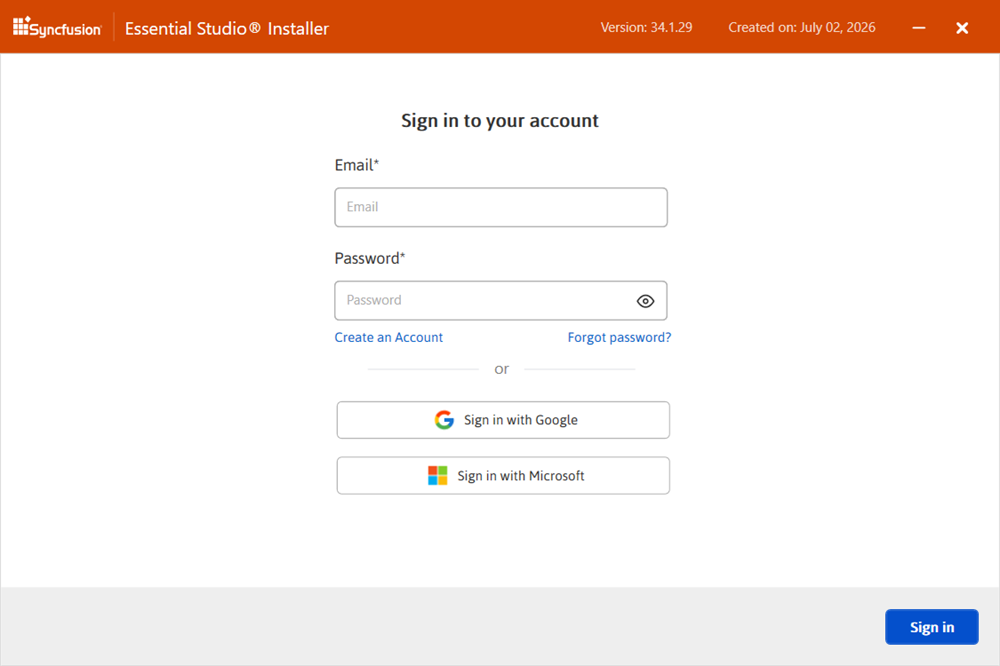

   I> The products you have chosen are installed based on your Syncfusion license (Trial or Licensed).

10. The download and installation/uninstallation progress is displayed, as shown in the screenshot below.

    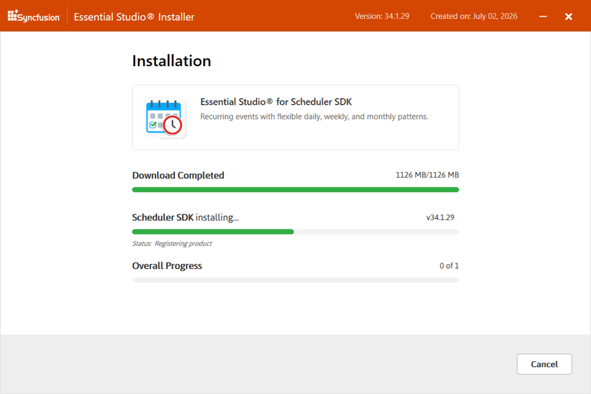

11. When the installation is finished, the **Summary** wizard appears. The list of products installed successfully (and any that have failed) is shown here. To close the Summary wizard, click **Finish**.

    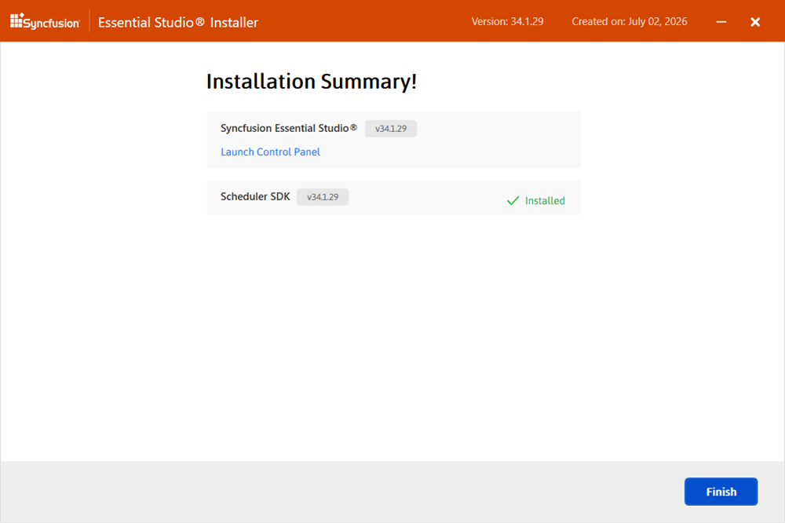

    * To open the Syncfusion Control Panel, click **Launch Control Panel**.

## Post-Installation

After installation, there are two Syncfusion Control Panel entries, as shown below. The **Essential Studio** entry manages all Syncfusion products installed in the same version, while the **Product** entry only uninstalls the specific product setup.

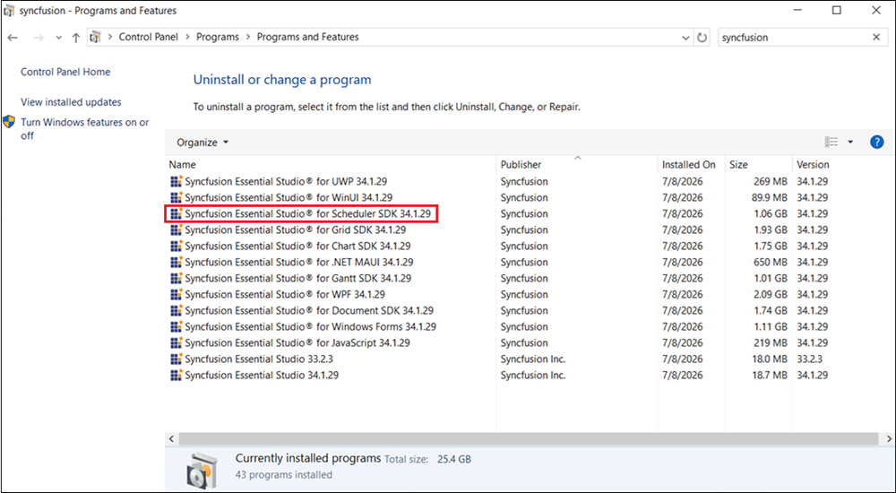
	
	
	
## Uninstallation

The Syncfusion Scheduler SDK installer can be uninstalled in two ways:

* Uninstall the Scheduler SDK using the Syncfusion Scheduler SDK Web Installer.
* Uninstall the Scheduler SDK from the Windows Control Panel.

Follow one of the options below to uninstall the Syncfusion Scheduler SDK installer.

### Option 1: Uninstall the Scheduler SDK Using the Syncfusion Scheduler SDK Web Installer

Syncfusion provides the option to uninstall products of the same version directly from the Web Installer application. Select the products to be uninstalled from the list, and Web Installer will uninstall them one by one.

   
   
**Option 2: Uninstall the Scheduler SDK from Windows Control Panel**  
   
You can uninstall all the installed products by selecting the **Syncfusion Essential Studio {version}** entry (element 1 in the below screenshot) from the Windows control panel, or you can uninstall Scheduler SDK alone by selecting the **Syncfusion Essential Studio for Scheduler SDK {version}** entry (element 2 in the below screenshot) from the Windows control panel.

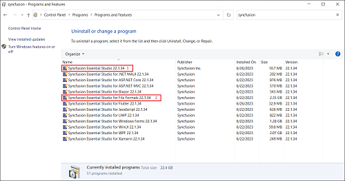

> If the **Syncfusion Essential Studio for Scheduler SDK `<version>`** entry is selected from the Windows Control Panel, only the Scheduler SDK is removed and the default MSI uninstallation window is displayed.

1. The Syncfusion Scheduler SDK Web Installer's welcome wizard appears. Click **Next**.

   

2. The Platform Selection Wizard appears. From the **Installed** tab, select the products to be uninstalled. To select all products, select the **Uninstall All** check box. Click **Next**.

   **Installed**

   

   You can also select the products to be installed from the **Available** tab. Click **Next**.

   **Available**

   

3. If other products are selected for installation, the **Uninstall Previous Version** wizard appears with the previous version(s) installed for the selected products. View the list of installed previous versions and select the **Uninstall All** check box to select all the versions. Click **Next**.

   

4. A confirmation pop-up appears for uninstalling the selected previous versions.

   

5. The Confirmation Wizard appears with the list of products to be installed/uninstalled. View and modify the list of products to be installed/uninstalled.

   

   N> Click the **Download Size** and **Installation Size** links to view the approximate size of the download and installation.

6. The Configuration Wizard appears. You can change the Download, Install, and Demos locations from here. You can also change the Additional settings on a product-by-product basis. Click **Next** to install with the default settings.

   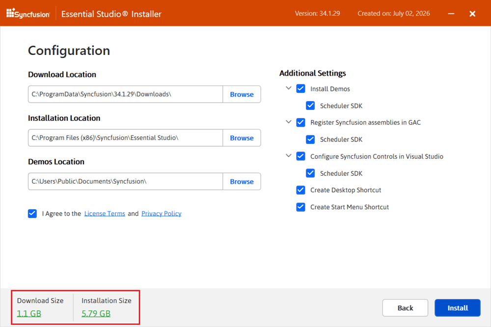

7. Read the License Terms and Privacy Policy, select the **I agree to the License Terms and Privacy Policy** check box, and click **Next**.

8. The login wizard appears. Enter your Syncfusion email address and password. If you don't already have a Syncfusion account, create one by clicking **Create an Account**. If you've forgotten your password, click **Forgot Password** to create a new one. Click **Install**.

   

   I> The products you have chosen are installed based on your Syncfusion license (Trial or Licensed).

9. The download, installation, and uninstallation progresses are displayed.

   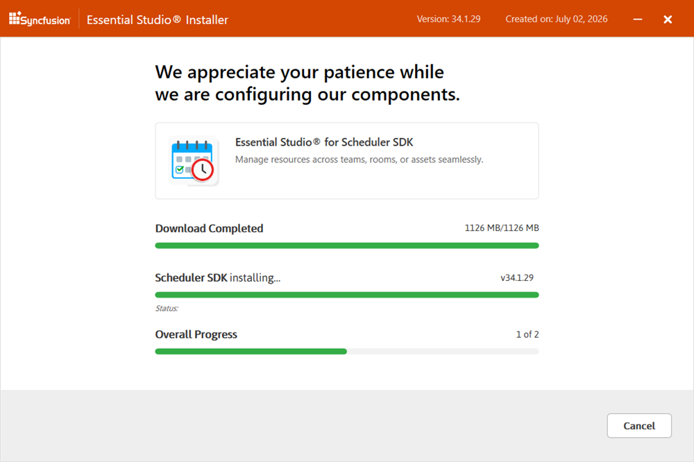

10. When the installation is finished, the **Summary** wizard appears. The list of products installed/uninstalled successfully (and any that have failed) is shown here. To close the Summary wizard, click **Finish**.

    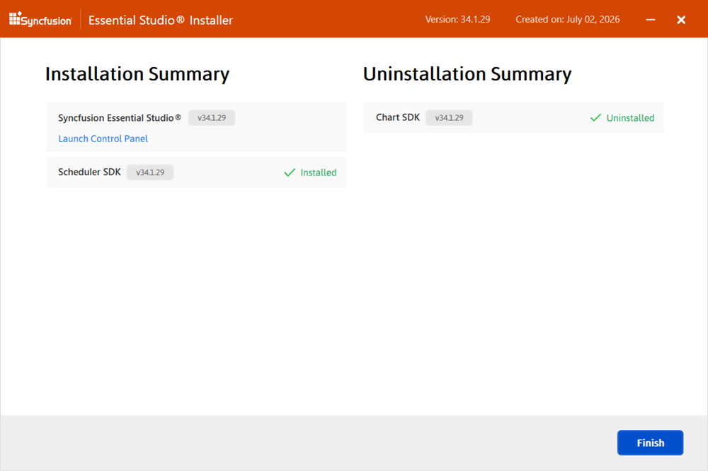
	
	* To open the Syncfusion Control Panel, click **Launch Control Panel**.