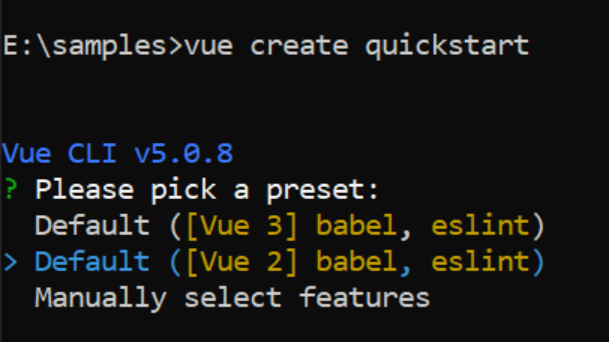

# Getting Started with the Vue Schedule Component in Vue 2

This article provides a step-by-step guide to creating a Vue 2 application using [Vue-CLI](https://cli.vuejs.org) and integrating the Vue Schedule component. It covers project setup, component installation, module injection, data binding, and basic customization.

> **Ready to streamline your Vue development?** Discover the full potential of Vue components with Syncfusion<sup style="font-size:70%">&reg;</sup> AI Coding Assistant. Effortlessly integrate, configure, and enhance your projects with intelligent, context-aware code suggestions, streamlined setups, and real-time insights—all seamlessly integrated into your preferred AI-powered IDEs like VS Code, Cursor, Syncfusion<sup style="font-size:70%">&reg;</sup> CodeStudio and more. [Explore Syncfusion<sup style="font-size:70%">&reg;</sup> AI Coding Assistant](https://ej2.syncfusion.com/vue/documentation/ai-coding-assistant/overview)

Check the following video to learn how to build a [Vue Scheduler](https://www.syncfusion.com/vue-components/vue-scheduler) application:



## Prerequisites

| Requirement | Version |
|-------------|---------|
| Vue | 2.6 or higher |
| Node.js | 16.0.0 or above |

### Vue supported versions

| Vue version | Minimum Syncfusion Vue Schedule version |
| ------------- | ------------------------------------------- |
|[Vue v2.7](https://blog.vuejs.org/posts/vue-2-7-naruto) | 20.3.47 and above |

### Browser Support

| Browser | Supported versions |
|---|---|
| Chrome | Latest |
| Firefox | Latest |
| Opera | Latest |
| Edge | 13+ |
| Internet Explorer (IE) | 11+ |
| Safari | 9+ |
| iOS Safari | 9+ |
| Android Browser / Chrome for Android | 4.4+ |
| Windows Mobile | IE 11+ |

> **Note:** This guide is for Vue 2. For Vue 3, refer to the [Getting Started with Vue 3](./getting-started-vue-3.md) guide.

## Setting up the Vue 2 project

To generate a Vue 2 project using Vue-CLI, use the [vue create](https://cli.vuejs.org#getting-started) command. Follow these steps to install Vue CLI and create a new project:

```bash
npm install -g @vue/cli
vue create quickstart
cd quickstart
npm run serve
```

or

```bash
yarn global add @vue/cli
vue create quickstart
cd quickstart
yarn run serve
```

When creating a new project, choose the option `Default ([Vue 2] babel, eslint)` from the menu.



Once the `quickstart` project is set up with default settings, proceed to add Syncfusion<sup style="font-size:70%">&reg;</sup> components to the project.

## Add Vue packages

Syncfusion<sup style="font-size:70%">&reg;</sup> packages are available at [npmjs.com](https://www.npmjs.com/search?q=ej2-vue). To use Vue components, install the required npm package.

This article uses the [Vue Schedule](https://www.syncfusion.com/vue-components/vue-scheduler) component as an example. Install the `@syncfusion/ej2-vue-schedule` package by running the following command:

```bash
npm install @syncfusion/ej2-vue-schedule --save
```
or

```bash
yarn add @syncfusion/ej2-vue-schedule
```

> The **--save** will instruct NPM to include the Scheduler package inside of the `dependencies` section of the `package.json`.

## Import Syncfusion<sup style="font-size:70%">&reg;</sup> CSS styles

Themes for Syncfusion<sup style="font-size:70%">&reg;</sup> Schedule component can be applied using CSS files provided through [npm theme packages](https://www.npmjs.com/package/@syncfusion/ej2-material3-theme). The following example uses the **Tailwind 3** theme. For other available themes (Bootstrap, Material, Fluent, etc.), refer to the [Themes](https://ej2.syncfusion.com/vue/documentation/appearance/theme) documentation.

Install the **Material 3** theme package using the following command:



 
npm install @syncfusion/ej2-material3-theme --save
 


 
Then add the following CSS reference to the **src/App.vue** file:




<style>
    @import '../node_modules/@syncfusion/ej2-material3-theme/styles/schedule/index.css';
</style>




## Add Vue component

Follow the below steps to add the Vue Schedule component:

Import and register the Schedule component in the `script` section, and define the component in the `template` section of the **src/App.vue** file.




<template>
  <div id='app'>
    <ejs-schedule></ejs-schedule>
  </div>
</template>
<script>
import { ScheduleComponent } from '@syncfusion/ej2-vue-schedule';

export default {
  components: {
    'ejs-schedule': ScheduleComponent
  }
}
</script>




## Module injection

The crucial step in creating a Schedule with specific views is to inject the required modules. Without module injection, only the default views will be available. The modules that are available with common Schedule basic functionality are as follows:

* **Day** - Inject this module for displaying day view.
* **Week** - Inject this module for displaying week view.
* **WorkWeek** - Inject this module for displaying work week view.
* **Month** - Inject this module for displaying month view.
* **Agenda** - Inject this module for displaying agenda view.
* **MonthAgenda** - Inject this module for displaying month agenda view.
* **Year** - Inject this module for displaying year view.
* **TimelineViews** - Inject this module for displaying timeline day, timeline week, and timeline work week views.
* **TimelineMonth** - Inject this module for displaying timeline month view.
* **TimelineYear** - Inject this module for displaying timeline year view.

These modules should be injected into the Schedule using the `provide` method within the `app.vue` file as shown below. Once injected, only the injected views will be loaded and displayed on the Schedule.

`[src/app/app.vue]`

```html
<template>
  <div id='app'>
    <ejs-schedule ></ejs-schedule>
  </div>
</template>
<script>
import { ScheduleComponent, Day, Week, WorkWeek, Month, Agenda } from '@syncfusion/ej2-vue-schedule';

export default {
  components: {
    'ejs-schedule': ScheduleComponent
  },
  provide: {
    schedule: [Day, Week, WorkWeek, Month, Agenda]
  }
}
</script>
```

## Run the project

To run the project, use the following command:

```bash
npm run serve
```

or

```bash
yarn run serve
```

The output will display the empty Scheduler.

## Populating Appointments

To populate the empty Scheduler with appointments, define either local JSON data or remote data through the [`dataSource`](https://ej2.syncfusion.com/vue/documentation/api/schedule/eventSettings#datasource) property available within the [`eventSettings`](https://ej2.syncfusion.com/vue/documentation/api/schedule/eventSettings) option. To define any appointments, start and end time fields are mandatory.

**Using Default Field Names:**

In the following example, you can see the appointment defined with default fields such as Id, Subject, StartTime, and EndTime:

```html
<template>
  <div id='app'>
      <ejs-schedule height='550px' :selectedDate='selectedDate' :eventSettings='eventSettings'></ejs-schedule>
  </div>
</template>
<script>
  import { ScheduleComponent, Day, Week, WorkWeek, Month, Agenda } from '@syncfusion/ej2-vue-schedule';
  export default {
      components: {
        'ejs-schedule': ScheduleComponent
      },
      data () {
        return {
          selectedDate: new Date(2018, 1, 15),
          eventSettings: {
            dataSource: [{
              Id: 1,
              Subject: 'Meeting',
              StartTime: new Date(2018, 1, 15, 10, 0),
              EndTime: new Date(2018, 1, 15, 12, 30)
            }]
          }
        }
      },
      provide: {
        schedule: [Day, Week, WorkWeek, Month, Agenda]
      }
  }
</script>
```

**Using Custom Field Names:**

If your data uses different field names, map the custom field names using the `fields` property as shown below:

```html
<template>
  <div id='app'>
      <ejs-schedule height='550px' :selectedDate='selectedDate' :eventSettings='eventSettings'></ejs-schedule>
  </div>
</template>
<script>
  import { ScheduleComponent, Day, Week, WorkWeek, Month, Agenda } from '@syncfusion/ej2-vue-schedule';
  
  let data = [{
    Id: 2,
    EventName: 'Meeting',
    StartTime: new Date(2018, 1, 15, 10, 0),
    EndTime: new Date(2018, 1, 15, 12, 30),
    IsAllDay: false
  }];

  export default {
    components: {
      'ejs-schedule': ScheduleComponent
    },
    data () {
      return {
        selectedDate: new Date(2018, 1, 15),
        eventSettings: {
          dataSource: data,
          fields: {
            id: 'Id',
            subject: { name: 'EventName' },
            isAllDay: { name: 'IsAllDay' },
            startTime: { name: 'StartTime' },
            endTime: { name: 'EndTime' }
          }
        }
      }
    },
    provide: {
      schedule: [Day, Week, WorkWeek, Month, Agenda]
    }
  }
</script>
```

The other fields available in Scheduler can be referred from [here](./appointments#event-fields).

## Setting Date

By default, the Scheduler displays the system date as its current date. To change the Scheduler's current date to a specific date, set the [`selectedDate`](../api/schedule#selecteddate) property to a JavaScript Date object.

`[src/app/app.vue]`

```html
<template>
  <div id='app'>
      <ejs-schedule height='550px' :selectedDate='selectedDate'></ejs-schedule>
  </div>
</template>
<script>
  import { ScheduleComponent, Day, Week, WorkWeek, Month, Agenda } from '@syncfusion/ej2-vue-schedule';

  export default {
    components: {
      'ejs-schedule': ScheduleComponent
    },
    data (){
      return {
        selectedDate: new Date(2018, 1, 15)
      }
    },
    provide: {
      schedule: [Day, Week, WorkWeek, Month, Agenda]
    }
  }
</script>
```

## Setting View

Scheduler displays `week` view by default. To change the current view, define the applicable view name to the [`currentView`](../api/schedule#currentview) property. The applicable view names are:

* Day
* Week
* WorkWeek
* Month
* Year
* Agenda
* MonthAgenda
* TimelineDay
* TimelineWeek
* TimelineWorkWeek
* TimelineMonth
* TimelineYear

```html
<template>
    <div id='app'>
        <ejs-schedule height='550px' :selectedDate='selectedDate' :currentView='currentView'>
        </ejs-schedule>
    </div>
</template>
<script>
  import { ScheduleComponent, Day, WorkWeek, Agenda, Month, Week } from '@syncfusion/ej2-vue-schedule';
  export default {
    components: {
      'ejs-schedule': ScheduleComponent
    },
    data () {
      return {
        selectedDate: new Date(2018, 1, 15),
        currentView: 'Month',
      }
    },
    provide: {
      schedule: [Day, WorkWeek, Agenda, Month, Week]
    }
  }
</script>
```

## Individual View Customization

Each individual Scheduler view can be customized with its own options, such as setting different start and end hours on Week and Work Week views, or hiding weekend days on Month view alone. This is achieved by defining the `views` property as an array of objects, where each object represents an individual view with its customization options.

The output will display the Scheduler with the specified view configuration.









        


> Explore the live demo at [Vue Scheduler example](https://ej2.syncfusion.com/vue/demos/#/material3/schedule/overview.html) to see Scheduler view customizations in action.

